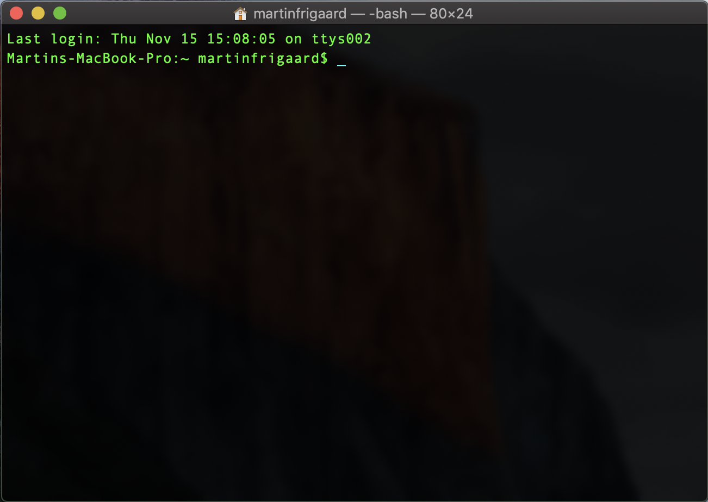

```{r setup, include=FALSE}
knitr::opts_chunk$set(echo = TRUE,
                      tidy = FALSE, 
                      size = "small",
                      message = FALSE,
                      warning = FALSE)
library(tidyverse)
library(magrittr)
library(blogdown)
library(broom)
library(markdowntemplates)
```

# The information age

> "Your work should speak for itself." - unknown

You have entered graduate school in an amazing time. Most people are walking around with more computational power in their pockets than previous generations ever imagined possible. An internet browser now gives you access to nearly all the accumulated knowledge of the human species (and an unreasonable number of cat pictures). As an example to how much has changed and how fast it's happened, consider a [2000 paper in Nature](https://www.nature.com/articles/21987) by Steve Lawrence and C. Lee Giles titled, "Accessibility of information on the web." The authors open with the jaw dropping statistic that the internet is "800 million pages, encompassing about 6 terabytes of text data on about 3 million servers." Fast forward to 2016, and Google claims to be aware of [130 trillion pages](https://searchengineland.com/googles-search-indexes-hits-130-trillion-pages-documents-263378) across the web. 

Put simply, we've never had more access to information than we do right now. And it's unlikely that there will be less available information in the future. 

**I know how the internet works--why are you telling me this?**

Because you need your work to be discoverable. You want collaborators, future employers, other graduate students, and (most importantly) future 'you' to be able to find a catalog of what you've been doing all those late nights in front of your computer. 

**Isn't that what my thesis/dissertation is for?** 

I know it's rude to answer a question with a question, but *how many theses/dissertations have you read?* Ask around to your most bibliophilic friends what their favorite thesis is, or what dissertation they think everyone should read? Those documents serve a purpose, but it's not to make sure all of your hard work reaches a wide audience.

**What about peer-reviewed publications?**

The scientific journal industry is not looking out for your best interests. They have a [clearly unethical business model](https://www.theguardian.com/commentisfree/2011/aug/29/academic-publishers-murdoch-socialist), even [big universities can't afford their prices](https://www.theguardian.com/science/2012/apr/24/harvard-university-journal-publishers-prices) (which means less people reading your work), and they won't [compensate](https://whyevolutionistrue.wordpress.com/2011/09/01/the-racket-of-academic-publishing/) you for your work.

One of the areas that has not kept up with these technological advances is scientific journals. The often coveted, peer-reviewed scientific journals won't pay you for the work you're doing. 


[Research has now shown](https://www.scientificamerican.com/article/are-digital-devices-altering-our-brains/?redirect=1) having access to so much information has changed the way we work, what we remember, and our attentions.

Unfortunately the hard work you're doing isn't 

# Getting set up

In order to follow along with this tutorial you'll need to download and install R, RStudio, and Git. I will cover this process assuming you have none of these on your machine. This section will cover downloading installing R and RStudio, and basic commands in Terminal.

# R & RStudio

**What is R?** 

*[R](https://www.r-project.org/) is a free statistical modeling software application and language.* 

**What is RStudio?** 

*[RStudio](https://www.rstudio.com/products/RStudio/) is an integrated development environment (IDE) for using R.*

RStudio is a free and open-source [integrated development environment](https://en.wikipedia.org/wiki/Integrated_development_environment) (IDE) for R. IDE's are an interesting topic to explore on your own, and you'll see there are many options to choose from. These applications typically come with a code editor (with syntax highlighting), a graphical/drag-and-drop tools, and some sort of debugging display. 

Other examples of IDEs are [DataGrip](https://www.jetbrains.com/datagrip/) for relational data, [Spyder IDE](https://www.spyder-ide.org/) for Python, or  [Stata](https://www.stata.com/why-use-stata/). *These are not free*.


## Installing R and RStudio

1. Download and install R from [CRAN](https://cran.r-project.org/)  
2. Download and install [RStudio](https://www.rstudio.com/products/rstudio/download/), the integrated development environment (IDE) for R. 

***

# Graphical user interfaces vs. command line interfaces

Most people interact with their computers using a [graphical user interface](https://en.wikipedia.org/wiki/Graphical_user_interface) or GUI (pronounced 'gooey'). GUI's are quick to learn because the computing environment usually mimics a familiar physical space (i.e., desktops, folders, documents). This virtual environment then gets filled with applications to perform specific functions. Below are some typical examples: 

* Chrome, Safari, and Firefox are for browsing the internet;

* Microsoft Word or Apple iWork Papers are for reports or articles; 

* Microsoft Outlook or Apple Mail is for writing emails and organizing calendars;

* Microsoft PowerPoint or Apple iWork Keynote create Presentations;

* Microsoft Excel, Apple iWork Numbers or an online application like Googlesheets generate numerical calculations and organize data.

Users interact with their computer's GUI using a mouse, track-pad, or touchscreen. These tools serve as extensions of their intentions, whether this means opening an application by clicking on it, deleting a file by dragging it into a virtual trash bin, pinching fingers together to zoom in on an image, etc.

In this sense, the GUI represents an environment where users communicate their intentions to a computer through a series of physical gestures (pointing, clicking, dragging and dropping) to perform a specific task, like looking at pictures, opening the browser, or moving files. These actions rely on a pointing device (mouse, track pad, or touchscreen) to interact with software programs, files, and data. 

This [user-centered design](https://en.wikipedia.org/wiki/User-centered_design) has made software applications (and other technologies) available to a broader range of people, and reduced many of the frustrating experiences many of us had in the early days of computing ([MS-DOS](https://en.wikipedia.org/wiki/MS-DOS) was my first interaction with the command line, and I immediately missed the [GEOS](https://en.wikipedia.org/wiki/GEOS_(8-bit_operating_system)) on my old Commodore 64).

All the benefits of GUIs come with a cost. This trade off comes in the form of a limited collection of possibilities a user can choose from (all of which were selected by the designer of the software). On the other hand, a [command line interface](https://en.wikipedia.org/wiki/Command-line_interface) is a text-based screen where users interact with their computer's programs, files, and operating system using a combination of commands and parameters.

Don't worry--this is not another post about how important it is for *everyone* to use the command line. There are plenty of tasks that are better suited for a GUI. The constant design improvements of GUIs are evidence that more and more people with minimal computer science knowledge will benefit from these technologies (*insert image of your grandma playing angry birds*).

As someone who works with data, you'll need to understand the technologies that are used to store, manipulate, and analyze data. Whether you're working on an academic article, a data journalism project, or a data set with a few questions (my personal favorite), you'll need to know more than the typical GUI will allow. Hadley Wickham made this point in an excellent talk aptly titled, " [You can't do data science in a GUI](https://www.youtube.com/watch?v=cpbtcsGE0OA) "

> "*The gooey is the easiest type of approach where you just point and click and everything is laid out in front of you. All of the options are laid out in front of you, which is great because you can see everything you can do. But it's also terrible because you have constraints--you can only do what the inventors of (SAS or Excel) wanted. Whereas with R--or other programming languages--is kind of the opposite. All you get is this blinking cursor and it's just telling you can do literally anything, but it's not gonna give you much...*"

> "*So I think an important thing about programming languages--like R or Python--is they give you a language to express your ideas, they give you very few constraints, which makes life tough for your learning or doing data science things occasionally, but the payoff for investing in a programming language is you get this whole this new language, and what you can express with them.*"

Fair warning--this will hurt at times. Most of the technologies we interact with on a daily basis don't behave in ways that are easy to understand (that's why GUIs exist). Switching from a GUI to a CLI seems like a step backward at first, but the initial frustration pays off because of the gains in flexibility, automation, and reproducibility.

## Terminal 

The Terminal is a command line interface application for Mac users. Terminal is available as an application (on Mac go to *Applications* > *Utilities* > *Terminal*) or as a pane in RStudio.

Here is a quick list of commonly used Terminal commands.

* **`pwd`** - Print working directory 
* **`cd`** - change directories  
* **`cp`** - copy files from one directory to another  
* **`ls`** - list all files
* **`ls -la`** - list all files, including hidden ones
* **`mkdir`** - make directory  
* **`cat`** - display a text file in Terminal screen
* **`echo`** - outputs text as arguments, prints to Terminal screen, file, or in a pipeline
* **`touch`** - create a few files
* **`grep`** - "globally search a regular expression and print"
* **`>>`** and **`>`** - redirect output of program to a file (don't display on Terminal screen)
* **`sudo`** and **`sudo -s`** (**BE CAREFUL!!**) perform commands as **`root`** user  

### The Terminal application

Here is an image of what the terminal application looks like with the Homebrew syntax highlighting. 

```{r 1-terminal, fig.height=3, fig.width=5, echo=FALSE}
# fs::dir_ls(".")

```

### The Terminal pane

A Terminal pane is available under *Tools* > *Terminal* > *New Terminal*. 

```{r 2-terminal-pane, fig.height=3, fig.width=5, echo=FALSE}
# fs::dir_ls("draft-images")
knitr::include_graphics(path = "draft-images/2-terminal-pane.png")
```

## Terminals, shells, and operating systems

Just like with any discipline, a major barrier to understanding these technologies is their jargon. I'll do my best to clear up/define some commonly used terms for referring to command line tools. To maximize the power of command-line tools, it also helps to know a little about where they came from.

### Operating systems

In 2007, Apple released their [Leopard](https://en.wikipedia.org/wiki/MacOS_version_history#Version_10.5:_%22Leopard%22) operating system that was the first to adhere to the [Single Unix Specification](https://en.wikipedia.org/wiki/Single_UNIX_Specification). I only introduce this but of history to help keep the terminology straight. macOS and Linux are both Unix systems, so they have a similar underlying architecture (and philosophy). Many commands used on a Mac can be used on a Linux machine.  

Windows has a command line tool called Powershell, but this is not the same as the Unix shells discussed above. This has to do with differences in the way the operating systems are designed. However, if you're a Windows 10 user, you can install a [bash shell command-line tool](https://www.windowscentral.com/how-install-bash-shell-command-line-windows-10). 

### Terminal applications

Strictly speaking, the Terminal application is not a shell, but rather it *gives the user access to the shell*. Other terminal emulator options exist, depending on your operating system and age of your machine. Terminal.app is the default application installed on masOS, but you can download other options (see [iTerm2](https://www.iterm2.com/)). For example, the [GNOME](https://en.wikipedia.org/wiki/GNOME) is a desktop environment based on Linux which also has a Terminal emulator, but this gives users access to the Unix shell. 

### Shells

On Macs, the Terminal application runs a [bash shell](https://en.wikipedia.org/wiki/Bash_(Unix_shell)). This is the most commonly used shell, but there are other options too (see [Zsh](http://zsh.sourceforge.net/), [tcsh](https://en.wikipedia.org/wiki/Tcsh), and [sh](https://en.wikipedia.org/wiki/Bourne_shell)). *in fact, bash is a pun for Bourne again shell*.

In the next section, I will walk through setting up Git and RStudio, and linking your local machine to Github. 