Intro to Terminal and Git/Github in RStudio
================
Martin Frigaard
2019-06-11

> In the previous two tutorials, we covered installing and setting up
> R/RStudio, Git, and configuring Git to work with RStudio. This section
> will go over how to work with RStudio’s project files, commits, pulls
> and pushes to Github,

> You should have a `NewProject` folder on your local computer, with
> [this](https://github.com/mjfrigaard/swow-data-project) cloned
> repository (with the following contents).

<!-- -->

# Working with RStudio Projects

I want to create an RStudio project in this folder because it makes life
easier in so many ways. In the upper-right corner of the RStudio IDE, I
click on *Project: (None)* \> *New Project…*.

Then I want to choose *Existing Directory*. I choose this option because
the folder already exists in
`~/Dropbox/Githubdemos/NewProject/swow-data-project` on my local
machine.

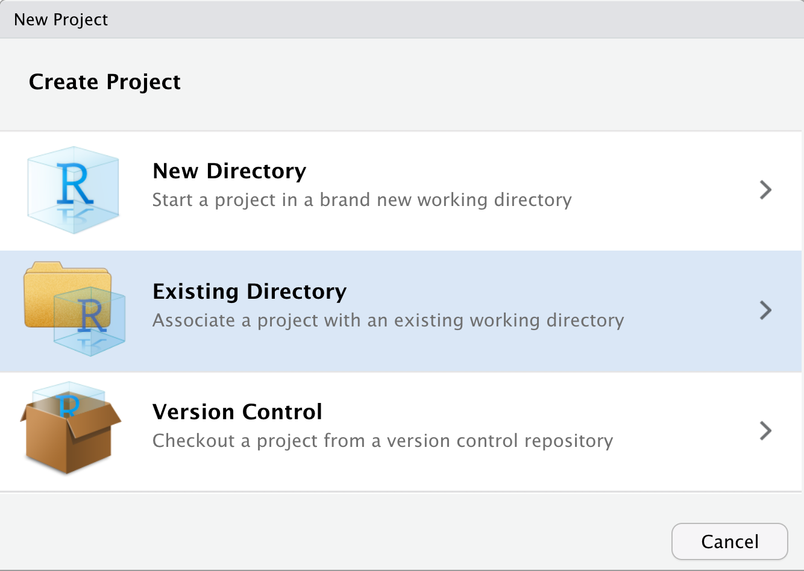<!-- -->

Then I want to navigate to the folder that contains my newly cloned
repo, and click *Create Project*.

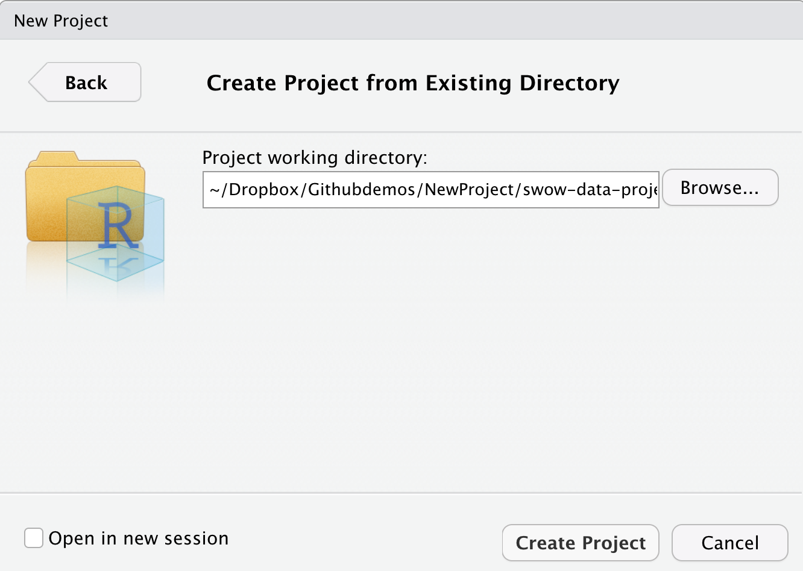<!-- -->

After RStudio works it’s magic, the IDE should reopen. If you open the
*Git* pane and click on the `README.md` file in the *Files* pane, your
IDE should look something like the layout below.

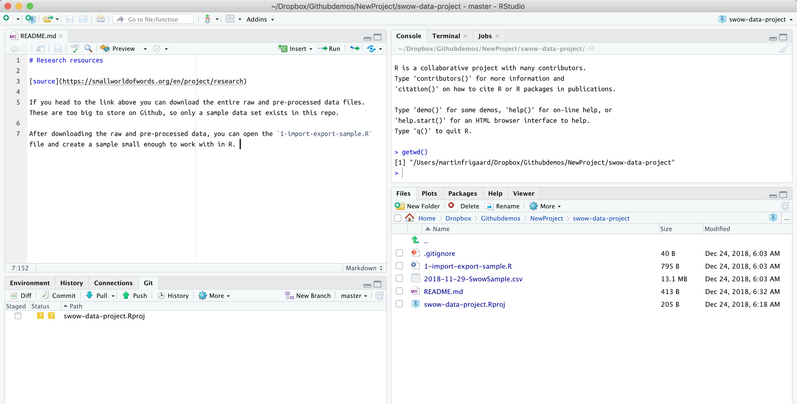<!-- -->

Aftering reading the `README.md` file, I learn that I will need to
download the data files from another source and store them in a folder
inside this directory. This should result in the folder structure you
see below.

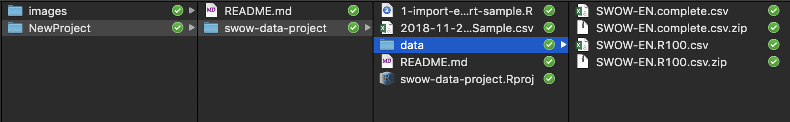<!-- -->

You’ll need to download the two data files from the website and store
them in a `data` folder for the script below to work.

# Running the .R script

Now we can open the `1-import-export-sample.R` script and see what it
does (the script is available below).

``` r
# load packages ------------------------
library(readr)
library(tidyverse)
library(magrittr)


# import data ----
# fs::dir_ls("data")
SWOW_EN_complete <- readr::read_csv("data/SWOW-EN.complete.csv")
SWOW_EN_R100 <- readr::read_csv("data/SWOW-EN.R100.csv")

SWOW_EN_complete %>% dplyr::glimpse(78)
SWOW_EN_R100 %>% dplyr::glimpse(78)

# remove X1 ---------------------------------------------------------------
SWOW_EN_complete <- SWOW_EN_complete %>% 
  dplyr::select(-X1)
SWOW_EN_R100 <- SWOW_EN_R100 %>% 
  dplyr::select(-X1)

# get a sample ---------------------------------------------------------------
SwowCompleteSample <- SWOW_EN_complete %>% 
  dplyr::sample_n(size = 100000)

SWOWR100Sample <- SWOW_EN_R100 %>% 
  dplyr::sample_n(size = 100000)

SwowCompleteSample %>% dplyr::glimpse(78)
SWOWR100Sample %>% dplyr::glimpse(78)

# export ----
readr::write_csv(as_data_frame(
                  SwowCompleteSample), path = 
            paste0(
              "data/",
          base::noquote(lubridate::today()),
              "-SwowCompleteSample.csv"))

readr::write_csv(as_data_frame(
  SWOWR100Sample), path = 
    paste0(
      "data/",
      base::noquote(lubridate::today()),
      "-SWOWR100Sample.csv"))


# verify location ----
fs::dir_ls("data")
```

This code appears to take in the raw and preprocessed data files, remove
a unknown column, take a sample from each dataset, then export these as
.csv files. This script should run fine without any changes.

After downloading the data and storing them in a `data` folder, you
should see this RStudio after running the `1-import-export-sample.R`
script.

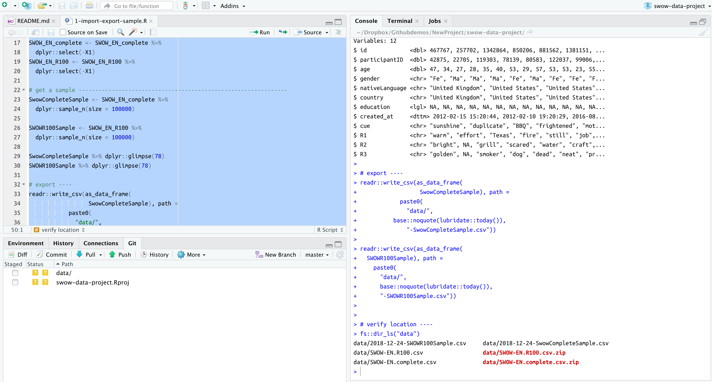<!-- -->

## The Git pane

Using RStudio’s Git pane is a great way to get comfortable
using/learning Git. RStudio is wonderfully designed, so we can enter
commands into a Terminal pane, and then see how these commands work in
Git via the Git pane.

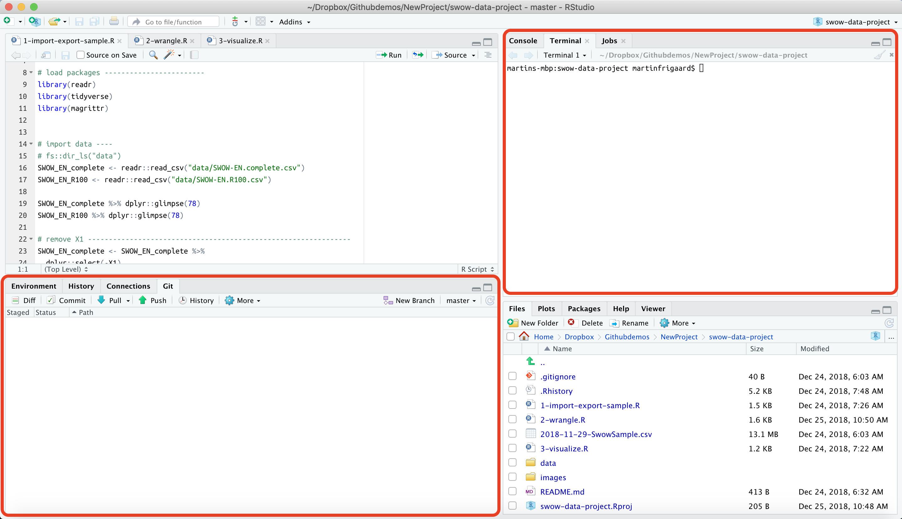<!-- -->

As I can see, there are already some familiar terms in this window
(*Status*, *Commit*, etc.). When we created the project (.Rproj file),
this was picked up as a change by Git. This information is also
available if I type `git status` into the Terminal pane:

``` bash
$ git status
On branch master
Your branch is up to date with 'origin/master'.

Untracked files:
  (use "git add <file>..." to include in what will be committed)

        data/
        swow-data-project.Rproj

nothing added to commit but untracked files present (use "git add" to track)
```

This explains the little question mark icons on the Git pane. I need to
`add` files before I can track them. This is part of the general Git
workflow (`git add`, `git commit -m`, `git push`), but I will make a few
more changes to the files in the folder first.

## Remove large data files

First we know the raw data files are too big to push to Github, so we
will remove them from `swow-data-project` and put them in the parent
folder `NewProject`. I can do this using the following Terminal
commands:

``` bash
$ cd data
$ cp SWOW-EN.R100.csv /Users/martinfrigaard/Dropbox/Githubdemos/NewProject
$ rm SWOW-EN.R100.csv
```

Copying files with Terminal takes the following syntax, `cp
file/to/be/copied destination/for/copied/file`

After copying, the `rm` command is used to delete the original
downloaded file.

This needs to be repeated for each .csv and .zip file. When I am
finished, my data folder should have these two files.

``` bash
$ ls
2018-12-24-SWOWR100Sample.csv           2018-12-24-SwowCompleteSample.csv
```

## Create wrangling & visualizing scripts

I will create two new `.R` files titled , `2-wrangle.R` and
`3-visualize.R` with the following contents.

``` r
#=====================================================================#
# This is code to create: TOPSWOWByGender.csv
# Authored by and feedback to mjfrigaard@gmail.com
# MIT License
# Version: 1.0
#=====================================================================#

# packages ----------------------------------------------------------------
library(tidyverse)
library(magrittr)

# import ------------------------------------------------------------------
# fs::dir_ls("data")
SwowCompleteSample <- readr::read_csv("data/2018-12-24-SwowCompleteSample.csv")

# inspect ------------------------------------------------------------------
SwowCompleteSample %>% dplyr::glimpse(78)

# count R1  ------------------------------------------------------------------
SwowCompleteSample %>%
  dplyr::count(R1, sort = TRUE)
# vast majority are 'Unknown word', remove for graph

# count gender  -------------------------------------------------------------
SwowCompleteSample %>%
  dplyr::count(gender, sort = TRUE)
# remove 387 X

# create Top 150 words by gender -----
TOPSWOWByGender <- SwowCompleteSample %>%
  dplyr::filter(R1 != "Unknown word") %>% 
  dplyr::count(R1, sort = TRUE) %>%
  dplyr::left_join(., SwowCompleteSample, 
                   by = "R1") %>% 
  dplyr::filter(n > 150) %>%
  dplyr::select(r1_word_count = n,
                R1,
                gender) %>% 
  dplyr::mutate(R1 = reorder(R1, r1_word_count)) 


# export -------------------------------
readr::write_csv(as_data_frame(
  TOPSWOWByGender), path = 
    paste0(
      "data/",
      base::noquote(lubridate::today()),
      "-TOPSWOWByGender.csv"))
```

``` r
#=====================================================================#
# This is code to create: TOPSWOWByGender.csv
# Authored by and feedback to mjfrigaard@gmail.com
# MIT License
# Version: 1.0
#=====================================================================#

# packages ----------------------------------------------------------------
library(tidyverse)
library(magrittr)

# import ------------------------------------------------------------------
# fs::dir_ls("data")
TOPSWOWByGender <- readr::read_csv("data/2018-12-24-TOPSWOWByGender.csv")

# check
TOPSWOWByGender %>% dplyr::glimpse()

# graph
TOPSWOWByGender %>%
  dplyr::filter(gender != "X") %>% 
  ggplot2::ggplot(aes(x = R1, y = r1_word_count, group = gender)) +
  ggplot2::geom_col() +
  ggplot2::coord_flip() + 
  ggplot2::facet_wrap(. ~ gender) + 
  ggplot2::labs(
    title = "SWOW Most Common Words by Gender",
    subtitle = "Words occurring more than 150 times, missing gender removed",
    y = "Word count",
    x = "Word")


# create image folder ------------------

if (!file.exists("images")) {
  dir.create("images")
}

# export graph ----
ggplot2::ggsave(filename = "draft-images/swow-words-by-gender.png", 
                width = 7, 
                height = 5, 
                units = "in")
```

After creating and running both scripts, I’ve saved a new
`swow-words-by-gender.png` file in a new `image` folder. I also see that
I did not include a header in the `1-import-export-sample.R` file, so I
add the following:

``` r
#=====================================================================#
# This is code to create: SwowCompleteSample.csv & SWOWR100Sample.csv
# Authored by and feedback to mjfrigaard@gmail.com
# MIT License
# Version: 1.1
#=====================================================================#
```

Now I will click on the files with little question mark icons in the
*Git* pane and they should all change to display the following:

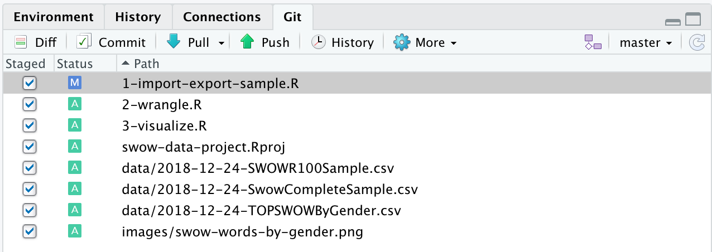<!-- -->

The green *A* icon stands for ‘Add’, and the *M* stands for ‘Modified’.

I can confirm this in Terminal with `git status`.

``` bash
$ git status
On branch master
Your branch is up to date with 'origin/master'.

Changes to be committed:
  (use "git reset HEAD <file>..." to unstage)

        modified:   1-import-export-sample.R
        new file:   2-wrangle.R
        new file:   3-visualize.R
        new file:   data/2018-12-24-SWOWR100Sample.csv
        new file:   data/2018-12-24-SwowCompleteSample.csv
        new file:   data/2018-12-24-TOPSWOWByGender.csv
        new file:   draft-images/swow-words-by-gender.png
        new file:   swow-data-project.Rproj
```

These have been added, but not committed. If I click on the *Commit* tab
in the *Git* pane, a new dialogue window opens. This is RStudio’s
interface for reviewing changes, making commits, and pushing/pulling
changes with Git/Github.

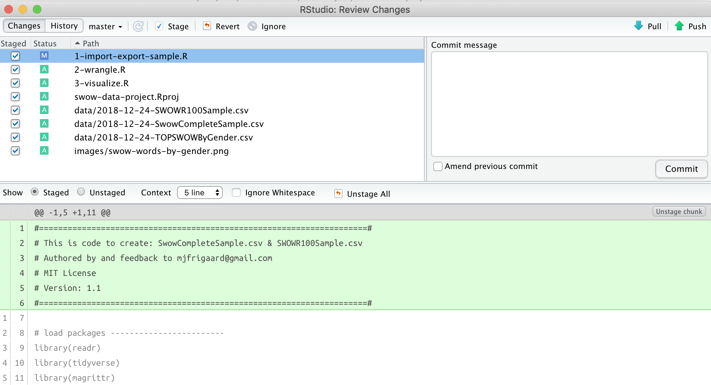<!-- -->

In the *Commit message* window, I will enter the following, “Added data,
scripts for wrangling, graph, and .Rproj”. Read more about writing good
Git commit messages [here](https://chris.beams.io/posts/git-commit/).
After clicking *Commit*, a new window pops up telling me some
information about the *commit*s I just committed.

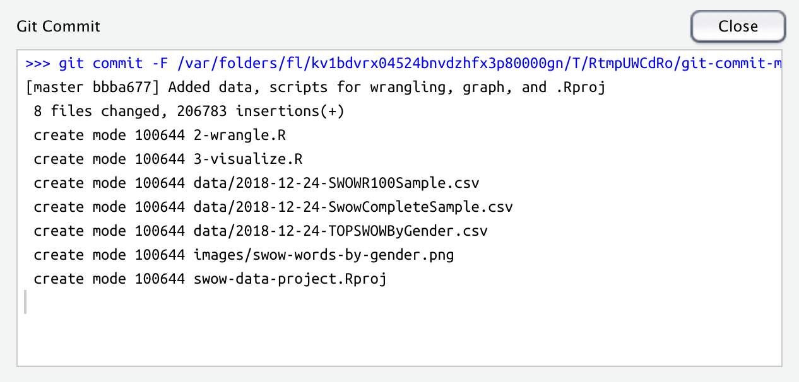<!-- -->

This shows me some relevant information about my commit:

  - The commit message (hopefully well written),
  - the number of files changed (what I expected to see),
  - how many insertions (this should line up with the number of lines of
    code in my .R scripts),
  - the ‘mode’ for each file (I created four new files), and more.

I won’t dive into each bit of information this dialogue box contains,
but all of this information *is* important. I will check `git status`
again to see what this looks like in the command line.

``` bash
$ git status
On branch master
Your branch is ahead of 'origin/master' by 1 commit.
  (use "git push" to publish your local commits)

nothing to commit, working tree clean
```

So now that every change I’ve made has been added and committed, I can
push these changes to Github.

## Push changes to Github

In the *Review Changes* pane and terminal message above, I can now see a
message near the top left that tells me, “Your branch is ahead of
‘origin/master’ by 1 commit”. This is telling me that my changes have
been *committed*, but not *pushed*. This becomes a little clearer when I
check `git status` again in the Terminal pane.

I want to *push* my `local commits` to the `origin/master` (which is the
Github repository). I can do this by clicking on the *Push* button with
the green arrow. This brings up another *Review Changes* window that
displays the status of the `git push`.

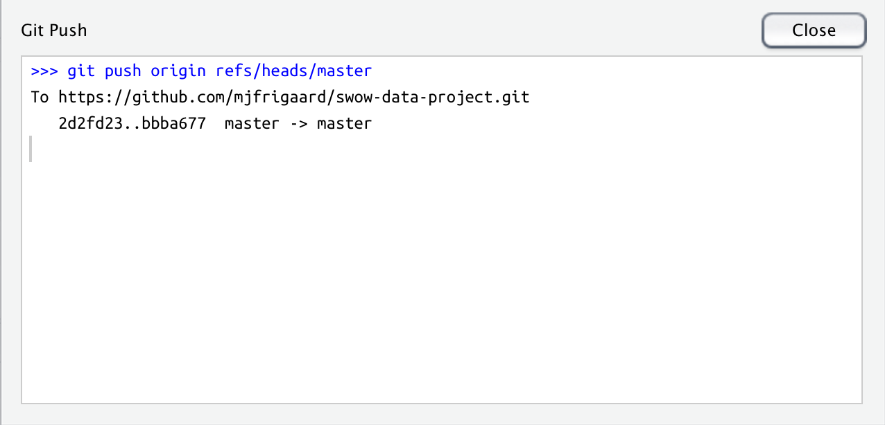<!-- -->

This tells me the commit id `bbba677` to reference these changes. I can
check this out on Github.

## Check the pushed changes

If I check the Github, I can see the new files are now added to the
repository.

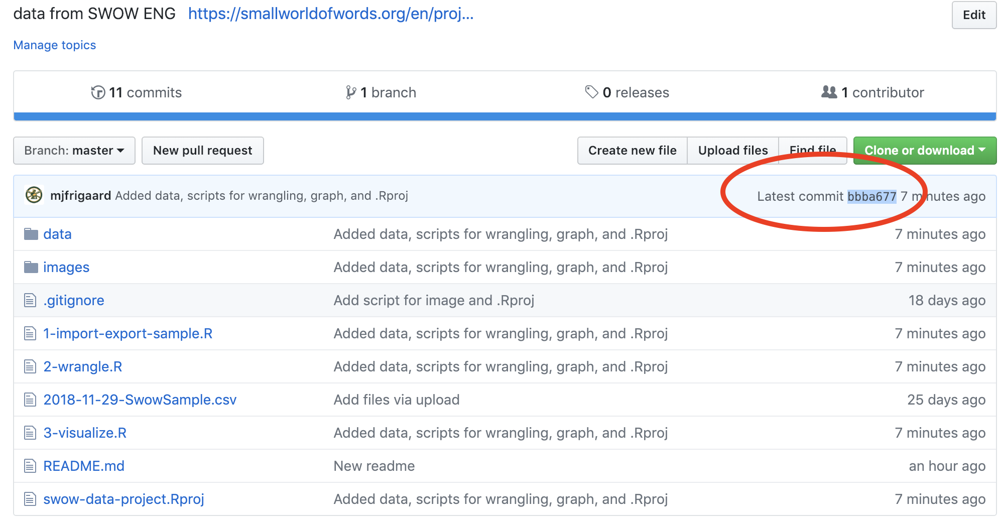<!-- -->

# Recap

And there you have it\! Now I’ve have covered 1) Basic terminal commands
2) setting up Git with RStudio, and 3) cloning a repository, making
changes, and pushing those changes back to Github.
