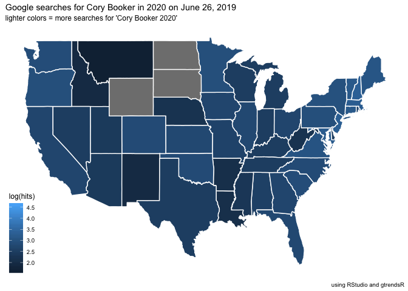

2019 Democratic Debate Google trend data
================
John Doe

**Rmarkdown:**

This is an R Markdown format used for publishing markdown documents.
When you click the **Knit** button all R code chunks are run and a
markdown file (`.md`) suitable for publishing to GitHub is generated.

**Including Code:**

You can include R code in the document to keep track of your work\!
Below we perform a search for Democratic presidential candidates during
the debates in June of 2019.

# Motivation

This document collects Google trend data for the 10 democratic
presidential candidates who spoke on the first night of the Democratic
presidential debate held in Miami, Florida, on June 26, 2019.

We will be collecting data from June 25, 2019 until June 27, 2019 to get
a gauge of how well (or how bad) each candidate did in terms of gaining
interest (as measured by Google search trends).

## Packages

The Google search trends are accessible via the
[gtrendsR](https://github.com/PMassicotte/gtrendsR) package. This and
other packages are in the `00-packages.R` script. We load these packages
in the code chunk below.

``` r
fs::dir_tree(".", recurse = FALSE)
```

    ## .
    ## ├── 01-import.Rmd
    ## ├── 02-wrangle.Rmd
    ## ├── README.Rmd
    ## ├── README.md
    ## ├── data
    ## ├── figs
    ## ├── google-trends-data.Rproj
    ## └── src

``` r
library(gtrendsR)
library(maps)
library(ggplot2)
library(lettercase)
library(viridis)
library(pals)
library(scico)
library(ggrepel)
library(tidyverse)
library(skimr)
```

## The candidates

There were ten candidates in the debates, all are listed alphabetically
below.

``` r
dem_candidates <- c("Amy Klobuchar",
                "Beto O’Rourke",
                "Bill de Blasio",
                "Cory Booker",
                "Elizabeth Warren",
                "Jay Inslee",
                "John Delaney",
                "Julián Castro",
                "Tim Ryan",
                "Tulsi Gabbard")
writeLines(dem_candidates)
```

    ## Amy Klobuchar
    ## Beto O’Rourke
    ## Bill de Blasio
    ## Cory Booker
    ## Elizabeth Warren
    ## Jay Inslee
    ## John Delaney
    ## Julián Castro
    ## Tim Ryan
    ## Tulsi Gabbard

We can pass the following search items through the `gtrendsR::gtrends()`
function below to download the data into our RStudio environment.

The first night of the Democratic presidential debate was held in Miami,
Florida, on June 26, 2019, so we’ve included the day before (June 25th)
and the day of the debate.

### Google search terms

Each candidates name was searched for with “2020”. We thought it would
be a good idea to add “2020” to the candidates name to make it easier to
identify searches that corresponded to the interested with the upcoming
election.

### Import data

See the script for more details.

``` r
source("src/01-import.R")
```

    ## Parsed with column specification:
    ## cols(
    ##   Poll = col_character(),
    ##   Date = col_character(),
    ##   Biden = col_double(),
    ##   Sanders = col_double(),
    ##   Warren = col_double(),
    ##   Harris = col_double(),
    ##   Buttigieg = col_double(),
    ##   ORourke = col_double(),
    ##   Booker = col_double(),
    ##   Yang = col_double(),
    ##   Klobuchar = col_double(),
    ##   Gabbard = col_double(),
    ##   Castro = col_double(),
    ##   Ryan = col_double(),
    ##   Bullock = col_double(),
    ##   Gillibrand = col_double(),
    ##   Spread = col_character()
    ## )

### Wrangle data

See the script for more details.

``` r
source("src/02-wrangle.R")
```

## Exploratory Data Analysis

Start with visualizing as much of the data as possible.

``` r
library(visdat)
library(inspectdf)
inspectdf::inspect_types(Dems2020Debate01IOT) %>% 
  inspectdf::show_plot()
```

<!-- -->

``` r
visdat::vis_miss(Dems2020Debate01IOT) + 
  ggplot2::coord_flip()
```

<!-- -->

### Candidates with high % going into debates

If we look at the candidates with the highest percent of likely voters
on the 26th, we see the following:

``` r
Dems2020Debate01IOT %>% 
  dplyr::filter(prior_vperc_fct == "> 1.0% of voters") %>% 
  ggplot(aes(x = date, 
             y = hits, 
             color = keyword)) +
  geom_line(aes(group = keyword), show.legend = FALSE) + 
  ggplot2::labs(
    x = "Date",
    y = "Google search hits",
    caption = paste0("Google search hits between ", 
                   min(Dems2020Debate01IOT$date),
                   " and ",
                   max(Dems2020Debate01IOT$date)),
    subtitle = "Google search hits for Candidates with > 1.0% of voters") + 
  ggthemes::theme_fivethirtyeight(base_size = 7.5) +
  facet_wrap(~ keyword, ncol = 2)
```

<!-- -->

This shows Booker doing well, Warren getting some searches later in the
evening, etc.

``` r
Dems2020Debate01IOT %>% 
  dplyr::filter(prior_vperc_fct == "0.5 - 0.9% of voters") %>% 
  ggplot(aes(x = date, 
             y = hits, 
             color = keyword)) +
  geom_line(aes(group = keyword), show.legend = FALSE) + 
  ggplot2::labs(
    x = "Date",
    y = "Google search hits",
    caption = paste0("Google search hits between ", 
                   min(Dems2020Debate01IOT$date),
                   " and ",
                   max(Dems2020Debate01IOT$date)),
    subtitle = "Google Search Hits for Candidates with between 0.5 - 0.9% of voters") + 
  ggthemes::theme_fivethirtyeight(base_size = 9) +
  facet_wrap(~ keyword, ncol = 2)
```

    ## Warning: Removed 2 rows containing missing values (geom_path).

<!-- -->

``` r
Dems2020Debate01IOT %>% 
  dplyr::filter(prior_vperc_fct == "0.2 - 0.4% of voters") %>% 
  ggplot(aes(x = date, 
             y = hits, 
             color = keyword)) +
  geom_line(aes(group = keyword), show.legend = FALSE) + 
  ggplot2::labs(
    x = "Date",
    y = "Google search hits",
    subtitle = "Google search hits for candidates with between 0.2 - 0.4% of voters",
    caption = paste0("0.2 - 0.4% of voters",
                     min(Dems2020Debate01IOT$date),
                   " and ",
                   max(Dems2020Debate01IOT$date))) + 
  ggthemes::theme_fivethirtyeight(base_size = 7.5) +
  facet_wrap(~ keyword, ncol = 3)
```

<!-- -->

This looks like Gabbard had a better night than the other three
candidates in her group.

### Candidates who had to gain ground in the debates

This is the middle group of candidates who would need to grab one of the
top-ranking spots.

``` r
Dems2020Debate01IOT %>%  
  dplyr::filter(prior_vperc_fct == "0.2% of voters") %>% 
  ggplot(aes(x = date, 
             y = hits, 
             color = keyword)) +
  geom_line(aes(group = keyword), show.legend = FALSE) + 
  ggplot2::labs(
    x = "Date",
    y = "Google search hits",
    subtitle = paste0("Google search hits between ", 
                   min(Dems2020Debate01IOT$date),
                   " and ",
                   max(Dems2020Debate01IOT$date)),
    caption = "using RStudio and gtrendsR") + 
  ggthemes::theme_fivethirtyeight() +
  facet_wrap(~ keyword, ncol = 3)
```

    ## Warning: Removed 7 rows containing missing values (geom_path).

<!-- -->

For coming in with the lowest polling percentage (based on voting that
day), John Delaney ended up with a moderate boost in Google searches.

### Women candidates

We can also check the `gender` categorical variable to see how the
candidates break down across `Men` and `Women`

``` r
Dems2020Debate01IOT %>% 
  dplyr::filter(gender == "Women") %>% 
  ggplot(aes(x = date, 
             y = hits, 
             color = keyword)) +
  geom_line(aes(group = keyword)) + 
  ggplot2::labs(
    x = "Date",
    y = "Google search hits",
    subtitle = paste0("Google search trends between ", 
                   min(Dems2020Debate01IOT$date),
                   " and ",
                   max(Dems2020Debate01IOT$date)),
    caption = "using RStudio and gtrendsR") + 
  ggthemes::theme_fivethirtyeight(base_size = 8) + 
  facet_wrap(. ~ keyword)
```

    ## Warning: Removed 1 rows containing missing values (geom_path).

<!-- -->

This shows Gubbard outperforming Warren in Google searches. And the
`Men`…

``` r
Dems2020Debate01IOT %>% 
  dplyr::filter(gender == "Men") %>% 
  ggplot(aes(x = date, 
             y = hits, 
             color = keyword)) +
  geom_line(aes(group = keyword)) + 
  ggplot2::labs(
    x = "Date",
    y = "Google search hits",
    subtitle = paste0("Google search trends between ", 
                   min(Dems2020Debate01IOT$date),
                   " and ",
                   max(Dems2020Debate01IOT$date)),
    caption = "using RStudio and gtrendsR") + 
  ggthemes::theme_fivethirtyeight(base_size = 7.5) + 
  facet_wrap(. ~ keyword, ncol = 3)
```

    ## Warning: Removed 9 rows containing missing values (geom_path).

<!-- -->

Shows Cory Booker doing the best, followed by John Delany.

### Map the data by state

What does the interest look like by location (i.e. `"region"`)?

We’ve created a new data structure `Dems2020InterestByRegion`. What does
it look like?

``` r
# recheck the structure
Dems2020InterestByRegion %>%
  skimr::skim_to_wide() %>% 
  dplyr::filter(type %in% c("integer", "numeric")) %>% 
  dplyr::select(variable, 
                n, 
                mean, 
                sd, 
                median = p50, 
                hist)
```

    ## # A tibble: 5 x 6
    ##   variable n      mean      sd        median   hist    
    ##   <chr>    <chr>  <chr>     <chr>     <chr>    <chr>   
    ## 1 hits     155370 "  23.18" "  14.84" 19       ▆▇▃▁▁▁▁▁
    ## 2 order    155370 7798.15   4503.19   7794     ▇▇▇▇▇▇▇▇
    ## 3 group    155370 " 30.15"  18.13     " 26   " ▅▇▇▆▃▃▇▃
    ## 4 lat      155370 " 38.18"  " 5.79"   " 38.18" ▂▅▅▆▇▆▆▃
    ## 5 long     155370 -89.67    14.08     -87.61   ▂▂▁▃▇▇▇▃

It looks like the variable of interest (`hits`) is pretty lopsided–what
can we do about it? After googling, we discover [this
article](https://medium.com/@TheDataGyan/day-8-data-transformation-skewness-normalization-and-much-more-4c144d370e55)
with this information,

> “The logarithm, x to log base 10 of x, or x to log base e of x (ln x),
> or x to log base 2 of x, is a strong transformation and can be used to
> reduce right skewness.”

Now we’ve documented our thought process (the “why”), and can
log-transform the data in the next graph.

## Tulsi Gabbard 2020 searches

``` r
Dems2020InterestByRegion %>% 
  dplyr::filter(keyword %in% "Tulsi Gabbard 2020") %>% 
  ggplot(aes(x = long, 
             y = lat)) +
  geom_polygon(aes(group = group,
                   # get the log(hits)
                   fill = log(hits)), 
                   color = "white") + 
  ggthemes::theme_map() + 
  ggplot2::labs(
    title = "Google searches for Tulsi Gabbard in 2020 on June 26, 2019",
    subtitle = "lighter colors = more searches for 'Tulsi Gabbard 2020'",
    caption = "using RStudio and gtrendsR") 
```

<!-- -->

## Cory Booker 2020 searches

These are the searches for Cory Booker on states.

``` r
Dems2020InterestByRegion %>% 
  dplyr::filter(keyword == "Cory Booker 2020") %>% 
  ggplot(aes(x = long, 
             y = lat)) +
  geom_polygon(aes(group = group,
                   # get the log(hits)
                   fill = log(hits)), 
                   color = "white") + 
  ggthemes::theme_map() + 
  ggplot2::labs(
    title = "Google searches for Cory Booker in 2020 on June 26, 2019",
    subtitle = "lighter colors = more searches for 'Cory Booker 2020'",
    caption = "using RStudio and gtrendsR")
```

<!-- -->

## Sharing your work

Click `knit` to get the markdown file to share.

## Ask more questions

What other questions can we answer with these data?
