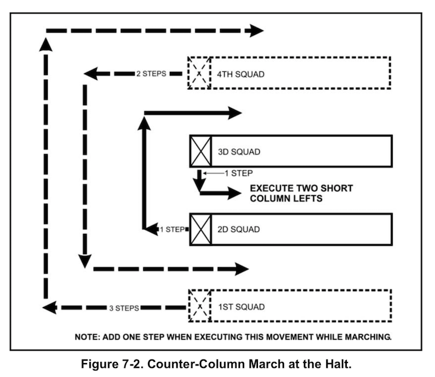

# What's in this manual?

"If you can't describe what you are doing as a process, you don't know what you're doing." - W. Edwards Deming

This is a manual for geting started in data science using R & RStudio, and Git & Github. We will also cover some practical principles of programming, data collection, analysis, and visualizations, and a few computer science topics. 

This manual was inspired by growing number of excellent publications on a variety of topics in data science (see list below). Rather than write a manual that focused on one of these tools or topics, we wrote a manual for *how these technologies work together*. Because this is a very "high level" manual, we also encourage readers to consult the original publications for more details on each specific topic. 

Our goal is to include enough information to get you up and running and at the same time, not overwhelm you. Odds are you've already Googled "*Getting start in [insert open source software]*," and you know there are a ton of resources available online for anything related to data science, data visualization, machine learning, etc. Figuring out where to start can feel like trying to get a drink of water from a fire hose. Given the massive number of resources, we decided to distil what we consider to be the "common threads" that run through each of these technologies. Along the way we are going to introduce a few computer science concepts that will help you build a toolkit, get started on a project, take that project to an outcome, and communicate the findings. 

## Who this manual is for

We've tried to keep this manual accessible to everyone. Whether you're currently using data in your job and want to add these tools to your skill set, or you'd like to start using data to improve what you do. Or maybe you have a knack for counting things and creating pictures. In the next few pages, we're going to introduce you to a workflow (a set of tools) for collecting, manipulating, summarizing, and visualizing data in a reproducible way.   We wrote this manual to try and distill these topics into a 'bare-minimum' toolset that you can learn and use quickly (because we know your time is limited). 

Whether you're an accountant, scientist, data analyst, journalist, grad student, product manager, or decision-maker, this manual is for you. 

## What this manual covers

This manual covers getting started with RStudio, Git, and Github. Although we use RStudio daily now, this wasn't always the case. We began our careers in other statistical programs (SPSS, Stata, SAS), and abandoned them for one reason or another.  We've continued using R/RStudio because of the sheer number of tasks we can accomplish, and that's what makes us recommend it to you. 

Many of the concepts covered in this manual come from our personal experiences. We wanted to make a manual that contained the analytic skills we didn't have after graduating from college but needed to be successful in our jobs. Everything in this manual was included to make you more prepared than we were. We also reached out to our colleagues and included their lessons and insights.

## What this manual doesn't cover

We also understand there are alternative approaches to accomplishing the same goal, and we will try to mention these examples wherever possible. Jupyter Lab and Jupyter Notebooks, for example, offer reproducible scientific programming environments that can accomplish many of the same objectives we'll tackle in this book. However, we still think there are reasons you should use RStudio + Github instead, and we will outline these in the following chapters.  

## Our approach to writing 

The US Army is amazingly efficient at training large groups of people on a wide range of tasks in a remarkably short period. Army leadership accomplishes this by addressing four considerations when planning a training exercise: 

- (a) *Relative importance*. Which activities contribute most to successful training?

> This manual contains **brief descriptions** of the tools we recommend, **diagrams and figures** outlining how they work, and **examples** for using them.

- (b) *Need*. Which training activities will benefit the most from guidance? Which activities have received little attention in the past or which have previously required improvement?

> We expand on some technologies we feel are harder to grasp (Git and version control), and go over topics college courses overlook or neglect (file naming, project organization).

- (c) *Time*. How much time is available? Which activities can be effectively taught in that time?

> Time is the real enemy of any data project. All computational work comes down to keystrokes and neurons. We're trying to narrow the time gap between 1) having a question or task (neurons) and 2) typing commands a computer can execute (and a human can read).

- (d) *Personnel*. What are the known or suspected levels of expertise among individuals receiving training?

> We assume everyone reading this text has zero exposure to the tools we will be covering (R, RStudio, Git, or Github).

Another secret to the Army's training abilities is the Field Manual (FM). Army FMs are amazing--they cover almost any topic you can imagine. For example, watch this video of the drill and ceremony movement called the ["counter column"](https://www.youtube.com/watch?v=EgeZl9UOJ0I).

As you can see, this is a complicated technique. But somehow the Army has been able to teach hundreds of thousands of soldiers for decades. How do they achieve this? By giving soldiers a field manual (FM 22-5) and lots of practice. 

The strength of FMs is how they're written: they present the material in everyday language (usually between a 6th-8th-grade reading level), using a lot of diagrams and hand-drawn pictures.

For example, below is a diagram for a performing a counter column from FM 22-5 Army Drill and Ceremony.



The image shows how to turn a platoon of soldiers (made up of four squads) around 180 degrees. Describing something like this with words becomes over-complicated quickly.

> "...there are lots of other books that explain what things are called. This book explains what they do." Randall Munroe, Thing Explainer

The quote above comes from an excellent book we recommend everyone reads. The author uses pictures and plain languge to describe multiple complicated things (rocket ships, the periodic table, laptops, etc.). The subtitle of the book, "*Complicated stuff in simple words*" is what we're trying to replicate here. Wherever possible, we've dropped unnecessary technical jargon and spelled out any acronyms. We've also created images and diagrams instead of words to explain complicated concepts.

## Our goals for you

The two primary goals we hope to accomplish in this manual are to 1) give you a workflow that allows you to collaborate with other people, and 2) communicate your work in a reproducible way to a wide range of audiences. We view collaboration and reproducibility as connected concepts because the better your collaborators can reproduce your work, the better they'll understand your results. 

## Assumptions we've made

We assume you'll be working on a computer (laptop or desktop), and have the ability to download, locate, and install software applications. Although the examples in this manual use a Mac operating system (macOS), it's possible to recreate everything on a Windows machine.

We also assume you've been using your computer to send/receive emails, write papers, and explore the internet. People encounter a need for data science skills at different times in their lives, so we realize there's a chance a few of you will be familiar with some of the content we're covering. If this is the case, hopefully, we cover it in a novel and painless way that doesn't make reading it feel like a waste of time. 

We use the plural 'we' throughout the manual based on the [excellent advice](http://www.econ.uiuc.edu/~econ508/Papers/mathwriting.pdf) from Donald Knuth, Tracy Larabee, and Paul Roberts, "*think of a dialog between author and reader.*" As with most written works, the topics in this manual are the result of many conversations, emails, comment threads, and communications that could not have happened in isolation. 

## Style guide

The text uses the following style guide: 

`this is code.` 

```sh
# this a code chunk
```

> *some quoted text*

[click on hyperlinks]()

plain text for our thoughts 

