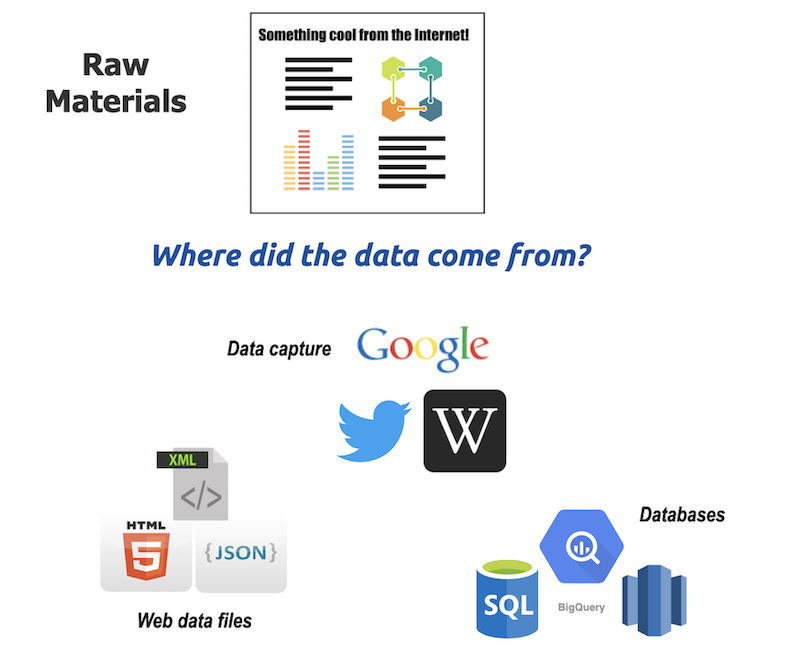
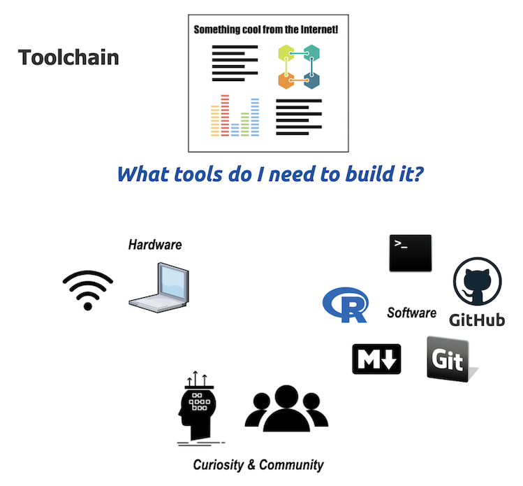

# Introduction: A toolchain for making data products

This book is about a toolchain for building data products. Wiktionary defines a  [toolchain](https://en.wiktionary.org/wiki/toolchain) as, "*A set of tools for software development, often used in sequence so that the output of one tool comprises the input of the next.*" We'll adjust this definition slightly to, 

> "**Toolchain:** A set of tools for creating *data products*, often used in sequence so that the output of one tool comprises the input of the next."

That last point is important--our toolchain expects the **output** from one tool (i.e., data from something you're interested in) to serve as the **input** into another tool (software for making visualizations, graphs, statistical analysis, etc.). To sequentially pass inputs and outputs between tools, we have to know and understand what we're building. In this text, we will focus on the process required to make a *data product*. 

You might also be wondering what we mean by *data product*, and we'll use the definition from [Brian Caffo](https://leanpub.com/ddp), 

> "A *data product* is the production output of a data analysis."


## What you will learn 

We're going to show you how to use RStudio.Cloud, Git, and Github for creating data products. Specifically, we will cover: 

1. Setting up an account with RStudio.Cloud and Github  
2. Downloading files from Github and uploading files to RStudio.Cloud  
3. Basic command-line tools 
4. Setting up version control (Git) with RStudio.Cloud  
5. Project organization  
6. Running code in RStudio.Cloud  
7. Dynamic documents with Rmarkdown  
8. Building a project website with Github pages  
9. Documenting and sharing all of your work with Git and Github  

In the following pages, we're going to tell you reasons and underlying principles for using these tools. If you read this text and decide not to adopt tools, we still think the principles can be exported and applied to other software and workflows. 

That list might seem like a lot (because it is), but we're giving you all the code files and data for this project. That means all you have to learn are the tools! 

## Why write a book for a toolchain?

We won't be taking a "30,000-foot view" in this text, but rather something closer to a [1,000-foot view](https://www.strategyskills.com/1000-foot-view/). The difference is that 30,000-feet is, "*too high up to see much of anything with any precision,*" and 1000 feet being a height where we can "*recognize what you're looking at, with the benefit of seeing it from a new, higher perspective.*"

## Who this book is for

We've tried to keep the materials accessible to a broad audience, but we understand there are few useful data analysis texts written for everyone. Data tends to be very specific to the field they come from, and it's hard to find data that gets everyone excited. To try and help address this issue, we use data from multiple sources (Google trends, Twitter, Wikipedia, and Googlesheets).

**We focus on the toolchain and tools.**

The next chapters outline a 'one-stop-shop' toolset that you can learn quickly and readily re-use (because we know your time is limited). 

We wrote this for anyone who:

1) has a data set they'd like to build something with,   
2) saw a data product (article, analysis, report, etc.) that they'd like to replicate, or   
3) someone who might be using one or two of these tools, and they're wondering how to if they can improve their toolchain  

We found these topics were missing from a lot of statistical coursework, but they're essential to getting things done when we're working with data. We also wanted to try and answer some of the questions we've frequently heard while training people on RStudio and Github.

This book isn't necessarily for data scientists, because the contents would either 1) be preaching to the converted, or 2) be considered blasphemy because they have strong opinions against the toolchain we're recommending. 

## How we know this toolchain works

We use these tools daily now, but we began our careers in other statistical programs (SPSS, Stata, SAS). We abandoned those tools because of the sheer number of tasks we can accomplish with RStudio and Github, and that's what makes us recommend this toolchain to you. We also reached out to our colleagues and included their lessons and insights.

## Where do we find data?

In the information age, there seems to be no limit to what can be measured or counted. Our desire for constant quantification is why articles are still touting "data scientist" as the sexiest job for the 21st Century. By the way, it appears this is [unlikely to change for some time to come](https://towardsdatascience.com/the-sexiest-job-of-the-22nd-century-ffe753e1d155). 
But you don't have to be a data scientist to build data products, you'll need to to understand 1) where to find the raw materials, and 2) how to use the tools of the trade. 

The image below displays some of the possible sources we can find the raw materials for creating a data product:



We've all seen something unique on the Internet and wondered how the authors were able to create such a compelling or impressive display of information. Before they could start making design decisions, the authors had to know where to find the data. The figure above shows some examples of where data can come from, and a few of the ways they can be stored. As we can see, data are available on more topics and more accessible than previous generations could've imagined. Data can be Internet search terms (Google search trends), terms that are trending on social media sites (Twitter, Instagram, etc.), and public reference works (Wikipedia).

Now that we've shown you a few places to find the raw material for a data product, we want to tell you about the tools you'll need. 

## What tools will I need?

We've already covered the raw materials needed to create a data science product, so let's outline the tools in the toolchain (below):



You'll need a computer, the Internet, and some experience using both. That's about it. We'll be focusing on *how these tools work together*. We'll show you how R, RStudio, Git, & Github can be used to create elegant yet durable data analysis products. We wrote this book with the intent of keeping all the work in the browser, but you *can* download these tools onto your local desktop (more on that later).

### What you'll be building

Today, most primary sources of media use data as part of their evidence base. Check out the interactive data visualizations on the [UpShot](https://www.nytimes.com/section/upshot) at the New York Times, the visual journalism data projects at the [BBC](https://www.bbc.com/news/world-32209370), or the daily graphs in the [Economist](https://www.economist.com/node/21011894). Measurement and math are powerful tools, which is why adding data gives a sense of precision and validity to any story.

The massive amounts of data available have also given rise to new forms of media. Nate Silver's blog covering elections and politics has grown into multiple projects on [fivethirtyeight](https://projects.fivethirtyeight.com/). [The Pudding](https://pudding.cool/) is an example of an online data journalism site that covers non-conventional data sources. [Vox](https://www.vox.com/) recently won an award for producing a [graph](https://www.vox.com/policy-and-politics/2018/9/28/17914308/kavanaugh-ford-question-dodge-hearing-chart) that communicates a topic that pundits could've debated endlessly.

In this text, you'll be creating summary tables, graphs, and figures like the ones you see below. These will be built using data from Google searches, Twitter, and Wikipedia (all public sources).

#### Graphing Google trends 


#### Graphing Tweets 


#### Mapping Google search terms  


### Data products and computer programs

To create a data product, we'll need to write small computer programs. Crazy, right? Not really. When executed, computer programs are sets of instructions for performing specific tasks. Data products take some raw data as the input, process and prepare those data, and generate figures and tables of the results. It might seem strange to think of a data product as a small computer program, but it will help you see the need for a toolchain. 

Recall the following portion from the definition above, 

> "*...the output of one tool comprises the input of the next.*" 

We a set of tools that takes an input (data), creates an output (visualization), then passes this output to another tool in the toolchain. We've found people start using one of these tools, but without fully understanding where it fits into the larger toolchain. After a few frustrating attempts to create the product they were hoping for, they'll start looking for another set of tools (or give up). Our goal with this book is to keep that scenario from happening.

All of this involves being able to communicate our intentions clearly and explicitly with our computers. That means writing code. **But this book will not teach you how to program in R.** 

If you want to learn to program with R, there are a ton of really great resources on the Internet right now for learning R programming and data science. We recommend the [R for data science](https://r4ds.had.co.nz/) and [community](https://www.rfordatasci.com/). We've found this 'dialect' of the R language is easier for beginners to learn (and easier for everyone else to read). 

We will reiterate the excellent point made in David Robinson's [blog post](http://varianceexplained.org/r/teach-tidyverse/)--learn the `tidyverse` first, then base R as you need it.

For other great examples (see [coursera](https://www.coursera.org/learn/r-programming), [edx](https://www.edx.org/learn/r-programming), and [udacity](https://www.udacity.com/course/data-analysis-with-r--ud651)). Many of these courses are fantastic--they can teach you programming languages, website design, database management, statistics, and machine learning (if that is your goal).  

We chose to center this book around a particular use case: you have data, and you want to build something and share it. 

We are starting you off with the data sources, and the code we used that are specific to this data product. However, we've chosen not to spend too much time on the content of those files (we've documented them if you want to look into the details). Instead, We're going to focus more on the "high level" ideas because these are topics you can take with you to your next project. 


We also encourage you to consult the articles and resource we've recommended throughout each chapter and in the appendix for more materials on each topic.

## After reading this book, you should feel better about...

After completing the project in this book, we want readers to: 
1) feel more confident in knowing how to organize a data project, 
2) understand why they should be using plain text files, 
3) know where to go to ask for help, 
4) grasp why we use version control (and why they should use it), 
5) be able to document changes to their files using Git and Github, and 
6) know how to create a website from a Github repository. 

Because we aren't covering R, statistics, or data visualization in this text, you will want to build those skills.

We plan to include enough information to get you up and running and at the same time, not overwhelm you. If you've already Googled "Getting started in data science," you know there are a *ton* of resources. Figuring out where to start can feel like trying to get a drink of water from a fire hose. 

### Technical assumptions

The reader we had in mind while writing this book was someone who, 

1. Uses a computer every day at work
2. Understands how to navigate a web browser (Chrome, Safari, Firefox, etc.)
3. Has worked with a word processor (like Microsoft Word, Google Docs, or Apple Papers) 

If you're an accountant, scientist, analyst, journalist, grad student, product manager, or decision-maker, this book is for you. 

## What this book covers

This book covers how to use RStudio.Cloud, Terminal, Git, and Github. We will also touch on some R, markdown, and essential computer science topics.  

## What this book doesn't cover

We also understand there are alternative approaches to accomplishing the same goal, and we will try to mention these examples wherever possible. Jupyter Lab and Jupyter Notebooks, for example, offer reproducible scientific programming environments that can accomplish many of the same objectives we'll tackle in this book. However, we still think there are reasons you should use RStudio + Github instead, and we will outline these in the following chapters.  

## How this book is structured

We structured this book somewhat like an Army Field Manual, which means each topic was chosen using the following criteria:

- (a) *Relative importance*. Which activities contribute most to successful training?

> This book contains **brief descriptions** of the tools we recommend, with **diagrams and figures** outlining how they work, and **examples** for using them.

- (b) *Need*. Which training activities will benefit the most from guidance? Which activities have received little attention in the past or which have previously required improvement?

> We'll expand on a few tools we felt are harder to grasp (Git and version control). We will also go over topics typical college courses overlook or neglect (file naming, project organization).

- (c) *Time*. How much time is available? Which activities can be effectively taught in that time?

> Time is the real enemy of any data project. All computational work comes down to keystrokes and neurons. This book is trying to narrow the gap between 1) seeing a data product (neurons) and 2) translating what you see into commands on a computer that can be used to recreate that product.

- (d) *Personnel*. What are the known or suspected levels of expertise among individuals receiving training?

> We assume everyone reading this text has very little exposure to the tools we'll be covering (R, RStudio, Git, or Github). We do expect you are comfortable using a computer. 

The secret to the Army's training abilities is the Field Manual (FM). Army FMs are amazing--they cover almost any topic you can imagine and are well illustrated. For example, watch this video of the drill and ceremony movement called the ["counter column"](https://www.youtube.com/watch?v=EgeZl9UOJ0I).

Now, look at the same thing in a figure. 


As you can see, executing a counter column is complicated. But the Army has taught hundreds of thousands of soldiers on this movement for decades. How? They give soldiers a field manual (FM 22-5) to read and dedicated time to practice. 

The strength of the FMs is how they present information: they gave the material in everyday language (usually between a 6th-8th-grade reading level) with an emphasis on diagrams, pictures, and simple drawings.

We've found so much data science and statistical information on the Internet has a ton of acronyms, jargon, and equations. We've actively avoided using technical verbiage, and focused on using figures and graphics. 

## What you'll walk away with

You will have a working data product (cool visualizations, lots of code, data) a ton of resources, and a book for reproducing this process again.

### Language and style guide

We use the plural'*we*' throughout the book based on the [excellent advice](http://www.econ.uiuc.edu/~econ508/Papers/mathwriting.pdf) from Donald Knuth, Tracy Larabee, and Paul Roberts, "*think of a dialog between author and reader.*" 

As with most written works, the topics in this book are the result of many conversations, emails, comment threads, and communications that could not have happened in isolation. We want to thank everyone who's contributed to these ideas over the years. 

The text uses the following style guide: 

`this is code.` 

```r
# this a code chunk
```

> *some quoted text*

[click on this for hyperlinks](http://tinytuba.com/)

plain text for our thoughts 


#### Places to learn more 

- [Practical Data Science for Stats](https://peerj.com/collections/50-practicaldatascistats/) is a resource you should bookmark in your browser. The articles in this collection will come up again in future sections, but we found we use these resources so much it's nice to have them somewhere handy. 

- The [R for data science community](https://www.rfordatasci.com/) and [R for Data Science](https://r4ds.had.co.nz/) book are excellent resources to help you started. 

- **Collaboration and reproducibility:** There's a direct connection between collaboration and reproducibility. The better your collaborators can reproduce your work, the better they'll understand your results. 

- We recommend RStudio and Github for anyone looking to get started with data science, visualization, reproducible reporting, dashboards development, or website/blog creation. By suggesting these particular tools, we're not saying there aren't other ways or means capable of accomplishing the same activities. These are the tools we've found success with, so they're what we recommend.
