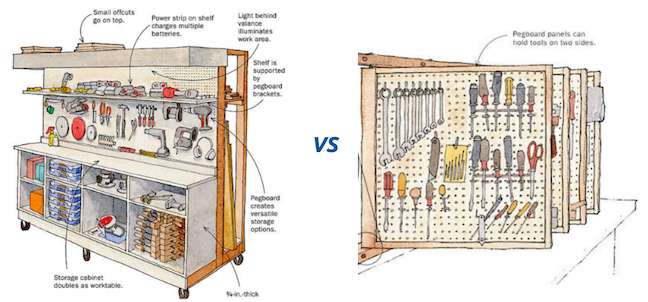
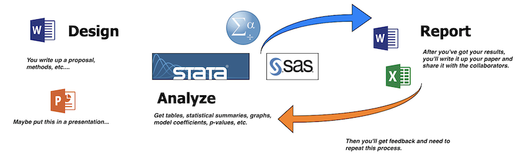

# Part 2: "Have a workflow."

A **workbench** is a place to keep and organize tools, and a **toolchain** is how we combine the tools to get things done. This chapter will cover the workbench we use and the three guiding principles of the toolchain we recommend. 

1. Use free open source software
2. Write code  
3. Document everything in plain text 

## Principle 1: Use open-source software

All of the tools in this book are available open-source and available free of charge. Just as a point of reference, the cost of a subscription to SPSS at the time of this writing is \$99.00 per user per month. Stata is \$595 per year or $1,595 for a perpetual license. There are educational discounts available, but this cost is not offset by much when we take into account the rising price of tuition.

A more important reason we recommend open source tools are the communities that we got access to when we started using them. By entering the universe of open source software, we got to take advantage of seeing problems solved in the open. We also found people like us, grappling with the same issues, and it's hard to overstate the benefit of this shared camaraderie. 

The final reason is philosophical: we all benefit from using open source tools and sharing improvements on them together. The ['four freedoms' of open source software](https://www.gnu.org/philosophy/free-sw.html) captures this sentiment below. 

**Freedom 0**: The freedom to run the program as you wish, for any purpose.

**Freedom 1**: The freedom to study how the program works, and change it, so it does your computing as you wish.  

**Freedom 2**: The freedom to redistribute copies so you can help your neighbor.  

**Freedom 3**: The freedom to distribute copies of your modified versions to others. By doing this, you can give the whole community a chance to benefit from your changes.

We've displayed some examples of open source tools for data management, statistics, and communication in the image below:


Follow the links below to learn more. 

- [Git](https://git-scm.com/)   
- [Github](https://github.com/)   
- [Linux](https://www.linux.org/)   
- [MySQL](https://www.mysql.com/)    
- [Netlify](https://www.netlify.com/)  
- [Python](https://www.python.org/)    
- [R](https://www.r-project.org/)    
- [RStudio](https://www.rstudio.com/)    

***

### The integrated development environment (aka the workbench)

An [integrated development environment](https://en.wikipedia.org/wiki/Integrated_development_environment) (IDE) is an application typically used by programmers to build and test software. We find it helpful to think of a woodworkers workbench as an analogy. The workbench on the left is an example of a simple rolling cart design (for people with minimal garage space).



As we can see, this workbench is efficiently designed to keep essential tools for the job within arms reach, and it uses storage space efficiently. IDE design follows these same principles. However, we also know some models are better than others. For example, consider the design of the workbench on the right. By making the panel positions adjustable, the workbench allows for easier access to more tools. Depending on the job, woodworkers can customize the panel arrangements with "*the simple pin that allows the rack's various faces to swing left/right for access to either side.*."

These examples illustrate how differences in the design of a workbench can have a meaningful impact on levels of productivity. Well-designed workbenches give us access to more tools without making these tools more difficult to find. 

***
  
## Principle 2: Write code

Usually, people interact with their computers using point-and-click [graphical user interfaces](https://en.wikipedia.org/wiki/Graphical_user_interface) or GUIs (pronounced 'gooey'). GUIs are quick and easy to learn because their design environment usually mimics an actual physical space (i.e., desktops, folders, or documents). GUIs are a mostly positive development because designing software with a more [user-centered design](https://en.wikipedia.org/wiki/User-centered_design) is one of the main reasons technology adoption has been on the rise for the past 20+ years. 

User-centered-designed software includes most of the point-and-click operating systems and applications. These programs give the user the ability to click through a predetermined list of options and procedures using their mouse or track-pad. Two examples of statistical programs designed around the GUI are below.


As we can see, these programs provide an extensive list of options to choose from. However, we think there are times when we should resist the temptation to abstract away some of life's complexity, and data science is one of them. Using applications like these encourage a copy + paste toolchain like the one below. 



If you follow the arrows, you can see we'll be required to go back through the same elaborate steps whenever we receive feedback on our project. Each time will take just as long as the first.

We recommend an alternative to this copy + paste process based on the activities of a [modern scientist from Jeff Leek](https://leanpub.com/modernscientist):

1. Develop code in the open   
2. Publish data and code open source  
3. Post preprints of your work  
4. Submit and review for traditional journals  
5. Blog or use social media to critique published work 

Two things should stand out from the list above: First, modern science is mostly writing. Second, some of that writing is code (i.e., programming). It's, for this reason, we recommend adopting a toolchain based on "*writing code*" wherever possible. We are aware that 'writing code' means being able to type, which might be daunting for people who struggle on a keyboard. We recommend practicing this skill (there are plenty of great apps out there to help!) because typing is an unavoidable necessity for using a computer.

### Software is the tool, not the solution

We think of data science software as the tools that help us gain a deeper understanding of the world. We don't think of software as an alternative to thinking or expect a software tool to do our thinking for us. We also prefer tools that are useful across multiple projects. 

As we stated in chapter 1, focusing on being 'good enough' will get you very far. The software we choose should be tools that help move us from beginner to intermediate, to expert. GUIs and drop-down options are great when we only need a limited number of options, or have simple needs from our software. However, if you want to build exciting data products, you'll need software that doesn't limit you to a predetermined list of options. Programming languages enhance creativity by giving you the freedom to express yourself in unique yet sufficiently precise ways. 

For this reason, we don't recommend relying too heavily on point-and-click proprietary software applications (SPSS, Stata, SAS, etc.). These GUI's make it hard to keep track of what we've clicked on, the order we've clicked on them in, and can oversimplify or obfuscate what's going on. 

### What do we mean by 'a workflow'?

A workflow is a set of steps that are used repeatedly to solve problems and accomplish the tasks we encounter in our daily work. Toolchains are more specific than workflows because they explicitly name tools, and multiple toolchains can fit inside a single workflow. Useful workflows improve our understanding of the problem and shorten the distance between questions and answers (without omitting crucial details). 

The quote below is from an interview with Andrew Gelman, a statistician from Cornell, who is an author on the excellent blog [Statistical Modeling, Causal Inference, and Social Science](https://statmodeling.stat.columbia.edu/). 

> **Question:** "I'm wondering how you, as an educator and statistician, would like to see statistical and data literacy change in general for a general population?"

> **Answer:** "... I've come to realize that a lot of people don't even know what they did. People don't have a workflow, they have a bunch of numbers, and they start screwing around with the numbers and putting calculations in different places on their spreadsheet, and then at the end, they pull a number out and write it down and type it into their report." - [Andrew Gelman](https://soundcloud.com/dataframed/election-forecasting-polling) 

As the quote above illustrates, ***how you got an answer is just as relevant as the answer you got***.  The tools we provide in this text give us a start-to-finish chain of documentation from question to solutions. 

Data science needs a particular set of tools, and a workbench to organize those tools. To manage data science projects, we'll need a workflow that gives us the ability to 1) document our intentions and, 2) write code that can translate our plans into something a computer can execute. These two points bring us to our next topic: plain text. As we'll discover, plain text files are a great way to accomplish these tasks. 

***

## Principle 3: Document everything in plain text

In [The Pragmatic Programmer](https://www.amazon.com/Pragmatic-Programmer-Journeyman-Master/dp/020161622X), authors Hunt and Thomas advise *'Keep[ing] Knowledge in Plain Text'*. This sentiment has been repeated [here](https://simplystatistics.org/2017/06/13/the-future-of-education-is-plain-text/), [here](https://richardlent.github.io/post/the-plain-text-workflow/), and [here](http://plain-text.co/index.html#introduction). 

We recommend keeping files, notes, and any pertinent documentation about our project in plain text files. The reasons for this will become more apparent as we move through the example, but I wanted to outline a few here:

- plain text lasts forever (files written 40 years ago are still readable today)  
- plain text can be *converted* to any other kind of document  
- plain text is searchable (`ctrl+F` or `cmd+F` allows us to find keywords or phrases)  

We'll also cover why you might want switch over to a plain text editor if you're currently using Google Docs, Apple Papers, or Microsoft Word. 

### Wait--why would I change what I'm doing if it works?

We get it--change is difficult, and if you've got a working ecosystem of software that keeps you productive, don't abandon it. However, you should be aware of these technologies and recognize that people using them will be adapting *their* workflows to collaborate with you. 

We covered the problems with a copy+paste workflow previously, but there are additional reasons to avoid this toolset:

1. It's not reproducible  
2. It's not logical or necessarily honest to separate computation from the analysis or presentation 
4. It's error-prone  


If we've convinced you RStudio is a flexible and adaptable tool, but you're still unclear on what makes a file 'plain text,' we'll cover that next. But first, we need to talk about what *isn't* a plain text file.

### What *isn't* plain text

Non-plain text files are usually called binary (i.e., files with binary-level compatibility) need special software to run on our computer. The language below is a handy way to think about these files:

> "Binary files are *[computer-readable but not human-readable](https://www.webopedia.com/TERM/B/binary_file.html)*"   

### What *is* plain text

So if binary files aren't plain text, what is a plain text file? The language from the [Wikipedia](https://en.wikipedia.org/wiki/Text_file) description is helpful here: 

> *When opened in a text editor, plain text files display computer and human-readable content*.

The last bit is the most crucial distinction--**human-readable vs. computer-readable**. In this manual, we'll point out which files are binary and which are plain text. Generally speaking, plain text files can be opened using a text editor or viewed with a command-line tool.  Examples of text editors include [Atom](https://atom.io/), [Sublime Text](https://www.sublimetext.com/), and [Notepad++](https://notepad-plus-plus.org/).

### Markdown 

 

[Markdown](https://en.wikipedia.org/wiki/Markdown) files (`.md`) are common type of plain text files. Markdown is a 'lightweight markup language,' which means it's easy for humans to read, and computers can convert it to HyperText Markup Language (HTML). Markdown allows for some formatting options to aid with communication (see below)

```md
<!-- comments -->

normal text

*italic*

**bold**

> quote

`code`

# h1
## h2
### h3
#### h4
##### h5
###### h6
```

To learn more, see [Markdown Syntax Documentation](https://daringfireball.net/projects/markdown/syntax) on John Gruber's site). 

**We recommend learning markdown before any other programming language because it's the lingua franca for asking questions.** [Stackoverflow](https://stackoverflow.com/), [RStudio community](https://community.rstudio.com/), [Reddit](https://www.reddit.com/), [Github](http://github.com/), and many other sites use markdown to post questions and answers. We recommend experimenting with [StackEdit](https://stackedit.io/app#), a browser-based markdown editor that gives user's the ability to write in markdown and see the syntax rendered as HTML.


### Our workbench

We recommend choosing a workbench that minimizes the number of additional applications you'll need to have open to get work done. We've found we can use [RStudio](https://www.rstudio.com/products/RStudio/) for ~90% of our daily work (*they're not paying us to say this*). RStudio gives us access to all the tools we need in the same place. 

RStudio has four primary panes, each serving a specific function. 

- the **Code** or **Source** pane is where we can document both human-readable and computer-readable text  
- the **Workspace** holds the data, functions, and other data analysis objects  
- the **Console** displays the results from our written code (and allows us to enter commands directly)
- the **Files** gives us access to the happenings outside the RStudio environment (imported raw data, exported results, etc.)


Just like any workbench, we need to fill RStudio with tools we need for the job. RStudio plays well with many open-source software tools, but or now we're going to focus on R and Git.

### What is R?

[R is a free statistical modeling software](https://www.r-project.org/)  application and language. If you are using the desktop application, follow the links below to install R. 

**Installing R & RStudio**

1. First, you'll need to download and install R from [CRAN](https://cran.r-project.org/).  
2. Second, download and install [RStudio](https://www.rstudio.com/products/rstudio/download/), the integrated development environment (IDE) for R 

### Use RStudio in the browser

An alternative to downloading and installing R and RStudio is using [RStudio.Cloud](https://rstudio.cloud/) which operates entirely in your browser. You'll need to sign up for RStudio.cloud for free using your Google account or email address, but we recommend using a Github account. You can create a Github account [here](https://github.com/join).  

### What is Git?

[Git](https://git-scm.com/) is a version control system (VCS). VCSs are used to track changes to projects with code. You can read more about Git in their online [text here](https://git-scm.com/book/en/v2).

### What is Github?

[Github](https://github.com/) is the web-based hosting service for Git. You should set up a free an account with Github [here](https://github.com/join?source=header). 

### What do Git/Github do?

We will cover more on Git/Github in later sections, but for now, know these tools will allow us to keep track of changes to our projects over time. 

**Note:** *You should explore different IDE's on your own-- you'll see there are many options, both paid and unpaid. We're confident you'll see RStudio is well suited to handle more than most of the things you'll want to accomplish.* 

**Open-source software bonus:** *As mentioned previously, you'll also find a massive network of support on [Stackoverflow](https://stackoverflow.com/questions/tagged/r), [RStudio Community](https://community.rstudio.com/), and [Google Groups](https://groups.google.com/forum/#!forum/r-help-archive).*

## Rmarkdown

RStudio has an extension of markdown, [RMarkdown](https://rmarkdown.rstudio.com/). Using RMarkdown in RStudio allows for a genuinely reproducible workflow: we're able to write our thoughts, code, display results, and then share everything in multiple outputs.  


I recommend reading up on R and RMarkdown because of how many different outputs this combination can be used to produce (.pdf, .docx, and .html). Consult the [R Markdown: The Definitive Guide](https://bookdown.org/yihui/rmarkdown/) for more information. The image below is an output from an `.Rmd` document in RStudio.


### Python & Jupyter vs. R & RStudio 

Python is a neat language and a great tool to combine with R. 

It's also helpful to know a little Python even if we're primarily working in R, because the benefits of being multilingual extend beyond just spoken languages. 

We recommend R/RStudio because we wrote this book for people who have a data file and specific questions (or general curiosity). Thus, the entry point for our audience into data science is *with data they need to analyze*, and this is what R was made to do. 

***

## Additional reasons for using R & RStudio

Below are a few more reasons you should consider using R/RStudio in case you're still on the fence.

### You can focus on your work

> '*The only factor becoming scarce in a world of abundance is human attention*" – Kevin Kelly in Wired

We recommend R/RStudio because of the time saved by switching between software applications. For example, when I was in graduate school, I'd have *a minimum of five applications open* to do data analysis. I would be using Word to write, Stata for statistics, Excel to create tables, the browser for internet research, and Adobe Acrobat for reading PDFs. That means I needed to learn five different GUIs, each with their design characteristics. 

Each software application cost me valuable neurons whenever I had to switch between them (read more about attentional residue in the footnotes). With R/RStudio, I cut this number to two (RStudio and the browser).

### RStudio gives us a better mental model 

The third reason is the design of the IDE itself. RStudio is a complementary cognitive artifact, something described in [this article from David Krakauer](http://nautil.us/blog/will-ai-harm-us-better-to-ask-how-well-reckon-with-our-hybrid-nature),

> "*[complementary cognitive artifacts are] certainly amplifiers, but in many cases, they're much, much more. They're also teachers and coaches...Expert users of the abacus are not users of the physical abacus—they use a mental model in their brain. And expert users of slide rules can cast the ruler aside having internalized its mechanics. Cartographers memorize maps, and Edwin Hutchins has shown us how expert navigators form near symbiotic relationships with their analog instruments.*"

These are in contrast to competitive cognitive artifacts, which is what a GUI does. 

> "*In the case of competitive artifacts, when we are deprived of their use, we are no better than when we started. They're not coaches and teachers—they are serfs.*"

RStudio does not remove the complexity of doing data analysis, writing blog posts, building applications, debugging code, etc. Instead, it creates an environment where you can do each of these tasks without having them abstracted away from you into drop-down menus, dialog boxes, and point-and-click options. 

There have been considerable efforts from the scientists at RStudio to create an environment and ecosystem of tools (called `packages`) to make data analysis less painful (and even fun). We're confident you'll find it helps you think about the inputs and outputs of your work in productive and creative ways. 
