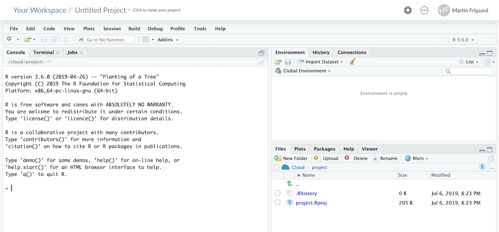
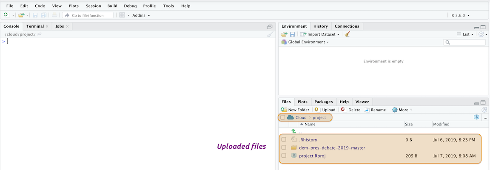
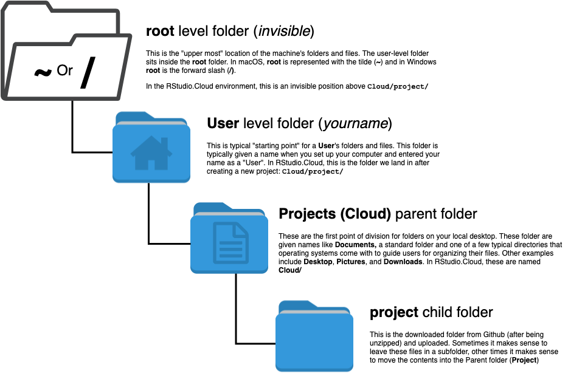

# Part 3: Getting organized 

Now that we've recommend a set of tools (R+RStudio+Git+Github), we will show how these tools get put together into a powerful and adaptive workflow with an example data project. We want to get started with an early, because this gives us an opportunity to cover project organization--a topic that was rarely covered in statistical coursework.

Project setup--how you organize files and folders--will directly contribute to your ability to be productive. In the same way it's hard to get things done in a messy office, it will be hard to do data science if you can't find your files.

---

## One "typical" scenario 

***You read something on the internet, got curious, and decided you wanted to dig a little deeper.*** 

The scenario above is one of many possible circumstances where this workflow is invaluable, but it isn't an uncommon one. In fact, some of the most interesting data projects are born of basic curiosity. 

Let's assume we read something about the first round of the 2019 Democratic Presidential Debates, and now we want to investigate how each candidate performed. 

We say "*typical*" with some caution here, because we've found an endless number of opportunities to use this workflow. For example:

- You've been asked to solve a problem or answer a question using data you don't currently posses, but know they exist in an [Application programming interface]((https://en.wikipedia.org/wiki/Application_programming_interface)) or API.

- There are data in a relational database management system or [RDBMS](https://en.wikipedia.org/wiki/Relational_database#RDBMS), but these data need to be retrieved, restructured, and presented in a way that allows for visualizations and models

- You need to combine data from multiple sources (APIs, web-scraping, or a RDBMS) and different formats (JSON, SQL, Excel, etc.) into a model or dashboard 

These are all situations where the R+RStudio+Git+Github workflow will come in handy as a "one-stop-shop", because the common threads between all of these situations are they 1) have data files and 2) require something to be built. 


### Our example data sources

To demonstrate how powerful R/RStudio can be, we are going to combine data from four different sources:

1) The [`gtrendsR`](https://github.com/PMassicotte/gtrendsR) package for R gives us access to Google search terms and trends. We're going to use this to import data on Google searches for the candidates before and after the night of the debates.

2) [`rtweet`](https://rtweet.info/) package in R can be used to download Twitter data, but takes a little bit to get set up. Fortunately, we've written a tutorial [here](http://www.storybench.org/get-twitter-data-rtweet-r/) and the package has excellent documentation (see [here](https://rtweet.info/articles/auth.html) and [here](https://rtweet.info/articles/intro.html)).  

3) There are data from voters on how they felt about each candidate going into the debates stored in a Google Sheet [here](http://bit.ly/2YEVASu) that we've accessed using the [`googlesheets`](https://cran.r-project.org/web/packages/googlesheets/vignettes/basic-usage.html) package in R (*you will need to copy this sheet into your Google drive to get this data set*). Another option is to use the [`datapasta`](https://cran.r-project.org/web/packages/datapasta/README.html) package and copy + paste these data into R. 

4) There is a [Wikipedia](https://en.wikipedia.org/wiki/2020_Democratic_Party_presidential_debates_and_forums) page dedicated to the debates. We will be extracting the tables with airtime for candidate using the [`xml2`](https://cran.r-project.org/web/packages/xml2/index.html) and [`rvest`](https://rvest.tidyverse.org/) packages. 

### Some background 

The data journalism site  [`fivethirtyeight`](https://projects.fivethirtyeight.com/democratic-debate-poll/) published an article looking at which candidates had high favorability going into the first night of the debates. These data were originally published in a table, but now they are in the graph below. 


As you can see from the figure, some people changed their minds about who they might potentially vote for in the debates. We are going to use freely accessible data from the internet to explore if this is a pattern that emerges in other areas (like Google searches and Twitter), and to see if there is any relationship to airtime.

---

## Get started with Github & RStudio.Cloud

In this example, we will be using an RStudio.Cloud environment to perform the analyses. All of these steps can be accomplished using the RStudio IDE on your local desktop, too. 

Head over to [Github and sign up](https://github.com/join) for a free account. After you've completed the necessary forms (*remember you only need a free account!*), you should see a page with a message telling you "**You don't have any public repositories yet**". 


We will eventually create our own repository, but for now let's head over to RStudio.Cloud and use our Github account to [sign into RStudio.Cloud](https://rstudio.cloud/). After we're all signed in, we will see the screen below:


The various resources, projects, and work spaces are outlined in the image above. We are going to download a repository from Github and open it in RStudio.Cloud. 

### Download a repository 

Most Github repositories are free for you to download and use, and you can do this by clicking on the green **Clone or download** button and click **Download ZIP**.


After you've picked a spot to put your project, download the zipped Github folder. 

### Upload the files into RStudio.Cloud

In the RStudio.Cloud browser, we're going to click on the **New Project** icon. It should display the RStudio IDE in the browser like the image below:



We are going to name this `Untitled` project as `dem-pres-debate-2019`. The results should look like the image below:


In the **Files** pane in the lower right corner, we're going to click on the **Upload** button, then we click on **Choose files** and locate our recently downloaded zipped Github folder and upload it into the `/cloud/project/` folder. 


This might take some time to fully upload, but after this folder gets uploaded into the cloud, we see the `dem-pres-debate-2019-master` folder in the **Files** pane. 



We want to move the contents of the `dem-pres-debate-2019-master` folder into the `project` folder. 


We are going to use the command line to do this, but before we can, we'll do a quick crash course on working from the **Terminal** in RStudio.Cloud. The next session will cover operating system differences, **Terminal** commands, and how to use command line tools effectively. 

## Unix and Windows

In 2007, Apple released its [Leopard](https://en.wikipedia.org/wiki/MacOS_version_history#Version_10.5:_%22Leopard%22) operating system that was the first to adhere to the [Single Unix Specification](https://en.wikipedia.org/wiki/Single_UNIX_Specification). I only introduce this bit of history to help keep the terminology straight. macOS and Linux are both Unix systems, so they have a similar underlying architecture (and philosophy). You can use most Linux commands on a Mac.  

Windows has a command line tool called Powershell, but this is not the same as the Unix shells discussed above. The differences between these tools reflect the differences in design between the two operating systems. However, if you're a Windows 10 user, you can install a [bash shell command-line tool](https://www.windowscentral.com/how-install-bash-shell-command-line-windows-10). 

### Command line tools

The [command line interface](https://en.wikipedia.org/wiki/Command-line_interface) (CLI) was the predecessor to a GUI, and there is a reason these tools haven't gone away. CLI is a text-based screen where users interact with their computer's programs, files, and operating system using a combination of commands and parameters. This basic design might make the CLI sound inferior to a trackpad or touchscreen, but after a few examples of what's possible from on the command-line and you'll see the power of using these tools. 

### The Terminal (mac0S)

Below is an image of what the terminal application looks like on macOS. On Macs, the Terminal application runs a [bash shell](https://en.wikipedia.org/wiki/Bash_(Unix_shell)), which is why you can see the `bash -- 86x25` on the top of the window. Bash is a commonly used shell, but there are other options too (see [Zsh](http://zsh.sourceforge.net/), [tcsh](https://en.wikipedia.org/wiki/Tcsh), and [sh](https://en.wikipedia.org/wiki/Bourne_shell)). *Fun fact: `bash` is a pun for the `sh` shell: `b`ourne-`a`gain `sh`ell*.


The Terminal is a command line interface emulator application for Mac users. Terminal is available as an application under the **Applications** > **Utilities** > **Terminal**. 

### The Terminal (RStudio)

The Terminal pane is also available in RStudio under **Tools** > **Terminal** > **New Terminal**. 


Now that we have a new Terminal window open, we can start to learning some common command line commands, understand relative vs. absolute paths, folder and file locations, and project organization.

### Common Terminal commands

**FAIR WARNING**--command line interfaces can be frustrating. Most of the technologies we interact with daily don't behave in ways that are easy to understand (that's why GUIs exist). Switching from a GUI to a CLI seems like a step backward at first, but the initial headaches pay off because of the gains you'll have in control, flexibility, automation, and reproducibility.

Here is a quick list of commonly used Terminal commands.

* **`pwd`** - `p`rint `w`orking `d`irectory 
* **`cd`** - `c`hange `d`irectories  
* **`cp`** - `c`o`p`y files from one directory to another  
* **`ls`** - `l`i`s`t all files
* **`ls -la`** - `l`i`s`t all files, including hidden ones
* **`mkdir`** - `m`a`k`e `dir`ectory  
* **`rmdir`** - `r`e`m`ove a `dir`ectory 
* **`cat`** - display a text file in Terminal screen
* **`echo`** - outputs text as arguments, prints to Terminal screen, file, or in a pipeline
* **`touch`** - create a few files
* **`grep`** - "`g`lobally search a `r`egular `e`xpression and `p`rint"
* **`>>`** and **`>`** - redirect output of program to a file (don't display on Terminal screen)
* **`sudo`** and **`sudo -s`** (**BE CAREFUL!!**) perform commands as **`root`** user, which can carry some heavy consequences.

### Why are we using the command line?

Being able to use the command line gives you more 'under-the-hood' access to your computer. We'll use the command line to navigate our computer's files, install new programs or libraries, and track changes to files. It might seem clunky and ancient, but there's a reason this technology is still around. The two key features that make the Unix programs so powerful are 1) specificity and 2) modularity.

- [Specificity](https://www.dictionary.com/browse/specific) means each Unix command or tool does one thing very well (or [DOTADIW](https://en.wikipedia.org/wiki/Unix_philosophy#Do_One_Thing_and_Do_It_Well))

- [Modularity](https://en.wikipedia.org/wiki/Modularity#Table_1:_The_use_of_modularity_by_discipline[34]) is the ability to mix and match these tools together with 'pipes,' a kind of grammatical glue that allows users to expand these tools in seemingly endless combinations  


We will work through an example to demonstrate some of these features. 

### Putting the command line to work: Finding your stuff

After downloading the files from Github, we've uploaded the zipped folder into the `Cloud/project`. In the RStudio.Cloud **Terminal** pane, we see the following: 

```sh
rstudio-user@6e4f199c041b:/cloud/project$
```

Everything up to the colon (`:`) represents the machine we are working on (`rstudio-user@6e4f199c041b`). The stuff between the colon and the dollar sign `$` is our current location (`/cloud/project`). 

If we were working on our local Mac laptop, 

```sh
Martins-MacBook-Pro:~ martinfrigaard$
```

The machine information would be `Martins-MacBook-Pro` and the location to be the home directory `~` (the top level folder) for the user `martinfrigaard`. 

File paths can get confusing, but the most important thing to pay attention to is whether you are looking at an absolute file path or a relative file path.



Now, this might be about as clear as mud, but it'll make more sense when we start moving things around. 

### Absolute vs. relative file paths

We're working in RStudio.Cloud, but the GUI representation of our folder structure won't be much different if we were working on a our local laptop. Remember, we want to move the contents of `dem-pres-debate-2019-master` into `cloud/project`. 

The command to move files from one place to another is `cp`, but we are going to add an two options, `-a` and `.`. There are many other options for using `cp`, read about them [here](https://www.gnu.org/software/coreutils/manual/html_node/cp-invocation.html#cp-invocation)

```sh
/Users/martinfrigaard/Documents/dem-pres-debate-2019-master
```

While the path on a Windows machine will look like this:

```sh
C:\Users\martinfrigaard\Documents\dem-pres-debate-2019-master
```

In R, the `\` is called an escape character, so in order to navigate through folders you will have to use two backslashes `\\`, which makes the above project located here:

```sh
C:\\Users\\martinfrigaard\\Documents\\dem-pres-debate-2019-master
```

We will cover a few other differences between these two common operating systems below. 

#### Absolute file paths 

An absolute file path starts from a specific place (i.e. an absolute place). If you're working on a Mac, the root structure is accessed using the tilde (`~`) or forward slash. For example, if I open a fresh Terminal window, I'll be able to see my location.


I am on `Martins-MacBook-Pro:` in the root `~` folder, signed in as `martinfrigaard`. If I want to move into the `ican-data` folder located inside `/Users/martinfrigaard/Documents`, I can use the `cd` or change directory command. 

```sh
cd /Users/martinfrigaard/Documents/ican-data
```

Now when I look at the Terminal window, I see the following: 


The Terminal application is showing that I am still using `Martins-MacBook-Pro:`, but now I am in `ican-data`. 

#### Relative file paths

A relative file path is the location of a folder or files starting from wherever you happen to be. This might seems confusing, but we can demonstrate the difference. We are currently in the `ican-data` folder. We will return the `root` folder using: 

```sh
cd ~
```

This places us in `/Users/martinfrigaard`, and if we want to get back to the `ican-data` folder, we can simply move forward from `/Users/martinfrigaard` using `cd` 

```sh
Martins-MacBook-Pro:~ martinfrigaard$ cd Documents/ican-data
Martins-MacBook-Pro:ican-data martinfrigaard$ 
```

Both of these got us to the same place, but the second is preferred. Why? Not everyone's folders are set up the same, so it's best not to assume that `/Users/martinfrigaard/Documents` means anything to a computer other than mine.

#### Using RStudio.Cloud

As discussed in the previous chapters, if you can't download these files onto your computer, you can use [RStudio.Cloud](https://rstudio.cloud/). We recommend setting up a Github account to sign in with. 

The next few sessions cover some background on standard operating systems, jargon, and some handy Terminal commands. 

***

If you're using RStudio.Cloud, you will need to create a *New Project* and upload the `ican-data.zip` file. 


We're going to use the Terminal pane in RStudio to explore the contents of this folder, starting with `ls` to list the files. 


```sh
$ ls

```

The output shows the RStudio project file, and the folder we uploaded. We want to bring these files into the [root folder](https://techterms.com/definition/root_directory). The root folder is the [parent folder](https://www.pcmag.com/encyclopedia/term/68042/parent-folder) to the `syw-example-master` folder.


We are going to copy the files into the `root` folder from the `syw-example-master` using the following commands. 


`cp -a /syw-example-master/. /./`

It's not necessary that you fully understand what these commands are doing, but be sure to *type them into the Terminal*. 


```sh
$ cp -a syw-example-master/. .
```

Now we can check for the files again with `ls`

```sh
$ ls
README.md  docs           show-your-work-example.Rproj  syw-example-master
data       project.Rproj  src
```

Ok, but we don't need the old folder, `syw-example-master`, so we will remove it with `rm` and combine it with two flags `i` and `R`. 

Type the following into the Terminal to learn more about the `rm` command. 

### Getting help 

```sh
$ info rm
```

If we scroll down, we learn the following about the `i` flag.

```
 -i     Request confirmation before attempting to remove each file,  
        regardless of the file's permissions, or whether or not the  
        standard input device is a terminal.  The -i option overrides  
        any previous -f options.
```


*What does the `R` do?*

After you've answered that question, type the following into the terminal pane, and hit return/enter. 


```sh
$ rm -iR syw-example-master
```

The Terminal is going to ask you if you want to delete each file. The process is a little tedious, but it's better than deleting everything before reviewing the files. 

First, Terminal asks if you want to `descend into directory 'syw-example-master'?`, and we do, so we type `y`. Then we are asked if we're going to head into the `docs` folder (we do), then we get asked if we want to `remove regular file` in the `docs` folder, `2012-10-62-ican-manuscript-revision-v02.docx`, and we do so we enter `y` and hit enter or return. After we've deleted all of the files, we can check the files in the root folder using `ls` again. 

```sh
$ ls 

```

Hm, this looks like a list of the files and folders, but not the files *in* the folders. Is there a way to get a beautiful [folder tree](https://en.wikipedia.org/wiki/Tree_(command)) that shows the entire project? 

### Install homebrew

The bash shell on macOS comes with a whole host of packages you can install with [homebrew](https://brew.sh/), the "The missing package manager for macOS (or Linux)".

*(You won't be able to do this on RStudio Terminal, but there are other options we will list below)*

After installing homebrew, you can install the [`tree`](https://brewinstall.org/Install-tree-on-Mac-with-Brew/) package, then enter the following commands to get the `tree` package.  

```sh
$ # install tree with homebrew
$ brew install tree
$ # get a folder tree for this project
$ tree
```

The `tree` command gives us the following output:

```sh

```

## Organizing your project files

As we can see, `tree` gives us a printout of the project folder in a hierarchy (or tree). The thing to notice is the separation of files into folders titled, `data`, `docs`, and `src`. The folders listed in `syw-example-master` represent somewhat of a 'bare minimum of folders' each research project should contain. 

## Organizing your project files

As we can see, `tree` gives us a printout of the project folder in a hierarchy (or tree). The thing to notice is the separation of files into folders titled, 	`data`, `docs`, and `src`. The folders listed in `syw-example-master` represent somewhat of a 'bare minimum of folders' each research project should contain.  

We can imagine a situation where an output like the one above would be helpful, but it would be better if we could store it somewhere with our project files. It's probably never a bad idea to save the original folder contents somewhere as a backup. 

We are going to use a few Terminal commands to document our file and folder organization.

### Create a file

We want to create a new file, `YYYY-MM-DD-syw-folder-backup.txt`, but have today's date in the `YYYY-MM-DD` position. We can do this by combining `touch`--a bash command--with the date variable (as `$(date +%Y-%m-%d)`) with the new file title (`-ican-folder-backup.txt`)

```sh
$ touch $(date +%Y-%m-%d)-ican-folder-backup-.txt
```

Check to see if this file has been created with `ls`. 

```sh
$ ls

```

To accomplish this, we will 'pipe' the output from `tree` into a plain text file and call it `ican-folder-backup`. We will also include today's `date`. Check out `date` and `(date +%Y-%m-%d)` in the Terminal to see what gets printed. 

```sh
$ date
Sun Jun 16 18:32:10 PDT 2019
```

```sh
$ (date +%Y-%m-%d)
2019-06-16
```

```sh
$ tree >> $(date +%Y-%m-%d)-ican-folder-backup.txt

```

Now we can view the contents of this file using the `cat` command. 

```sh

```

There we have it! We've backed up the original file contents and structure and time-stamped it. 

The main takeaways from this activity are 1) keep raw data in a separate folder and 2) document everything in `README.md` files. 


We've covered a small taste of how these commands can be combined to create very efficient workflows and procedures. I can tether commands together, and move inputs and outputs around with a lot of flexibility (and a little reading).

## Getting more help

This section has been a concise introduction to command line tools, but hopefully, we've demystified some of the terminologies for you. The reason these technologies still exist is that they are powerful. Probably, you're starting to see the differences between these tools and the standard GUI software installed on most machines. [Vince Buffalo](http://vincebuffalo.org/blog/), sums up the difference very well,

> "*the Unix shell does not care if commands are mistyped or if they will destroy files; the Unix shell is not designed to prevent you from doing unsafe things.*"

The command line can seem intimidating because of its power and ability to destroy the world, but there are extensive resources available for safely using it and adding it to your wheelhouse. 

* [The Unix Workbench](https://seankross.com/the-unix-workbench/) 

* [Data Science at the Command Line](https://www.datascienceatthecommandline.com/)

* [Software Carpentry Unix Workshop](https://swcarpentry.github.io/shell-novice/) 

##### More on file organization, collaborating, and version control

*Fortunately, many articles have come out in the last few years with excellent, practical advice. I recommend reading these before getting started (you'd be surprised at the cacophony of files a single project can produce). We've listed a few 'must reads' below:*

- [working with data in spread sheets](https://www.tandfonline.com/doi/full/10.1080/00031305.2017.1375989), 
- [sharing data with collaborators](https://www.tandfonline.com/doi/full/10.1080/00031305.2017.1375987), 
- [how to name your files](https://speakerdeck.com/jennybc/how-to-name-files), and 
- [the importance of using version control](https://www.nature.com/news/democratic-databases-science-on-github-1.20719).

##### Terminals vs. Shells 

Sometimes you'll hear the term "shell" thrown around when researching command line tools. Strictly speaking, the Terminal application is not a shell, but rather it *gives the user access to the shell*. Other terminal emulator options exist, depending on your operating system and age of your machine. Terminal.app is the default application installed on macOS, but you can download other options (see [iTerm2](https://www.iterm2.com/)). For example, the [GNOME](https://en.wikipedia.org/wiki/GNOME) is a desktop environment based on Linux which also has a Terminal emulator, but this gives users access to the Unix shell. 