# Part 3: Organizing your project files

"*If you can't describe what you are doing as a process, you don't know what you're doing.*" - W. Edwards Deming

Now that we've recommended a workbench (RStudio) and a set of tools (R, Git, Github), we'll use an example project to show how combining these tools create a durable and adaptive workflow. We want to get started with an example early because having a job to do allows us to cover project organization.

Our statistical coursework rarely covered how to set up a project setup (we often marvel at how much time we wasted trying to find our files). The way we set our projects up--how we organize files and folders--will directly contribute to our ability to be productive. You've probably discovered it's hard to get things done in a messy office? Well, it will be hard to do data science if we don't organize our files in a logical way that helps us get things done.

---

## Example project: motivation for getting data

***We read something on the internet, got curious, and decided we wanted to dig a little deeper.*** 

The scenario I've described above might seem vague, but we want to show how powerful these tools can be, and we've found some of the most exciting data projects are born of basic curiosity. 

In this case, let's imagine we read something about the first round of the [2019 Democratic Presidential Debates](https://en.wikipedia.org/wiki/2020_Democratic_Party_presidential_debates_and_forums), but we missed all the news coverage. 

We happened to read an article from the data journalism website [`fivethirtyeight`](https://projects.fivethirtyeight.com/democratic-debate-poll/), and it displayed an image showing how voters had changed their minds after seeing the candidates. 

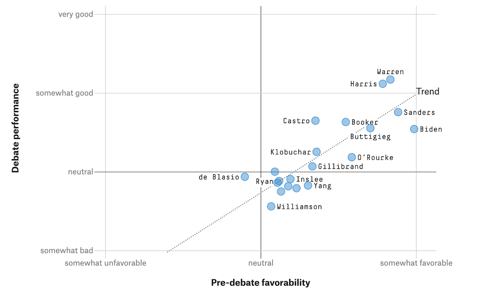

Wanting to be informed citizens (and knowing how to collect and analyze data), we decide to investigate how each candidate performed using various sources of data. 

#### Data journalism 

Journalists are a bit like statisticians in the sense that both get to ["*play in everyone's backyard*"](https://www.nytimes.com/2000/07/28/us/john-tukey-85-statistician-coined-the-word-software.html). Data journalism explicitly combines analysis and communication skills, which makes it a great place to look for tools and methods we can adapt to various projects.  

The best data journalism projects combine the rigor of numbers and math with an ability to **write something people want to read**. Data journalists like [Aleszu Bajak](https://twitter.com/aleszubajak), [Andrew Flowers](https://twitter.com/andrewflowers), and [Andrew Ba Tran](https://twitter.com/abtran) have been hugely influential in introducing R as a tool in the newsroom. 

Another reason journalism is an excellent resource for sharing your work is because journalists are trained to view the world differently than typical scientists or analysts. As the NBC investigative reporter [Andy Lehren](https://twitter.com/lehrennbc) describes in the text [Digital Investigative Journalism](https://www.palgrave.com/gp/book/9783319972824),

> *"Journalists can approach data differently than those more trained in computer sciences. Take, for instance, matching databases. Traditional IT managers compare data sets that were designed to talk with each other. Journalists may wonder if the payroll list of school teachers includes registered sex offenders."*

More brains are better than one when it comes to looking at data, and that's usually because of the different types of questions that come out of these brains. 

### Modern data 

To demonstrate how powerful R/RStudio can be, we are going to combine data from four different sources. Each source represents a different way to access data in using R + RStudio. 

1) The [`gtrendsR`](https://github.com/PMassicotte/gtrendsR) package for R gives us access to Google search terms and trends. We're going to use this to import data on Google searches for the candidates before and after the night of the debates.

2) [`rtweet`](https://rtweet.info/) package in R can be used to download Twitter data but takes a few steps to get set up. Fortunately, we've written a tutorial [here](http://www.storybench.org/get-twitter-data-rtweet-r/) and the package has excellent documentation (see [here](https://rtweet.info/articles/auth.html) and [here](https://rtweet.info/articles/intro.html)). 

3) There is a [Wikipedia](https://en.wikipedia.org/wiki/2020_Democratic_Party_presidential_debates_and_forums) page dedicated to the debates. We'll be scraping the tables with airtime for a candidate using the [`xml2`](https://cran.r-project.org/web/packages/xml2/index.html) and [`rvest`](https://rvest.tidyverse.org/) packages. 

4) Finally, we also have some data from voters on how they felt about each democratic candidate going into the debates stored in a [Google Sheet](http://bit.ly/2YEVASu) that we've accessed using the [`googlesheets`](https://cran.r-project.org/web/packages/googlesheets/vignettes/basic-usage.html) package in R (*you will need to copy this sheet into your Google drive to get this data set*). Another option is to use the [`datapasta`](https://cran.r-project.org/web/packages/datapasta/README.html) package and copy + paste these data into R. 


---

### Step 1: Github

In this example, we will be using an RStudio.Cloud environment to perform the analyses. All of these steps can be accomplished using the RStudio IDE on your local desktop, too. 

Head over to [Github and sign up](https://github.com/join) for a free account. 

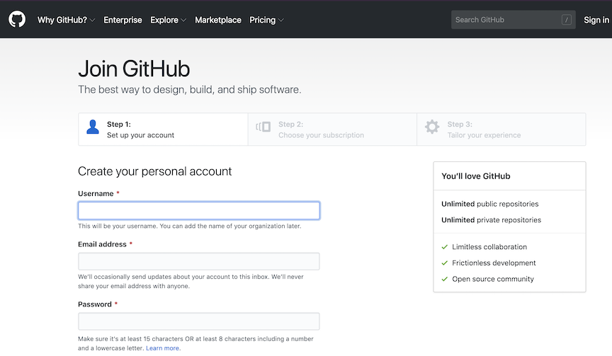

After you've completed the necessary forms (*remember you only need a free account!*), you should see a page with a message telling you "**You don't have any public repositories yet**". 

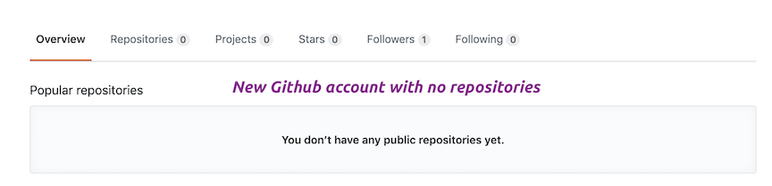

### Step 2: RStudio.Cloud

We will eventually create our repositories, but for now, let's head over and use our Github account to [sign into RStudio.Cloud](https://rstudio.cloud/). After we're all signed in, we will see the screen below:

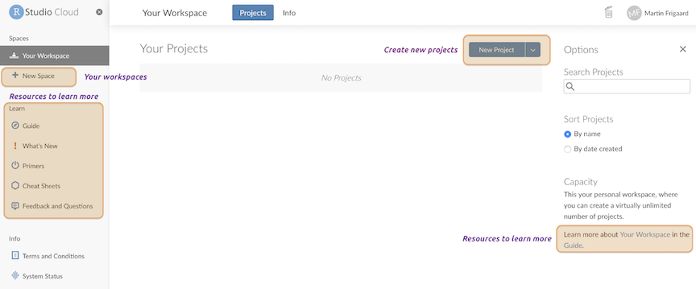

We've outlined the various resources, projects, and workspaces in the image above (we will go over each in more detail in a later section). For now, we are going to download a repository from Github and open it in RStudio.Cloud. 

### Step 3: Download a repository from Github

Most of the repos on Github are free for us to download and use. We can do this by clicking on the green **Clone or download** button and click **Download ZIP**.

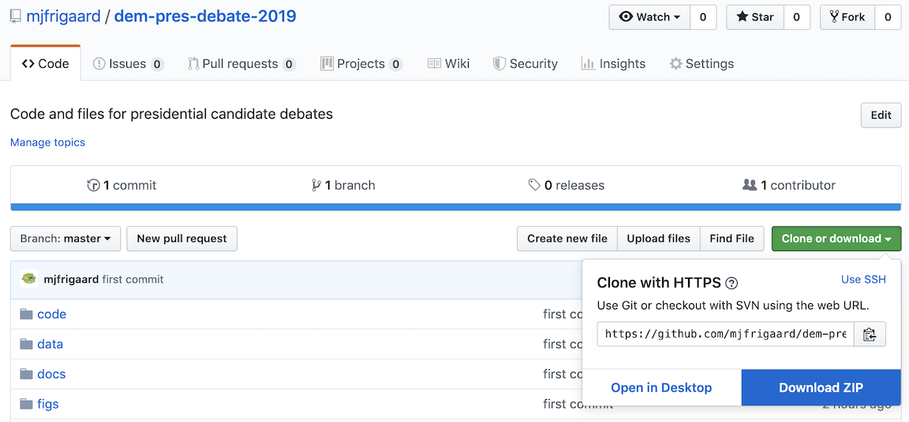

Pick a location on your computer to put your project and download the zipped Github folder. 

### Step 4: Upload files into RStudio.Cloud

Back in the RStudio.Cloud browser, we're going to click on the **New Project** button. It should display the RStudio IDE in the browser like the image below:


We are going to change the name of this **Untitled** project to **dem-pres-debate-2019**. The results should look like the image below:

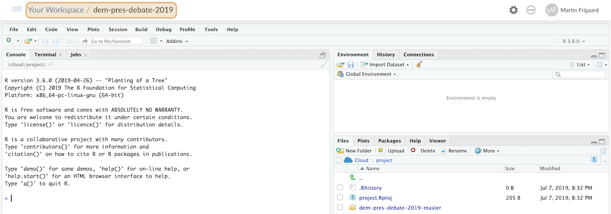

Look at the **Files** pane in the lower right corner and click on the **Upload** button, then click on **Choose files** and locate the recently downloaded zipped Github folder. Upload this file into the RStudio.Cloud project workspace. 


#### Accessing files in RStudio.Cloud

Uploading these files might take some time, but when everything is in RStudio.Cloud, we'll see the `dem-pres-debate-2019-master` folder in the **Files** pane. 


The unzipped the file we uploaded and created a folder called `dem-pres-debate-2019-master`. Unfortunately, it put this folder *inside* the `cloud/project` folder. We wanted to upload the *contents* of the `dem-pres-debate-2019-master` file into the `cloud/project` folder (and not the folder itself). 


We are going to use this opportunity to introduce a few command line tools. To do this, we'll be working from the **Terminal** pane in RStudio.Cloud. The next session will be a quick "crash course" in operating system terms, their differences, a few **Terminal** commands, why we still have these command line tools, and how to use them effectively. 

## The Command line: Unix and Windows

In 2007, Apple released its [Leopard](https://en.wikipedia.org/wiki/MacOS_version_history#Version_10.5:_%22Leopard%22) operating system that was the first to adhere to the [Single Unix Specification](https://en.wikipedia.org/wiki/Single_UNIX_Specification). I only introduce this bit of history to help keep the terminology straight. macOS and Linux are both Unix systems, so they have a similar underlying architecture (and philosophy). Most Linux commands also work on macOS. 

Windows has a command line tool called Powershell, but this is not the same as the Unix shells discussed above. The differences between these tools reflect the differences in design between the two operating systems. However, if you're a Windows 10 user, you can install a [bash shell command-line tool](https://www.windowscentral.com/how-install-bash-shell-command-line-windows-10). 

### Command line interfaces

The [command line interface](https://en.wikipedia.org/wiki/Command-line_interface) (CLI) was the predecessor to a GUI, and there is a reason these tools haven't gone away. CLI is a text-based screen where users interact with their computer's programs, files, and operating system using a combination of commands and parameters. This basic design might make the CLI sound inferior to a trackpad or touchscreen, but after a few examples of what's possible from on the command-line and you'll see the power of using these tools. 

### What am I getting out of this?

That is a fair question--being able to use the command line gives us more 'under-the-hood' access to any computer. We can use the command line to navigate our computer's files, install new programs or libraries, and track changes to files. It might seem clunky and ancient, but people keep this technology around because of it's 1) specificity and 2) modularity (also the two features that make Unix programs so powerful). What do we mean by this?

- [Specificity](https://www.dictionary.com/browse/specific) means each Unix command or tool does one thing very well (or [DOTADIW](https://en.wikipedia.org/wiki/Unix_philosophy#Do_One_Thing_and_Do_It_Well))

- [Modularity](https://en.wikipedia.org/wiki/Modularity#Table_1:_The_use_of_modularity_by_discipline[34]) is the ability to mix and match these tools together with 'pipes,' a kind of grammatical glue that allows users to expand these tools in seemingly endless combinations 

Having these skills have also made us more comfortable when we've had to interact with remote machines or different operating systems (Linux, per se). We will work through an example to demonstrate some of these features. 

### The Terminal (mac0S)

Below is an image of what the terminal application looks like on macOS. On Macs, the Terminal application runs a [bash shell](https://en.wikipedia.org/wiki/Bash_(Unix_shell)), which is why you can see the `bash -- 86x25` on the top of the window. Bash is a commonly used shell, but there are other options too (see [Zsh](http://zsh.sourceforge.net/), [tcsh](https://en.wikipedia.org/wiki/Tcsh), and [sh](https://en.wikipedia.org/wiki/Bourne_shell)). *Fun fact: `bash` is a pun for the `sh` shell: `b`ourne-`a`gain `sh`ell*.


The Terminal is an emulator application for Mac users. Terminal is available as an application under the **Applications** > **Utilities** > **Terminal**. 

### The Terminal (RStudio)

The Terminal pane is also available in RStudio under **Tools** > **Terminal** > **New Terminal**. 

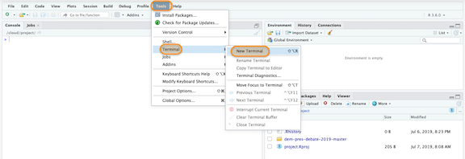

The **Terminal pane** will open in the same window as the **Console pane**.

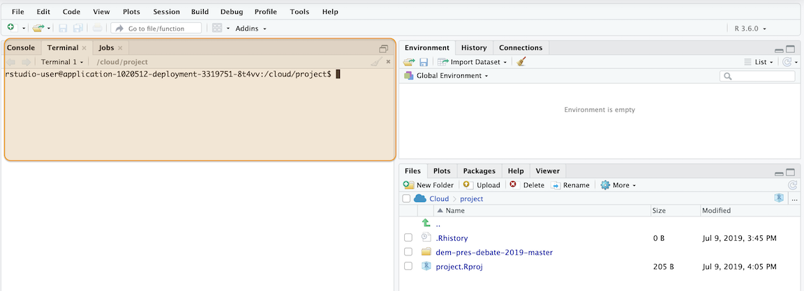

Now we will get some practice organizing our data science project using the command line.

## Good enough command line tools

**FAIR WARNING**--command line interfaces can be frustrating. Computers don't behave in ways that are easy to understand (that's why GUIs exist). Switching from a GUI to a CLI seems like a step backward at first, but the initial headaches pay off because of the gains we'll have in control, flexibility, automation, and reproducibility.

Here is a quick list of commonly used Terminal commands.

* **`pwd`** - `p`rint `w`orking `d`irectory 
* **`cd`** - `c`hange `d`irectories 
* **`cp`** - `c`o`p`y files from one directory to another 
* **`ls`** - `l`i`s`t all files
* **`ls -la`** - `l`i`s`t all files, including hidden ones
* **`mkdir`** - `m`a`k`e `dir`ectory 
* **`rmdir`** - `r`e`m`ove a `dir`ectory 
* **`cat`** - display a text file in Terminal screen
* **`echo`** - outputs text as arguments, prints to Terminal screen, file, or in a pipeline
* **`touch`** - create a few files
* **`grep`** - "`g`lobally search a `r`egular `e`xpression and `p`rint"
* **`>>`** and **`>`** - redirect output of program to a file (don't display on Terminal screen)
* **`sudo`** and **`sudo -s`** (**BE CAREFUL!!**) performing commands as **`root`** user can carry some heavy consequences.

### Command line skill #1: who is using what?

After downloading the files from Github, we've uploaded the zipped folder into the `Cloud/project`. In the RStudio.Cloud **Terminal** pane, we should see something like this: 

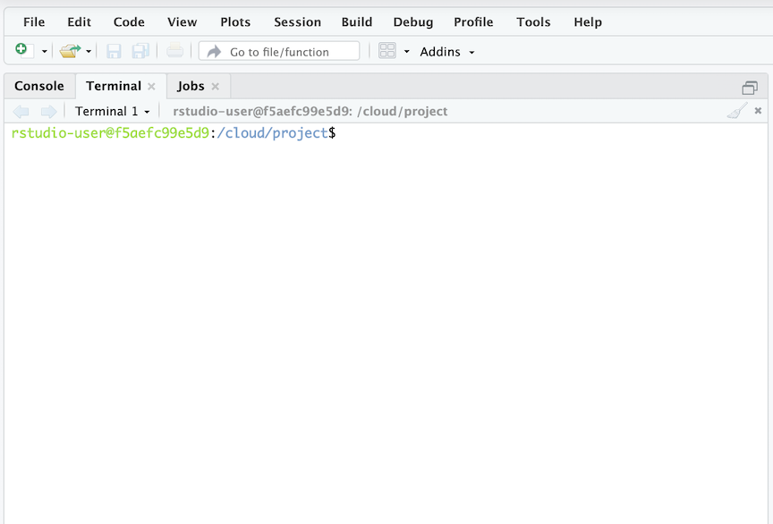

The figure above might look like gobbledygook at first, but command line interfaces have a recognizable pattern if we know what we're looking for:

- First, we can almost always expect some `user@machine` identifier to tell us who we're signed is as and on what machine

- Second, there's usually some way of displaying the **`home`** directory. In this case, it's the stuff between the colon (`:`) and the dollar sign `$` (**`/cloud/project`**)

Let's check a few things to help figure out what's going on. 

```sh
rstudio-user@f5aefc99e5d9:/cloud/project$ whoami
rstudio-user
```

We are the `rstudio-user` on this machine `f5aefc99e5d9`. The same information on a local MacBook laptop might look like this:

```sh
Martins-MacBook-Pro:~ martinfrigaard$ whoami
martinfrigaard
```

In this case, the machine information would be `Martins-MacBook-Pro` and the location to be the **`home`** directory `~` (the top level folder) for the user `martinfrigaard`. 

### Command line skill #2: where am I?

In the RStudio.Cloud **Terminal** pane, enter the print working directory (`pwd`) command:

*I've omitted everything preceding the prompt (`$`) for easier printing*

```sh
$ pwd
/cloud/project
```

`pwd` tells us where we are, otherwise known as the current working directory. Imagine the current working directory as the spot we're standing, and file path `/cloud/project` as the way back to our **`root`**  folder.

To get a sense of our surroundings lets list the files in `/cloud/project` using `ls`

```sh
$ ls
dem-pres-debate-2019-master  project.Rproj
```

We can see the folder (`dem-pres-debate-2019-master`) and the RStudio project file (`project.Rproj`). On a side note, it's always a good idea to pay attention to file extensions (`.Rproj`, `.R`, `.md`, etc.), because different files interact with the **Terminal** in different ways.

### Command line skill #3: moving around 

Now that we know where we are, and what files and folders are in here with us, we can start to stretch our legs and move around. Let's start by changing directories `cd` to the `dem-pres-debate-2019-master` folder, then check with `pwd`.

```sh
$ cd dem-pres-debate-2019-master
$ pwd
/cloud/project/dem-pres-debate-2019-master
```

Now we can check the files in this new directory with `ls`

```sh
$ ls
01-import.Rmd     README.Rmd  data
02-wrangle.Rmd    README.md   dem-pres-debate-2019.Rproj
03-visualize.Rmd  code        figs
```

The output from `ls` shows me there are four sub-folders in the `dem-pres-debate-2019-master` folder, two `.Rmd` files, one `.md`, and one `.Rproj` file.

Now that we've moved into this folder and looked around let's climb back out of it. We can always move up one folder by executing the `cd ..` command. 

```sh
$ cd ..
$ pwd
cloud/project
```

Let's move back into `dem-pres-debate-2019-master` using `cd` again, but this time, we will move up one folder using `cd /cloud/project`. 

```sh
$ cd /cloud/project
$ ls
dem-pres-debate-2019-master  project.Rproj
```

We can also check the files in `dem-pres-debate-2019-master` using `ls` and the folder name. 

```sh
$ ls dem-pres-debate-2019-master
01-import.Rmd     README.Rmd  data
02-wrangle.Rmd    README.md   dem-pres-debate-2019.Rproj
03-visualize.Rmd  code        figs
```

These commands tell **Terminal** to list the files in the folder at the end of the file path. 

#### Absolute vs. relative file paths 

An **absolute file path** starts at the root directory (`~` or `\`) and follows along the path, folder by folder, until it lands in the last folder or file.

**`/start/from/absolutely/where/i/tell/us`**

A **relative file path** starts at a folder but leaves the rest 'relative' to wherever that folder is located. 

**`start/from/wherever/we/put/me`**

#### Folder trees

Below is an example folder tree structure on a macOS. 


The **`root`** folder is the "uppermost" location of this machine's folders and files. In macOS, `root` is represented with a tilde (`~`). In Windows, the `root` folder is located with the forward slash (`/`). If we have the right privileges, we can log in as the `root` user, and the prompt will change from `$` to `#` (be careful here!)

When we log into a computer, we start in a **`home`** folder (usually with a shorter version of that user's full name they used to set up their operating system). The `home` folder is the typical "starting point" for that `user`'s folders and files. If we are working on macOS, this is the folder with a little house on it.

Depending on the operating system, this location starts with some standard default folders (`Desktop`, `Documents`, `Downloads`, and `Applications`)

#### Special case: Windows machines 

On Windows machines, the file path to `dem-pres-debate-2019-master` might look like this:

```sh
C:\Users\martinfrigaard\Documents\dem-pres-debate-2019-master
```

But we would need to write it like this: 

```sh
C:\\Users\\martinfrigaard\\Documents\\dem-pres-debate-2019-master
```

This odd way of writing file paths is because, in R, the `\` is called an escape character, so to navigate through folders we will have to use two backslashes `\\`. 

Below is the folder tree on RStudio.Cloud:


Now, this image might be about as clear as mud, but it'll make more sense when we start moving things around. 

### Command line skill #4: moving things around 

We're working in RStudio.Cloud, but the GUI representation of our folder structure won't be much different if we were working on our local laptop. 

Remember, we want to move the contents of `dem-pres-debate-2019-master` into `cloud/project`. The command for moving files from one place to another is `mv`, but we are going to add two options, `-v` and `*`. There are many other options for using `mv`, read about them [here](https://www.gnu.org/software/coreutils/manual/html_node/mv-invocation.html#mv-invocation). 

The sequence of commands we'll enter in the RStudio.Cloud Terminal are below:

```sh
$ mv -v dem-pres-debate-2019-master/* /cloud/project
```

You will see the following changes in **Terminal**:

```sh
'dem-pres-debate-2019-master/01-import.Rmd' -> '/cloud/project/01-import.Rmd'
'dem-pres-debate-2019-master/02-wrangle.Rmd' -> '/cloud/project/02-wrangle.Rmd'
'dem-pres-debate-2019-master/03-visualize.Rmd' -> '/cloud/project/03-visualize.Rmd'
'dem-pres-debate-2019-master/README.Rmd' -> '/cloud/project/README.Rmd'
'dem-pres-debate-2019-master/README.md' -> '/cloud/project/README.md'
'dem-pres-debate-2019-master/code' -> '/cloud/project/code'
'dem-pres-debate-2019-master/data' -> '/cloud/project/data'
'dem-pres-debate-2019-master/dem-pres-debate-2019.Rproj' -> '/cloud/project/dem-pres-debate-2019.Rproj'
'dem-pres-debate-2019-master/figs' -> '/cloud/project/figs'
```
And the following changes in the **Files** pane:

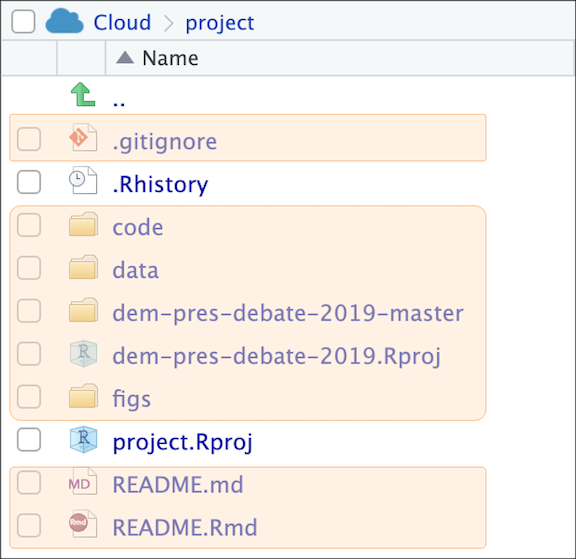

Now we know we've successfully moved all of the files. But we will want to get rid of the old folder, `dem-pres-debate-2019-master`. 

### Command line skill #5: Deleting things

To delete a folder, we can either use `rmdir` or `rm -Ri`. 

```sh
$ rm dem-pres-debate-2019-master -Ri
rm: descend into directory 'dem-pres-debate-2019-master'? 
```

This command is helpful because the `i` option tells **Terminal** to check with us before doing anything. Go ahead and enter `n` and try using `rmdir` to delete the `dem-pres-debate-2019-master` folder. 

```sh
$ rmdir dem-pres-debate-2019-master
rmdir: failed to remove 'dem-pres-debate-2019-master': Directory not empty
```

**Terminal** does it's best to save us from ourselves, but that's not always possible. As Doug Gwyn said, 

> "*Unix was not designed to stop its users from doing stupid things, as that would also stop them from doing clever things.*"

Well, what does `rmdir` actually do then? We can figure this out with `rmdir --help`

```sh
$  rmdir --help
```

This command will print some useful information about the `rmdir` command:

```sh
$  rmdir --help
Usage: rmdir [OPTION]... DIRECTORY...
Remove the DIRECTORY(ies), if they are empty.
# else omitted...
```

Now we know this is not the right tool for the job (the folder isn't empty), so we will use `rm -Ri dem-pres-debate-2019-master`. Each folder and file will prompt a question that needs a response before **Terminal** can delete anything. 

The **Terminal** pane should have the following contents when we're finished:

```sh
$ rm -Ri dem-pres-debate-2019-master
rm: descend into directory 'dem-pres-debate-2019-master'? y
rm: remove regular file 'dem-pres-debate-2019-master/.DS_Store'? y
rm: remove regular file 'dem-pres-debate-2019-master/.gitignore'? y
rm: remove directory 'dem-pres-debate-2019-master'? y
```

### Command line skill #6: Printing things

**Terminal** works very well with plain text format. For example, I can use `head` and the name of a file I want to see.

```sh
$ head README.md
```

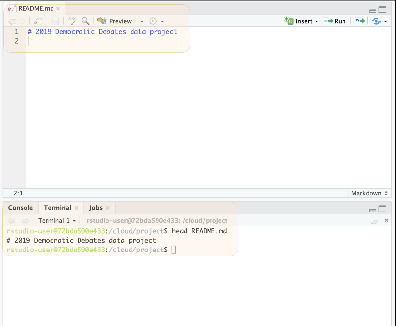

As we can see, this is the first few lines of the `README.md`. Markdown is a plain text format so that it will print clearly to the **Terminal** window. In addition to `head`, we can also use the `tail` command to view the bottom of the `README.md` file. 

What if we want to see all the contents in `README.md`? Well, before printing all the contents, we want to see how big the file is, and we can do that using `wc` (which stands for "word count").

```sh
$ wc README.md
# 462  1739 14415 README.md
```

The three numbers above are the number of lines (`462`), the number of words (`1739`), and the number of characters (`14415`). 

`wc` is telling us that `README.md` might be hard to read on the Terminal window. Fortunately, that's where the `less` command comes in.

```sh
$ less README.md
```

`less` will display the contents of `README.md`, but in a way that allows us to scroll through the file using the arrow keys. After we're done viewing the file, we can exit `less` using `q`.

Another option to print is `cat`, but this will print the entire contents to the **Terminal** window, so use `wc` first to see if that's the best choice. 

### Command line skill #7: Create things 

Sometimes we might need to create a new file and add some text to it. This skill is handy if we don't have to open any new applications.

The `touch` command will create a new file (`CHANGELOG.txt`), and `echo` will put the "some thoughts" on this file (which we can verify with `cat`).

```sh
$ touch CHANGELOG.txt
$ echo "some thoughts" > CHANGELOG.txt
$ cat CHANGELOG.txt
some thoughts
```

The `>` symbol tells **Terminal** to send `echo "some thoughts"` to `CHANGELOG.txt`. When we use `car`, we see these commands put "some thoughts" into the top lines of the new file, `CHANGELOG.txt`.

The `CHANGELOG.txt` file is for writing notes about changes to our project, but we should add a date to make sure they're listed chronologically. Unix has a `date` variable we can access using `$(date)` (which 'attaches' the output from the command date with "some thoughts"), so we will repeat the process above, but include today's date with `$(date)`.

```sh
$ echo $(date) "some thoughts" > CHANGELOG.txt
$ cat CHANGELOG.txt
```

In Unix systems, we can always access today's date with the `date` or `cal`.

### Command line skill #8: Combine things 

The commands above are great for creating new files and adding new text, but what if `CHANGELOG.txt` already exists and we wanted to add more thoughts to it? We can do this by changing the `>` symbol to `>>`.

```sh
$ echo $(date) "more thoughts" >> CHANGELOG.txt
$ cat CHANGELOG.txt
# Thu Jul 11 13:45:57 UTC 2019 some thoughts
# Thu Jul 11 13:49:42 UTC 2019 more thoughts
```

`>>` tells **Terminal** to append the output from `echo` to `CHANGELOG.txt` on a new line. 

Another powerful tool in the Unix toolkit is the pipe (`|`). The pipe can be used to 'direct' outputs from one command to another. For example, if I wanted to see how many R script files are in the `code` folder, I could use the following:

```sh
$ ls code | grep ".R" | less
```

We will leave the `grep` command for you to investigate with `--help` to figure out what's happening here.

#### Other command line stuff: homebrew

The bash shell on macOS comes with a whole host of packages we can install with [homebrew](https://brew.sh/), the "The missing package manager for macOS (or Linux)".

*(You won't be able to do this on RStudio Terminal, but there are other options we will list below)*

After installing homebrew, we recommend installing the [`tree`](https://brewinstall.org/Install-tree-on-Mac-with-Brew/) package.

```sh
$ # install tree with homebrew
$ brew install tree
$ # get a folder tree for this project
$ tree
```

The `tree` command gives us output like the folder tree below. 

```sh
├── 01-import.Rmd
├── 02-wrangle.Rmd
├── 03-visualize.Rmd
├── README.Rmd
├── README.md
├── code
├── data
│   ├── processed
│   └── raw
└── dem-pres-debate-2019.Rproj
```

Folder trees come in handy for documenting the project files (and any changes to them). 

## Command line recap

We've covered eight command line tools, and we hope you can see how these can be combined to create very efficient workflows and procedures. By tethering commands together, we can move inputs and outputs around with a lot of flexibility.

***

## Organizing your project files

As we saw above, the `tree` output gave us a printout of the project folder in a hierarchy (i.e. a tree with branches). 

The thing to notice is the separation of files into folders titled, `data`, `docs`, and `src` or `code`. We didn't choose these folder names at random--there is a way to organize a data science project. We recommend starting with the structure outlined by Greg Wilson et al. in the paper, ["Good Enough Practices for Scientific Computing"](https://swcarpentry.github.io/good-enough-practices-in-scientific-computing/#project-organization). If you already have an organization scheme, we still recommend reading at least [this section]((https://swcarpentry.github.io/good-enough-practices-in-scientific-computing/#project-organization)) of the paper--it's full of great information and links to other resources. 

## Getting more help

This section has been a concise introduction to command line tools, but hopefully, we've demystified some of the terminologies for you. The reason these technologies still exist is that they are powerful. Probably, you're starting to see the differences between these tools and the standard GUI software installed on most machines. [Vince Buffalo](http://vincebuffalo.org/blog/), sums up the difference very well,

> "*the Unix shell does not care if commands are mistyped or if they will destroy files; the Unix shell is not designed to prevent you from doing unsafe things.*"

The command line can seem intimidating because of its power and ability to destroy the world, but there are extensive resources available for safely using it and adding it to your wheelhouse. 

* [The Unix Workbench](https://seankross.com/the-unix-workbench/) 

* [Data Science at the Command Line](https://www.datascienceatthecommandline.com/)

* [Software Carpentry Unix Workshop](https://swcarpentry.github.io/shell-novice/) 

##### More on file organization, collaborating, and version control

*Fortunately, many articles have come out in the last few years with excellent, practical advice. I recommend reading these before getting started (you'd be surprised at the cacophony of files a single project can produce). We've listed a few 'must reads' below:*

- [working with data in spread sheets](https://www.tandfonline.com/doi/full/10.1080/00031305.2017.1375989), 
- [sharing data with collaborators](https://www.tandfonline.com/doi/full/10.1080/00031305.2017.1375987), 
- [how to name your files](https://speakerdeck.com/jennybc/how-to-name-files), and 
- [the importance of using version control](https://www.nature.com/news/democratic-databases-science-on-github-1.20719).

**Terminals vs. Shells:** Sometimes you'll hear the term "shell" thrown around when researching command line tools. Strictly speaking, the Terminal application is not a shell, but rather it *gives the user access to the shell*. Other terminal emulator options exist, depending on your operating system and age of your machine. Terminal.app is the default application installed on macOS, but you can download other options (see [iTerm2](https://www.iterm2.com/)). For example, the [GNOME](https://en.wikipedia.org/wiki/GNOME) is a desktop environment based on Linux which also has a Terminal emulator, but this gives users access to the Unix shell. 