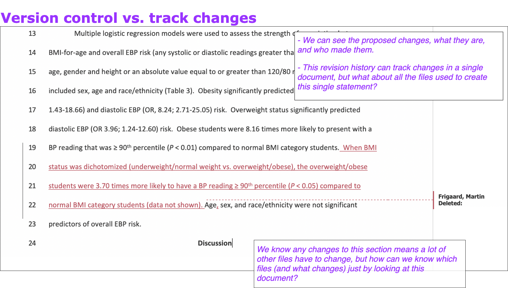
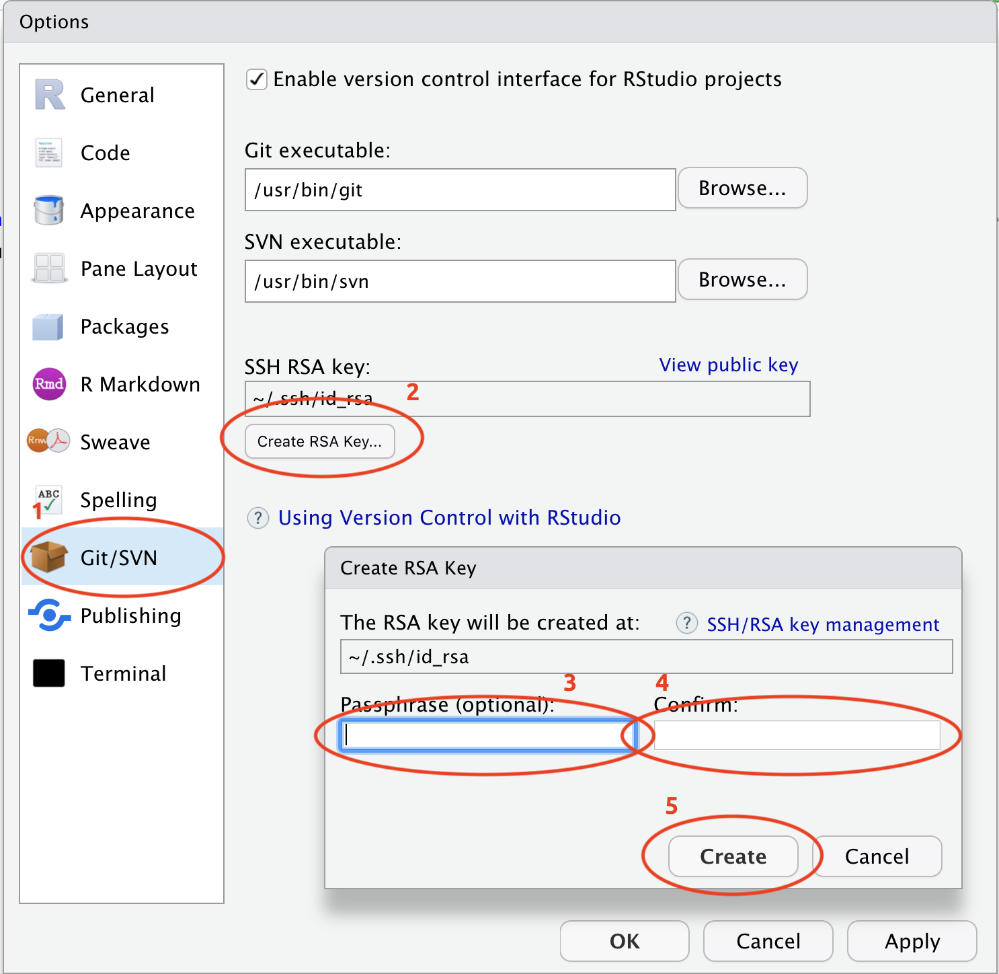

# Part 4: keeping track of the changes to your work

In the previous section, we introduced RStudio.Cloud, Github, and a few command line tools using the **Terminal**. If you're unfamiliar with these topics, please start there. This section will go over how to use these tools to track changes with version control, specifically Git, Github and RStudio.

## Tracing all your steps

> **Directions**: Show all your work. Indicate clearly the methods you use, because you will be scored on the correctness of your methods as well as on the accuracy and completeness of your results and explanations. - AP stats open questions, 2018

We were asked to show our work 

'Sharing your' work also means showing how your work has changed over time. For example, maybe you've used the Review tools in Mircosoft Word, or you've collaborated in a Google sheet document. Both examples are a type of version control, because you can choose 

The .docx is an earlier version of the manuscript, and there are some suggested changes to the results section below. 

The good thing about using tracked changes in .docx files is that we can see 1) what the differences are, 2) who suggested them, 3) the time/date of the proposed change, and 4) any comments about the change. 



Unfortunately, this only applies to a single document. When you're writing by committee (which is quite often in science), you know asking someone to change a single sentence can result in changes to dozens of files. Fortunately, this change is suggesting a deletion, so this is unlikely to result in generating additional analyses, tables, write-ups, etc. 


***

## Git

Git is a [version control system](https://en.wikipedia.org/wiki/Version_control) (VCS), which is somewhat like the **Tracked Changes** in Microsoft Word or the **Version History** in Google Docs, but extended to every file in a project. Git will help you keep track of your documents, datasets, code, images, and anything else you tell it to keep an eye on.

### Plain text + Git

Git prefers plain text files because, until recently, software engineers and app developers were using programs like Git to track their source code (which they write in plain text)--another reason we recommend keeping your documentation and notes in a plain text file. 

### Why use Git?

You will eventually ask yourself, *why am I subjecting myself to this--is there another way?*

We've included these sections to remind you that you're making a sound choice. 

Git has become the most common version control system used by [programmers](https://insights.stackoverflow.com/survey/2018#work-version-control). 


source: [StackOverflow Developer Survey Results](https://insights.stackoverflow.com/survey/2018#overview)

### Git is a useful way to think about making changes

Git is also a helpful way of thinking about the changes to your project. The terminology of Git is strange at first, but if you use Git long enough, you'll be thinking about your code in terms of 'commits,' 'pushes,' 'forks,' and 'repos.' 

As someone who analyzes data regularly, these concepts are also countable, which means you can quantify change and work in more interesting ways. 

## Installing Git

1. Download and install [Git.](http://git-scm.org/)     

2. Create a [Github](https://github.com/) account.  

### Configuring Git with `git config`

Git needs a little configuration before we can start using it and linking it to Github. There are three levels of configuration within Git, `system`, `user`, and `project.` 

1) For **system** level configuration use:  
`git config --system`

2) For **user** level configuration, use:  
`git config --global`

3) For **Project** level configuration use:  
`git config`

I'll set my Git `user.name` and `user.email` with `git config --global` so these I've configured these for all projects on my computer. 

```sh
$ git config --global user.name "Martin Frigaard"
$ git config --global user.email "mjfrigaard@gmail.com"
```

I can check what I've configured with `git config --list`. 

```sh
$ git config --list
```

At the bottom of the output, I can see the changes. 

```sh
user.name=Martin Frigaard
user.email=mjfrigaard@gmail.com
```

These are also stored in a `.gitconfig` file I can view using:

```sh
$ cat .gitconfig
[user]
    name = Martin Frigaard
    email = mjfrigaard@gmail.com
```

### Synchronize RStudio and Git/Github

[Jenny Bryan](https://jennybryan.org/) has created the online resource [Happy Git and GitHub for the useR](http://happygitwithr.com/) has all in the information you will need for connecting RStudio and Git/Github. I echo a lot of this information below (with copious screenshots).



Go to *Tools* > *Global Options* > ...

- 1. Click on *Git/SVN*  

- 2. Then *Create RSA Key...*  

- 3, 4, and 5. In the dialog box, enter a passphrase (and store it in a safe place), then click *Create*. 

The result should look something like this:

```sh
whoeveryouare ~ $ ssh-keygen -t rsa -b 2891 -C "USEFUL-COMMENT"
Generating public/private rsa key pair.
Enter file in which to save the key (/Users/username/.ssh/id_rsa):     
Enter passphrase (empty for no passphrase): 
Enter same passphrase again: 
Your identification has been saved in /Users/username/.ssh/id_rsa.
Your public key has been saved in /Users/username/.ssh/id_rsa.pub.
The key fingerprint is:
SHA483:g!bB3r!sHg!bB3r!sHg!bB3r!sH USEFUL-COMMENT
The key's randomart image is:
+---[RSA 2891]----+
|      o+   . .   |
|     .=.o . +    |
|     ..= + +     |
|      .+* E      |
|     .= So =     |
|    .  +. = +    |
|   o.. = ..* .   |
|  o ++=.o =o.    |
| ..o.++o.=+.     |
+----[SHA483]-----+
```

Now I need to go back to Terminal and store this `SSH` from RStudio. 

## Adding a key SSH in Terminal

In the Terminal, I enter the following commands. 

```sh
$ eval "$(ssh-agent -s)"
```

The response tells me I'm an `Agent`.

```sh
Agent pid 007
```

Now I want to add the *SSH RSA* to the keychain. There are three elements in this command: the `ssh-add`, the `-K`, and `~/.ssh/id_rsa`. 

* The `ssh-add` is the command to add the *SSH RSA*    

* The `-K` stores the passphrase I generated, and    

* `~/.ssh/id_rsa` is the location of the *SSH RSA*.  

```sh
$ ssh-add -K ~/.ssh/id_rsa
```

Enter the passphrase and then have it tell me the identity has been added.  

```sh
Enter passphrase for /Users/username/.ssh/id_rsa: 
Identity added: /Users/username/.ssh/id_rsa (username@Martins-MacBook-Pro.local)
```

## Create the `~/.ssh/config` file

On macOS-Sierra 10.12.2 or higher requires a `config` file. I can do this using the Terminal commands above. 

First, I move into the `~/.ssh/` directory. 

```sh
$ cd ~/.ssh/
```

Then I create this `config` file with `touch`

```sh
$ touch config
# verify 
$ ls
config        id_rsa        id_rsa.pub
```

I use `echo` to add the following text to the `config` file.

```sh
Host *
 AddKeysToAgent yes
 UseKeychain yes
```

Recall the `>>` will send the text to the `config` file.

```sh
# add text 
$ echo "Host *
>  AddKeysToAgent yes
>  UseKeychain yes" >> config
```

Finally, I can check `config` with `cat`

```sh
# verify 
$ cat config
Host *
 AddKeysToAgent yes
 UseKeychain yes
```

Great! Now I am all set up to use Git with RStudio. In the next section, we will move the contents of a local folder to Github. 

### Writing = thinking with words

At the very minimum, a researcher should be able to communicate 1) the problem they found, 2) their proposed solution, 3) what they did, and 4) what they observed. Each of these steps has too much detail for pointing and clicking. 

Every area of research has it's own jargon and acronyms, and it can be challenging to explain complicated concepts in plain language. But we've found doing this is worth the effort because the process allows you to sort through your thoughts on a topic, develop new analogies, and make new connections. 

I highly recommend the article [The Science of Science Writing](https://www.americanscientist.org/blog/the-long-view/the-science-of-scientific-writing) for anyone looking to improve their write technical writing abilities. I received some excellent advice along the way about prose, "*favor brevity above all else, but never sacrifice precision or clarity just to rush to the point*."