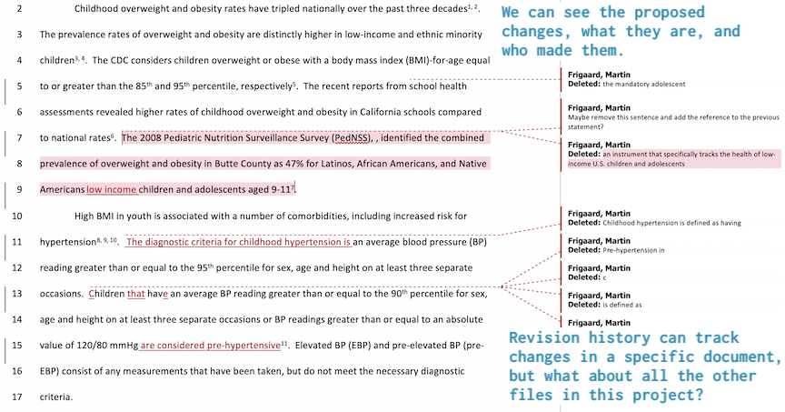
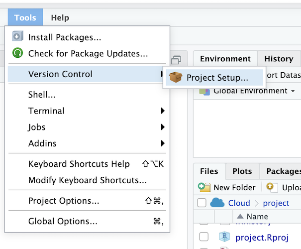
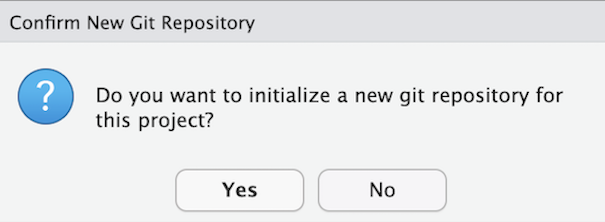
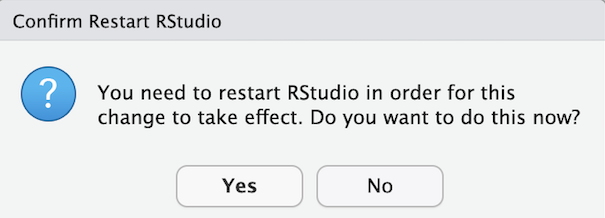
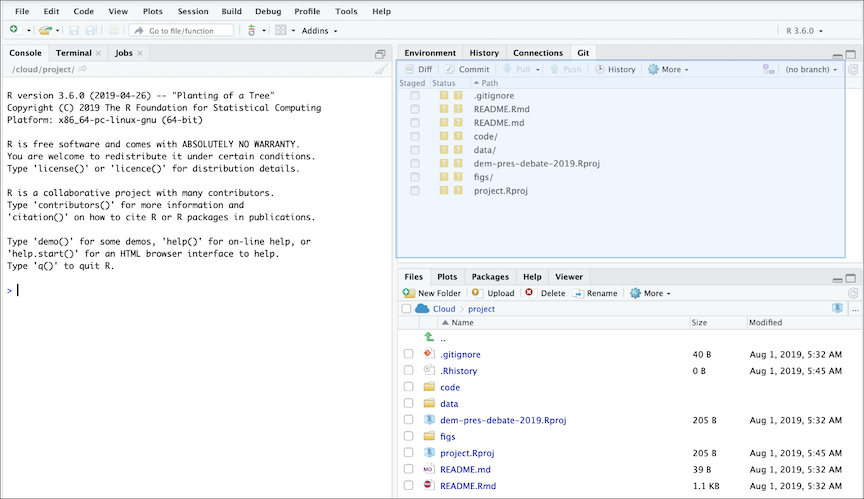

# Part 4: Keep track of changes with version control

In the previous sections, we've covered using **Terminal** in the RStudio. If you're unfamiliar with these topics, please start there. This section will include tracking changes with version control, specifically Git, Github, and RStudio.

## Tracing our steps 

'Sharing your' can take a few forms. You can finish a product, then share your work for people to see and use in what they're doing.  
Another option is to share what we're currently working on in a way that allows other people can collaborate with us along the way.

To accomplish the second option, we need a means showing how our work has changed over time. For example, maybe we've used the 'Review' tools in Microsoft Word, or we've collaborated in a Google sheet document. Both are types of [version control](https://en.wikipedia.org/wiki/Version_control) because they're a formal system of managing changes to information over time. 

Consider a typical lifespan of a `.docx` file:

```
project/
└── product/
        ├── draft-1.docx
        ├── draft-2.docx
        ├── draft-3-mf.docx
        ├── draft-3-mk.docx
        ├── final.docx
        ├── final-final.docx
        └── no-really-final.docx
```

This is the inevitable progression of a document that requires collaboration ***and*** iteration. Revision features are great when we're using a single file, and that file should not be altered until changed have been approved/rejected. But what about all the supporting files that are needed to create that report or analysis in our Word documents? Every project or product we've ever worked on required more than a single Word document. 



The file displayed above is an early version of a peer-reviewed manuscript. In this situation, a coauthor has suggested some changes to our results section. While making changes, the document is essentially 'locked' until the next coauthor can review. This is a serious limitation when a project involves many files, and those files require frequent updates, or *versions*. 

### Enter version control 

Sound version control systems let us see four important aspects of change:

1. What the differences are (*i.e. the actual changes*), 
2. Who made the changes (*this allows us to separate our changes from everyone else's*), 
3. The time/date of the proposed changes (*without this, it's impossible to know what order the changes took place in*), and 
4. Any comments about the change (*the 'how and why' for the changes*)

Unfortunately, tracked changes in Microsoft Word only applies to a single document at a time. When we're working collaboratively on a project (which is quite often), we know asking someone to change a single sentence can result in changes to dozens of files. That's why we need a way to track changes across multiple files in a project.

***

## Git

Git is a [version control system](https://en.wikipedia.org/wiki/Version_control) (VCS), which is somewhat like the *Tracked Changes* in Microsoft Word or the *Version History* in Google Docs, but extended to every file in a project. Git will help us keep track of our documents, datasets, code, images, and anything else we tell it to keep an eye on.

### Why use Git?

You will eventually ask yourself, *why am I subjecting myself to this--is there another way?*

We've included these sections to remind you that you're making a sound choice. 

### Plain text + Git

Software developers keep track of their code with Git. We learned in the last chapter that most code files get kept in plain text, so Git plays well with plain text.

### Everyone else is doing it

Git has become the most common version control system used by [programmers](https://insights.stackoverflow.com/survey/2018#work-version-control). 


source: [StackOverflow Developer Survey Results](https://insights.stackoverflow.com/survey/2018#overview)

### Git is a useful way to think about making changes

Git is also a helpful way of thinking about the file changes in our project. The terminology of Git is strange at first, but after we use Git long enough, we'll start thinking about our code in terms of 'adds', 'commits,' 'pushes,' 'pulls,' and 'repos.' We'll go over these terms in-depth in the next chapter.

As someone who analyzes data regularly, we can start to think about how to quantify these concepts, too. For example, we can count changes to files, or lines of code, or even measure how changes to code in one file can alter what other files do. All of this is exciting because it means we can start to quantify the changes we make, and we begin to think about our work in exciting new ways. 

## Setting up Git

If you'd like to install Git on your local machine, you can do so following these two links:

1. Download and install [Git.](http://git-scm.org/)     

2. Create a [Github](https://github.com/) account.  

In RStudio.Cloud, we want to add version control to this project from *Tools* > *Version Control* > *Project Setup* 




From here, we will see the *Git/SVN* option on the sidebar, where we will select *Git* from the drop-down list next to *Version control system*. After this, RStudio.Cloud will ask if we want to *initialize a new git repo*, which we do. 



Then we will be asked if we are OK to restart RStudio.Cloud (and we are).



After restarting the RStudio IDE, we should see the **Git** tab in one of the panes. 



### Configuring Git

Git needs a little configuration before we can start using it and linking it to Github. There are three levels of configuration within Git, `system`, `user`, and `project.` 

1) For **system** level configuration use:  
`git config --system`

2) For **user** level configuration, use:  
`git config --global`

3) For **Project** level configuration use:  
`git config`

We'll set our Git `user.name` and `user.email` with `git config --global` so these are configured for all projects. 

```sh
$ git config --global user.name "Martin Frigaard"
$ git config --global user.email "mjfrigaard@gmail.com"
```

We can check what we've configured with `git config --list`. 

```sh
$ git config --list
```

At the bottom of the output, we can see the changes. 

```sh
user.name=Martin Frigaard
user.email=mjfrigaard@gmail.com
core.repositoryformatversion=0
core.filemode=true
core.bare=false
core.logallrefupdates=true
```

On our local machine, the `user.name` and `user.email` are in the `.gitconfig` file.

We can view this using:

```sh
$ cat .gitconfig
[user]
    name = Martin Frigaard
    email = mjfrigaard@gmail.com
```

### Synchronizing RStudio and Git/Github

[Jenny Bryan](https://jennybryan.org/) has created the online resource [Happy Git and GitHub for the useR](http://happygitwithr.com/) has all the information anyone would need for connecting RStudio and Git/Github. We echo a lot of this information below (with copious screenshots). 

The first step is setting up the RSA Key and passphrase.

Go to *Tools* > *Global Options* > ...

- 1. Click on *Git/SVN*  

- 2. Then *Create RSA Key...*  

- 3, 4, and 5. In the dialog box, enter a passphrase (and store it in a safe place), then click *Create*. 


The result should look something like this:


Or like this on our local machine.

```
whoeveryouare ~ $ ssh-keygen -t rsa -b 2891 -C "USEFUL-COMMENT"
Generating public/private rsa key pair.
Enter file in which to save the key (/Users/username/.ssh/id_rsa):     
Enter passphrase (empty for no passphrase): 
Enter same passphrase again: 
Your identification has been saved in /Users/username/.ssh/id_rsa.
Your public key has been saved in /Users/username/.ssh/id_rsa.pub.
The key fingerprint is:
SHA483:g!bB3r!sHg!bB3r!sHg!bB3r!sH USEFUL-COMMENT
The key's randomart image is:
+---[RSA 2891]----+
|      o+   . .   |
|     .=.o . +    |
|     ..= + +     |
|      .+* E      |
|     .= So =     |
|    .  +. = +    |
|   o.. = ..* .   |
|  o ++=.o =o.    |
| ..o.++o.=+.     |
+----[SHA483]-----+  
```

Great! We need to go back to Terminal and store this `SSH` from RStudio. 

### Adding a key SSH in Terminal

In the Terminal, we enter the following commands. 

```sh
$ eval "$(ssh-agent -s)"
```

The response tells us we're an `Agent`.

```sh
Agent pid 007
```

Now we want to add the *SSH RSA* to the keychain. There are three elements in this command: the `ssh-add`, the `-K`, and `~/.ssh/id_rsa`. 

* The `ssh-add` is the command to add the *SSH RSA*    

* The `-K` stores the passphrase we generated, and    

* `~/.ssh/id_rsa` is the location of the *SSH RSA*.  

```sh
$ ssh-add -k /home/rstudio-user/.ssh/id_rsa
```

Enter the passphrase, and then git should tell us the identity has been added.  

```sh
Enter passphrase for /home/rstudio-user/.ssh/id_rsa:
Identity added: /home/rstudio-user/.ssh/id_rsa (/home/rstudio-user/.ssh/id_rsa)
```

### Create the `.ssh/config` file

Most operating systems require a `config` file. We can do this using the Terminal commands above. 

First, I move into the `.ssh/` directory. 

```sh
$ cd /home/rstudio-user/.ssh
```

Then we create this `config` file with `touch`

```sh
$ touch config
# verify 
$ ls
config        id_rsa        id_rsa.pub
```

We use `echo` to add the following text to the `config` file.

```sh
Host *
 AddKeysToAgent yes
 UseKeychain yes
```

Recall the `>>` will send the text to the `config` file.

```sh
# add text 
$ echo "Host *
>  AddKeysToAgent yes
>  UseKeychain yes" >> config
```

Finally, we can check `config` with `cat`

```sh
# verify 
$ cat config
Host *
 AddKeysToAgent yes
 UseKeychain yes
```

Great! Now I am all set up to use Git with RStudio. In the next section, we'll extend our Github skills by moving the contents of a local folder to Github. 

### A quick git terminology overview 

Below are some commonly used terms/commands associated with Git and Github.

***init*** - the command `git init` is used to initialize a new git repository (it tells Git to start tracking changes in this directory).

***status*** - `git status` will tell you what you've done and what is happening. You can check the status of a git repository with `git status` (use this liberally). 

***add*** - For Git to keep track of the changes we make to files, we have to tell Git which files to pay attention to. We can do this using `git add`. The `git add -A` tells git to stage *ALL* the files that are in an initialized repo. 

***commits*** - commits are the staple in Git/Github the toolchain. Commits are what Git uses to track the changes you've made to files or folders. Commits are confusing because they can be nouns ("I'm creating a commit with these changes") or verbs (I am going to commit these changes to my project"). 

To quote David Demaree, 

> *  "Semantically, each commit represents a complete snapshot of the state of your project at a given moment in time; its unique identifier serves to distinguish that state from the way the files in your project looked at any other moment in time."*

***repository*** - repos are the files and folders in your project and all the changes you make while working on them. On your local computer, a repository can exist in a folder you initialize a repository in (see below). On Github, a repo has the following structure: 

`https://github.com/<username>/<repository_name>`. 

***clone*** - this command copies all files and changes into a new working directory from a remote, initializes (`init`) a new Git repository, and it adds a remote called `origin`.

***diff*** - this is how Git shows differences between files. Read more about how changes are formatted/displayed [here.](https://www.git-tower.com/learn/git/ebook/en/command-line/advanced-topics/diffs)

#### More on Git and Github and data organization

*Fortunately, many articles have come out in the last few years with excellent, practical advice on organizing data analysis projects. I recommend reading these before getting started (you'd be surprised at the cacophony of files a single product can produce). We've listed a few 'must-reads' below:*

- [the importance of using version control](https://www.nature.com/news/democratic-databases-science-on-github-1.20719)

- [sharing data with collaborators](https://www.tandfonline.com/doi/full/10.1080/00031305.2017.1375987)

- [how to name your files](https://speakerdeck.com/jennybc/how-to-name-files)


