# Part 5: RStudio.Cloud

In this chapter, we're going to introduce R packages (the source of R's power), how to quickly navigate RStudio's panes, and more benefits of working in Rmarkdown/plain text.

***

## What have we done so far?

The last few chapters covered a lot, so let's do a quick recap:

*1) We created RStudio.Cloud and Github accounts* 

*2) We downloaded a repository from Github onto our local computer.*

*3) We uploaded the repository files into RStudio.Cloud, then moved the files into the `project` folder using the Terminal.*  

*4) We added and committed these changes to our local Git repository using RStudio's Git integration.*

Now we have a project folder in RStudio with the following structure: 

```sh
project/
    ├── CHANGELOG.txt
    ├── README.Rmd
    ├── README.md
    ├── code/
    ├── data/
    ├── dem-pres-debate-2019.Rproj
    ├── figs/
    └── project.Rproj
```

There are three folders in this project: `code/`, `data/`, and `figs/`. We will go over the contents of these folders and files in more depth in the following sections. First, we will cover some tips for navigating RStudio's various panes. 

We covered the **Terminal** and **Git** panes in chapters three and four. Now that we've run some code, we will go over RStudio's other panes.

### Packages pane

Packages are a vital part of the R ecosystem. R packages are collections of functions and objects collected together with a specific purpose. When we started our RStudio.Cloud session, a few packages get loaded automatically. R users typically refer to these default packages and functions as "base R." Base R packages cover a wide range of statistical procedures and visualizations. Unfortunately, base R can also be challenging to learn because of its inconsistent syntax and style conventions. 

A list of the packages and their descriptions are available in the **Packages** pane. We've installed the packages we will use with the `00.1-inst-packages.R` file. If we wanted to, we could also install more packages using *Install* icon, and then enter its name. We don't recommend this, though, because you'll want a record of the packages you used in the project. 

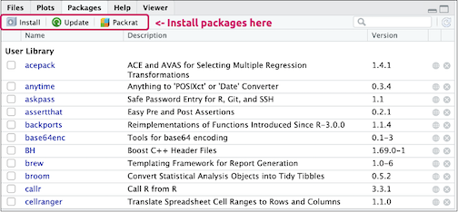

You can click on the names of each package to learn more about them and load them into the RStudio session. One of the great things about R is the many user-created packages that greatly expand the number of functions. At the time of this writing, R users have contributed [14638](https://cran.r-project.org/web/packages/) packages available for us to download and use. 

#### `tidyverse` packages

R is open-source software, so users can write packages to expand and enhance its functionality. The [tidyverse](https://cran.r-project.org/web/packages/tidyverse/vignettes/manifesto.html) is a collection of R packages lead by RStudio's Chief Scientist, [Hadley Wickham](http://hadley.nz/). These package have been developed for doing data science. All `tidyverse` packages share a few similar underlying principles that allow them to work well together. 

Unlike base R, the `tidyverse` also a consistent grammar and syntax, which makes it easier to read and write. You can learn more about this syntax in the [R for Data Science](https://r4ds.had.co.nz/) text or on the [tidyverse webpage](https://www.tidyverse.org/). 

So far, the code we've run comes from base R. Going forward; we're going to use various packages from the `tidyverse.`


### Files pane

The **Files** pane displays the files and folders in this project. The file path is visible in the top portion of the pane, beneath the options for *New Folder*, *Upload*, *Delete*, *Rename*, and *More*. An image of this folder's contents is below:


The script to install the packages for this project (`00.1-inst-packages.R`) is in the `code` folder. Navigate to this folder either by clicking on the file path (`Cloud/project/code`). 

We can see `00.1-inst-packages.R` and other scripts are in the **Files** pane. We now know that because the `.R` files are plain text files, so they have code for the computer to execute, and comments for a human to tread. 

In R, we can create comments with a preceding `#` on any line. 

```r
# this is a comment
```

When we click on the `00.1-inst-packages.R` file, we can see it open in the **Source** pane. RStudio.Cloud is giving us a few hints about the packages referenced in the .R file. We're being told we need to install a package before moving forward:

> ***Package devtools required but is not installed.*** 

RStudio gives us a choice to ***Install*** or ***  Don't Show Again***, and we'll click on the ***Install*** option. Packages vary in the length they take to install, but we'll wait patiently for `devtools` package finish downloading. After the install has finished, you should see the `>` prompt in the **Console** pane. 


### Source pane

When working in RStudio, sometimes we'll write some code, and want to run that code and see if it works. To do this, we can highlight the rest of the script with the mouse cursor (lines 14-22), then hold down `ctrl` or `cmd` and hit `enter` or `return`. 


After the installation has completed for all the packages, we'll see the following in the **Console** pane.


Back in the **Files** pane, we can navigate back to the `project/` folder by clicking on the path above the files. 

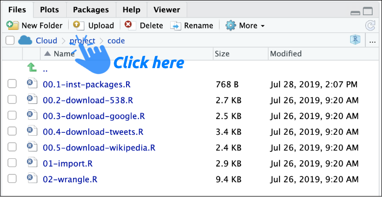

We can see the `README.Rmd` file in the **Files** pane in the lower right corner. We'll click on it, so the file opens in the **Source** pane (see image below). 


We've highlighted the pane of RStudio that's displaying the `README.Rmd` file. If you see another prompt to install additional packages, click on *Install* and wait for the installation to finish. As you can see, this is a relatively small area in the IDE. Working in a tiny corner of the screen can be hard, but fortunately, RStudio gives us the ability to expand any pane into a fullscreen view. In this case, we'll zoom in the `README.Rmd` file.

If we want to focus on the **Source** pane, and can zoom in using `shift`+`control`+`1`.


As soon as you click `1`, your screen should expand to look like the image below:


Since the **Source** pane is where we'll write most of our code, it's also the pane we are spending most of our time. We've seen that's where our files open, so being able to focus on the area quickly is helpful. 

### Console

The **Console** is probably the second most used area in RStudio (it displays most of the output), so we also should know how to zoom in on this pane. To focus on this pane, we'll use `shift`+`control`+`2`.


What if we accidentally zoom into the wrong pane? We can easily resize the IDE to its original position by holding down the `shift`+`control` buttons, then clicking either number again. Combining those keys should return the IDE to its default arrangement.

#### Working in one pane 

We can move through every pane in RStudio by holding down `shift`+`control` and clicking on numbers `1`-`9`. Go ahead and do that now.

If you ever forget which number corresponds to which pane, you can always find them under *View* > *Panes* (see image below)


### Help 

Inevitably, we'll write something that doesn't work. When things aren't working (try to remain calm), you're going to want a place to start looking for solutions. The **Help** pane is accessible in the lower right corner of the IDE. 

If it's hard to read the **Help** pane, you can adjust the size by following the instructions in the image below:


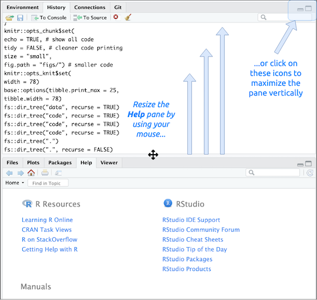

#### Working in two panes

Sometimes we'll want to do our work in more than one pane at a time. For example, what if we're working in the **Source** pane, but have a question about a function? We can get answers to a lot of problems using RStudio's internal **Help** pane. After resizing the **Help** pane, we should see the following layout in our IDE. 


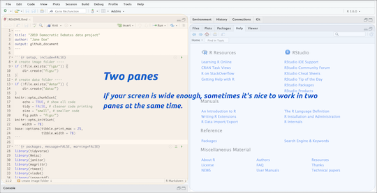


### History and Plots

The **History** panel has the code we've previously run and can be sent directly to the **Console** or **Source** panes.

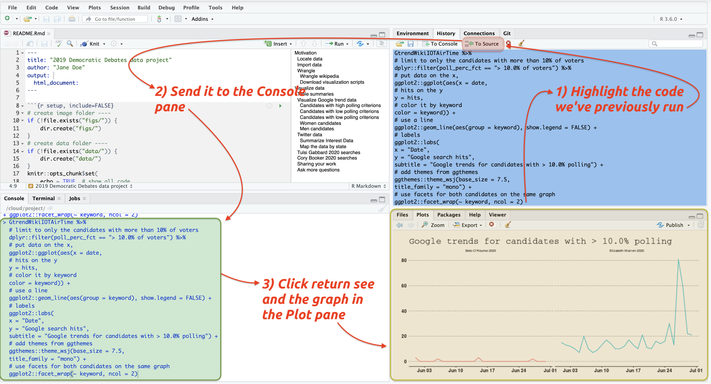 

The **History** comes in handy when we're looking to reproduce a plot without having to run an entire script.

### Jobs and Connections 

The **Jobs** pane allows us to run multiple jobs at the same time. For example, if we wanted to run the `01-import.R` and then `02-wrangle.R`, we could do this using the **Jobs** pane. See the image below:

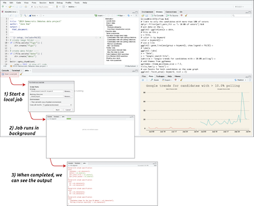 

The **Connections** pane tells us what databases we're connected to, and their connection status. This pane require us to cover some advanced topics, but nothing are too complicated if you've been using RStudio and working with data for awhile. Check out more information [here](https://db.rstudio.com/rstudio/connections/). 

## Recap on RStudio panes

As we pointed out earlier, RStudio is like a workbench built around different panes. Each pane serves a specific purpose and being able to move between them allow us to work quickly and efficiently.

**Keyboard shortcuts are time-savers**. Not having to switch from keyboard to mouse over and over again keeps us focused on the task at hand. 

***

## Where should we write code?

You might be wondering why we have provided you with both `.R` scripts and `.Rmd` files. Well, we want to show you a few options for documenting your work in RStudio. The two sections below outline two standard options (but these are by no means the only way to work with these tools!)

### Option 1) everything goes in scripts 

`rmarkdown` is a relatively new package, so early `R` users didn't have an option to put everything in `.Rmd` files (we fit into this group). We have found this approach is excellent when you're reasonably confident about the project. If you're familiar with the data files, wrangling techniques, visualizations, and products, you can quickly outline the scripts and predetermine their names and contents.

For example, the folder tree of our code folder tells us what we should expect from this project. 

```sh
code
    ├── 00.1-inst-packages.R
    ├── 00.2-download-538.R
    ├── 00.3-download-google.R
    ├── 00.4-download-tweets.R
    ├── 00.5-download-wikipedia.R
    ├── 01-import.R
    └── 02-wrangle.R
```

We can see there are seven script files, each one with a numerical prefix. These prefixes tell us the order to run the code files, too. The file names also tell us what each script does (`download`, `import`, `wrangle`, etc.). 

The layout above is an example of how to organize a set of `.R` scripts that follow the guidelines mentioned in previous chapters. These naming conventions make it easier for newcomers to the project to get oriented to its contents.

### Option 2) everything goes in the Rmarkdown 

The second option is well illustrated in the [tweet](https://twitter.com/polesasunder/status/953624238266646529?s=20) below by Andrew MacDonald:

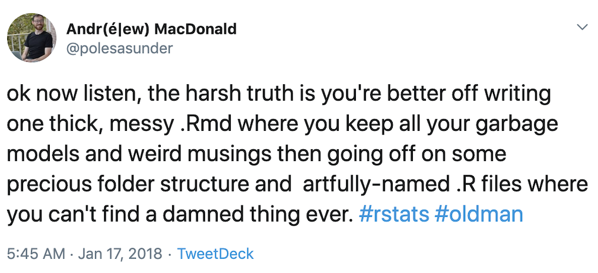

In our experience, this accurately captures the reality of data projects (especially in the beginning stages). Throwing everything into the Rmarkdown file gives us a lot more flexibility by allowing us to add multiple types of content. 

All that being said, it's always good practice to come back and revise the `README.Rmd` document, so it's contents outline all steps in the analysis thoroughly. We consider documentation to be a form of communication with our future selves, and this typically involves clearly describing each step. During the revision, we might also break down each of the chunks into individual scripts. We can also add more details to the text portions, with links to external content, etc. 

We've found each project usually starts at a bit of a sprint, so we try to capture as much code and content in `.Rmd` files early. We can focus on trimming it down later, but the flexibility of markdown combined with functional code is better than limiting ourselves to code and comments `.R` script files. 

*** 

## Rmarkdown

We're going to move forward assuming we're documenting everything in a `README.Rmd` file. In the next few sections, we'll add various components to the `README.Rmd` we've placed in the project folder. 

If you're ever wondering how to outline your `README.Rmd` file, the figure from [R for Data Science](https://r4ds.had.co.nz/introduction.html) isn't a bad place to start. 

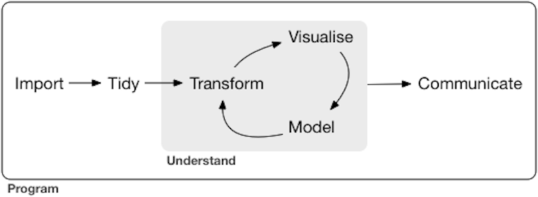

### Rmarkdown step 1: create a YAML header 

At the top of the `README.Rmd` document, the first thing we see is what's called the "`YAML` header", and it's going to tell RStudio.Cloud the file's `title`, the `author`, and what the `output` file will be. 


The `YAML` header always goes at the top of the `README.Rmd` file, between two sets of three dashes:

```yaml

---
title: "2019 Democratic Debates data project"
author: "Jane Doe"
output: github_document
---

```

People typically use `YAML` in configuration files, which makes it perfect for setting some default options in our `README.Rmd` document. Read more about YAML headers in the [RMarkdown book](https://bookdown.org/yihui/rmarkdown/) and on the [YAML website](https://yaml.org/). `YAML` actually stands for "[YAML Ain't Markup Language](https://en.wikipedia.org/wiki/YAML)." 

We can change the `output` argument to [`html_document`](https://bookdown.org/yihui/rmarkdown/html-document.html), [`word_document`](https://bookdown.org/yihui/rmarkdown/word-document.html), or [`pdf_document`](https://bookdown.org/yihui/rmarkdown/pdf-document.html) and create a different file from the plain text we are going to be working in. For now, we are going to focus on the [`github_document`](https://rmarkdown.rstudio.com/github_document_format.html) output. 

### Rmarkdown step 2: know the Knit output options 

Another benefit of working in the `README.Rmd` document is that when we combine it with the powerful [`knitr` package](https://yihui.name/knitr/), we drastically extend the kind of files we can produce from our analysis. `Knitr` follows a principle of [literate programming put forth by Donald E. Knuth](https://www-cs-faculty.stanford.edu/~knuth/lp.html).

> "Let us change our traditional attitude to the construction of programs: Instead of imagining that our main task is to instruct a computer what to do, let us concentrate rather on explaining to humans what we want the computer to do." 
> - Donald E. Knuth, Literate Programming, 1984

The **Knit** button will render the plain text `.Rmd` document into a variety of different output options.

 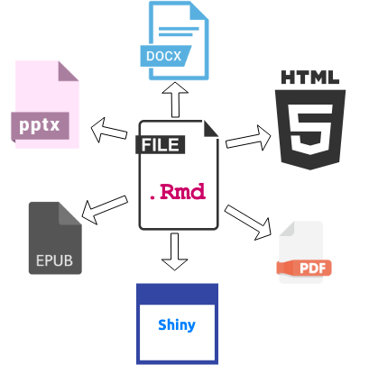

The `.Rmd` files also give us the ability to document our intentions, write and execute code, and interpret and explain the results. After we've outlined (and revised) our thought process, we can go about organizing the code in more efficient ways to carry out our intentions.

### Rmarkdown step 3: Compose functional code chunks

We like to think of Rmarkdown documents like a stack of two sheets of paper, and each piece representing a different file type (`.R` and `.md`). When you lay the markdown file on top of the .R script, you get the Rmarkdown file. 

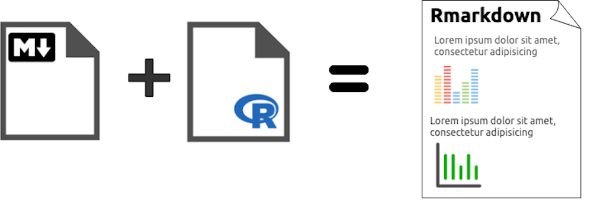

Combining markdown R script files gives us syntax for formatting our text (stuff like *italic*, **bold**, `code`, etc.), and a functional coding script we can get access to by inserting code chunks.

For example, in the `README.Rmd` file we can type directly onto the paper using the markdown syntax. But if we want to run some R code, imagine tearing a little hole in the markdown paper, and revealing an R script underneath. 

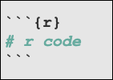

These code chunks allow us to run R code in-between the markdown text. 

#### R Code chunk options & labels

Code chunks come with a long list of options (feel free to experiment with all possible combinations found [here](https://yihui.name/knitr/options/) and [here](https://rmarkdown.rstudio.com/lesson-3.html)). The most common are `echo`, `eval`, and `include`.

+ `echo` =  *show the code in the output?*

 + `eval` = *run the code chunk?*

+ `include` = *put the results from the code in the output?*

We will show a few examples of these with labels below:

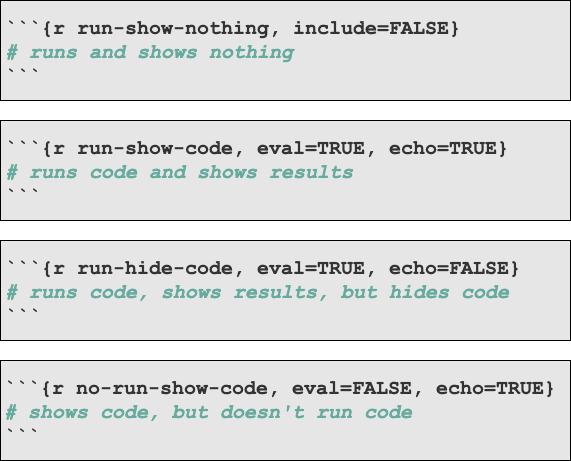

The code chunks above are labeled, and we recommend *labeling all code chunks*. We've found it forces us to think through the analysis as a series of operations, and reduces random calculations spread throughout the document.

#### The setup code chunk

After the `YAML` header, our `setup` chunk tells us what we're going to be doing with the code, text, figures, and output in this `README.Rmd` file. 

Our `setup` chunk does the following:

**Project folders:** We check to see if the project has image or data folders, and if not, it creates them.

```r
# create image folder ----
if (!file.exists("figs/")) {
    dir.create("figs/")
}
# create data folder ----
if (!file.exists("data/")) {
    dir.create("data/")
}
```

**Chunk options:** We've included `echo=TRUE`, which means the code will print in the output file. The `tidy=FALSE` makes sure the code doesn't get reformatted when the document gets rendered. We set both options to their default values, but we've included them below so that you can see more examples. 

The `size = "small  "` and `fig.path = "figs/"` are used to change the size of the printed code, and the location of any output visualizations.

```r
knitr::opts_chunk$set(
    echo = TRUE, # show all code
    tidy = FALSE, # cleaner code printing
    size = "small", # smaller code
    fig.path = "figs/") # where the figures will end up
```

**Knit options:** The `knitr::opts_knit$set()` function gives us the ability to stipulate options for what happens when we render the document (knitted and rendered are somewhat synonymous).

```r
knitr::opts_knit$set(
    width = 78)
```

**Base options:** the final setting tells RStudio.Cloud how we want the tables to print ('''25' rows, and `78` columns).

```r
base::options(tibble.print_max = 25,
              tibble.width = 78)
```

Why `78`? The standard code file is 80 columns across, which is the length of a punch card (read more [here](http://bit.ly/code-80-cols)). We go two columns less than 80 ( to give a little wiggle room). 

#### Running code chunks 

To run the code in your document, we have a few options. First, we can use the same keyboard shortcuts we use for executing code in the `.R` scripts (`ctrl`+`enter` or `cmd`+`return`). 

The second option is the small green play icon on the far right-hand side of the code chunk. Running code one chunk at a time is a great way to test what the output of a graph looks like, or to see the data table from a join. 

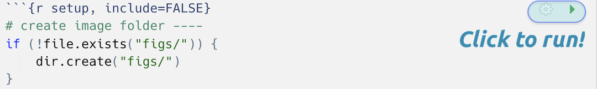

The third option is we run a series of chunks (or the entire document) using the drop-downs at the top of the `.Rmd` file. We use this option if we've added a few chunks, and we want to make sure everything works together.

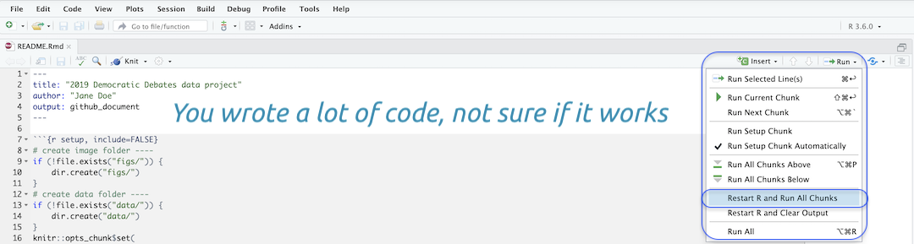

Don't worry if all of this is confusing! We will be creating our very own `README.Rmd` for this project, so you'll get some practice!

***

## Documenting our projects 

The `README.Rmd` file we've provided for this project is in the **Source** pane, and we can start by looking at the contents of the file (look at the `YAML` header, `setup` chunk, and `packages`). 

As we've stated before, we won't be going through the code collects and downloads the data for this project. We'll provide links to those resources, but we're going to focus on the *workflow for using data to create tables, images, and products*. 

Hit the enter/return key until we a few lines of padding beneath the `packages` code chunk. Our cursor should be around line 37. 

We will begin this document with the following text under our first line header (`#`).

```md
# Motivation

We read an interesting article on `fivethirtyeight` about the democratic debates in June of 2019. In particular, the image below displays how voters had changed their minds after watching the candidates.

```

As the text above states, we saw something cool, and we're going to see if we can recreate or verify some of the information. The source of this inspiration comes from [this fivethirtyeight article](https://projects.fivethirtyeight.com/democratic-debate-poll/).

> **Including an image in the .Rmd file:** If you want to include an image in your `README.Rmd` file, read about the `knitr::include_graphics()` function by entering `??include_graphics` in the **Console** pane. 

## Import

Now that we have an idea why we're here, we want to start exploring the data. We're going to document all of our steps in the `README.Rmd` file.

We will start by importing all of the data for this project. We've put the raw data files in the `data/raw/` folder. **Always leave raw data in its own folder, and never alter the raw data files (read more [here](https://amstat.tandfonline.com/doi/abs/10.1080/00031305.2017.1375987)).**

In our `README.Rmd` file, we'll create a new level-two header (`##`) called 'Data files' and a code chunk labeled "`locate-data`" (it should look like the image below).

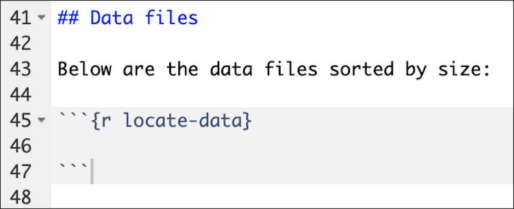

### File management 

To locate the files in `data/raw/` folder, we like to use the `fs` package. `fs` stands for 'file system', and this package gives us the ability to navigate our project folders and files. 

Check out the package website [here](https://fs.r-lib.org/) for a full description and examples. `fs` is loaded as part of the `tidyverse`.

Start with a folder tree of the data folder. 

```r
# where are the data?
fs::dir_tree("data")
# data
# ├── processed
# └── raw
#     ├── 538
#     │   └── 2019-07-06-Cand538Fav.csv
#     ├── google-trends
#     │   ├── 2019-07-10-Dems2020Night1Group1.rds
#     │   └── 2019-07-10-Dems2020Night1Group2.rds
#     ├── twitter
#     │   ├── 2019-07-06-Night01Tweets.rds
#     │   ├── 2019-07-06-Night01TweetsRaw.rds
#     │   ├── 2019-07-06-Night01TweetsUsers.rds
#     │   ├── 2019-07-06-Night02Tweets.rds
#     │   ├── 2019-07-06-Night02TweetsRaw.rds
#     │   └── 2019-07-06-Night02TweetsUsers.rds
#     └── wikipedia
#         ├── 2019-07-10-WikiDemAirTime01Raw.csv
#         ├── 2019-07-10-WikiDemAirTime02Raw.csv
#         └── 2019-07-25-PollingCriterionRaw.csv
```

The raw data are in four separate folders, each representing the data source (`538`, `google-trends`, `twitter`, `Wikipedia`).

Size can be a significant impediment to getting your work done quickly, so it's best to determine the size of the raw data files before importing. 

The code chunk below tells us how big each file is and the folder in which its located.

```r
# how big are each of these files?
fs::dir_info(path = "data", recurse = TRUE) %>% 
    # only files
    filter(type == "file") %>% 
    group_by(path) %>%
    # sort by size
    tally(wt = size, sort = TRUE)
# A tibble: 12 x 2
#    path                                                                 n
#    <fs::path>                                                 <fs::bytes>
#  1 data/raw/twitter/2019-07-06-Night02Tweets.rds                    7.99M
#  2 data/raw/twitter/2019-07-06-Night02TweetsRaw.rds                 7.87M
#  3 data/raw/twitter/2019-07-06-Night01Tweets.rds                    6.92M
#  4 data/raw/twitter/2019-07-06-Night01TweetsRaw.rds                 6.83M
#  5 data/raw/twitter/2019-07-06-Night02TweetsUsers.rds                1.9M
#  6 data/raw/twitter/2019-07-06-Night01TweetsUsers.rds               1.65M
#  7 data/raw/google-trends/2019-07-10-Dems2020Night1Group2.rds     111.47K
#  8 data/raw/google-trends/2019-07-10-Dems2020Night1Group1.rds     109.52K
#  9 data/raw/wikipedia/2019-07-25-PollingCriterionRaw.csv              722
# 10 data/raw/538/2019-07-06-Cand538Fav.csv                             581
# 11 data/raw/wikipedia/2019-07-10-WikiDemAirTime02Raw.csv              202
# 12 data/raw/wikipedia/2019-07-10-WikiDemAirTime01Raw.csv              191

```

The output tells us the twitter data files are the largest (`7.99M`). All of these files are small enough for RStudio.Cloud to handle, though.

We can import the data using the `01-import.R` file in the `code` folder. Feel free to open this file and examine its contents in the **Source** pane. We will use the `base::source()` function to run all of the code in the `01-import.R` file.

```r
# import data using 01-import.R file
source("code/01-import.R")
```

The `01-import.R` file loads all of the data files into the RStudio.Cloud session. We can verify this by examining the contents of the environment with `base::ls()`. 

```r
base::ls()
```

The output tells us the following objects are in our working environment. 

```r
#  [1] "google_data_files"       
#  [2] "google_data_path"        
#  [3] "GoogleData"              
#  [4] "GSheetCand538Fav"        
#  [5] "GTrendDems2020Night1G1"  
#  [6] "GTrendDems2020Night1G2"  
#  [7] "twitter_data_files"      
#  [8] "twitter_data_path"       
#  [9] "twitter_users_data_files"
# [10] "TwitterData"             
# [11] "TwitterUsersData"        
# [12] "wiki_data_files"         
# [13] "wiki_data_path"          
# [14] "WikiData"                
# [15] "WikiDemAirTime01Raw"     
# [16] "WikiDemAirTime02Raw"     
# [17] "WikiPollCriterionRaw"
```

We can also see these objects in the **Environment** pane. 

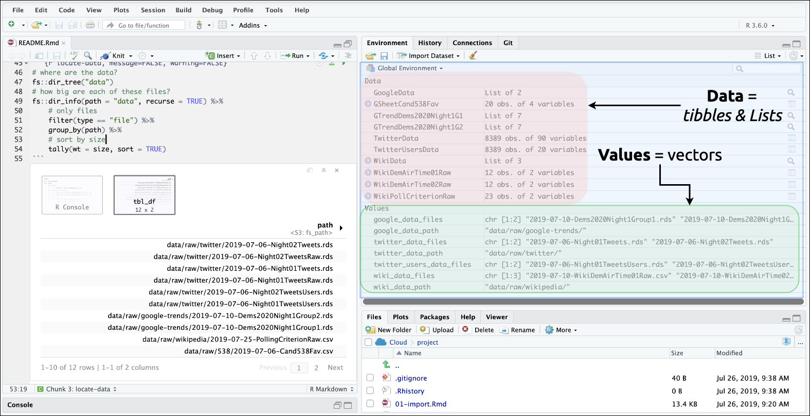

The *Global Environment* holds all of our imported data.

## Document changes with Git

So, we've imported some data into the RStudio.Cloud session, but we need to make sure we're keeping track of the changes to our files. 

We can do this by checking our `git status` in the **Terminal** pane.

```sh
$ git status
On branch master

Initial commit

Untracked files:
  (use "git add <file>..." to include in what will be committed)

        .gitignore
        CHANGELOG.txt
        README.Rmd
        README.md
        code/
        data/
        dem-pres-debate-2019.Rproj
        figs/
        project.Rproj

nothing added to commit but untracked files present (use "git add" to track)
```

Git is telling us we have quite a few new files in our project (which we expected), but that to Git to pay attention to them, we need to `add` them. We can do this in the **Git** pane RStudio provides (it's by the **Environment** pane).

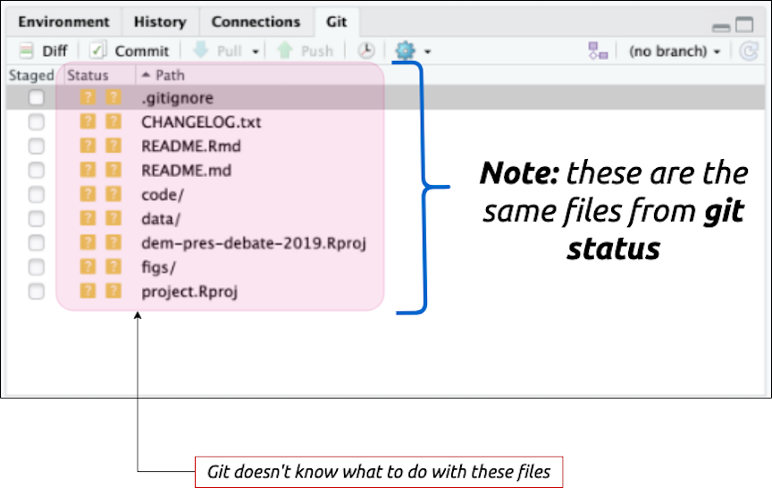

We will click on each checkbox next to the files in the **Git** pane. Don't be alarmed if this list expands to include all the subfiles and folders. 

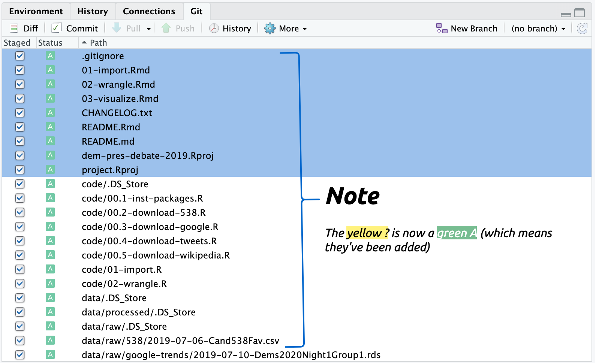

Now we can re-check `git status` to see what just happened. 

```sh
$ git status

On branch master

Initial commit

Changes to be committed:
  (use "git rm --cached <file>..." to unstage)

        new file:   .gitignore
        new file:   CHANGELOG.txt
        new file:   README.Rmd
        new file:   README.md
        new file:   code/.DS_Store
        new file:   code/00.1-inst-packages.R
        new file:   code/00.2-download-538.R
        new file:   code/00.3-download-google.R
        new file:   code/00.4-download-tweets.R
        new file:   code/00.5-download-wikipedia.R
        new file:   code/01-import.R
        new file:   code/02-wrangle.R
        new file:   data/.DS_Store
        new file:   data/processed/.DS_Store
        new file:   data/raw/.DS_Store
        new file:   data/raw/538/2019-07-06-Cand538Fav.csv
        # omitted 
```

This long list of files shows all the contents have been added and are ready to be committed. 

### Committing the changes 

If we click on the *Commit* icon in the **Git** pane, this will open a new window in RStudio.Cloud. In this window, we will enter a commit message ("First commit!"), and click the *Commit* button. We've outlined this entire process in the schematic below:

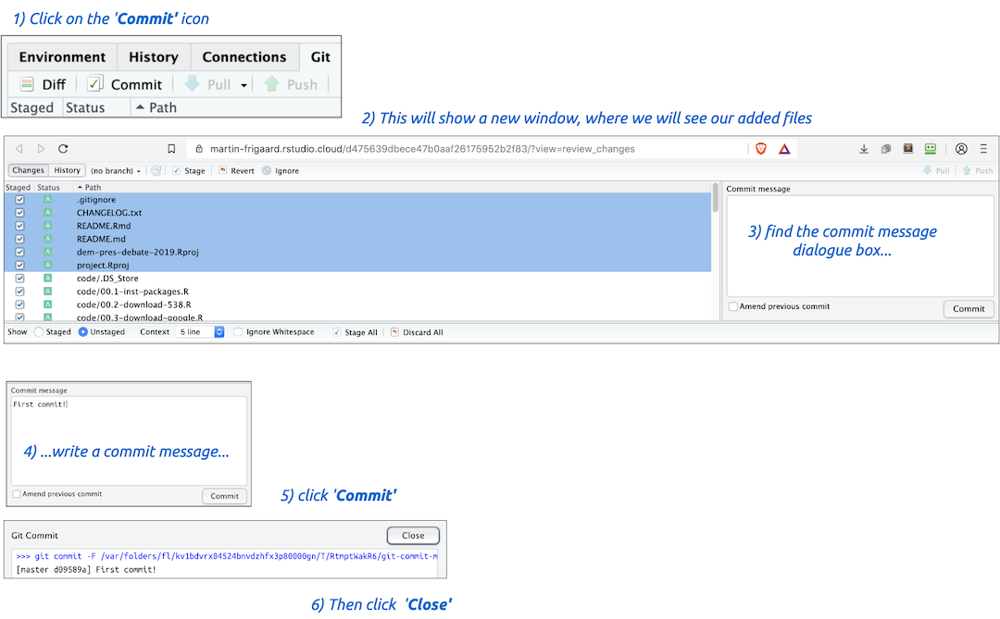

This process--adding files, reviewing the changes to a project, and committing these changes to a Git repository--make up ~70% of the work you'll be doing with Git. 

In the next chapter we will introduce moving your files to Github.

***

#### A quick lesson in compassionate programming

***Your code will always be communicating to at least two audiences: your computer, and your future self. Be friendly to both of them!***

R code can be difficult to read, but pipes (`%>%`) can help with clarity. The pipe is part of the [`magrittr` package](https://cran.r-project.org/web/packages/magrittr/vignettes/magrittr.html), and it takes code written like this:

```r
outer_function(inner_function(Data_X), Data_Y)
```

And makes it look like this:

```r
Data_X %>% # do this 
   inner_function() %>% # then do this
   outer_function(Data_Y)
```

`%>%` is a form of [syntactic sugar](https://en.wikipedia.org/wiki/Syntactic_sugar), which is a fancy way of saying "*something that helps us communicate better.*" You'll see the pipe throughout the project's R code files, and you can always read it as, "*do this, then do this.*"

## Wrangle

In the last section, we used the `README.Rmd` file to import our data into RStudio. We'll continue using the `README.Rmd` file to add the contents from one additional `.R` script, `02-wrangle.R`. We will then create a new section and code file for visualizing the data (`03-visualize.R`).

We've provided a lot of code and comments in the `02-wrangle.R` script for you to explore, revise, and adapt to your liking. In the next few sections, we are going to move the code from the `02-wrangle.R` script into a new part of the `README.Rmd` (you probably guessed it "`Wrangle`").

Data wrangling is whatever steps we needed to take the raw data into something we can use to create a table, visualization, model, etc.  You'll sometimes see 'wrangling' referred to as cleaning or munging.

The `02-wrangle.R` script prepares the data from the `01-import.R` for the visualizations. If you think back to the process outlined in the figure in [R for Data Science](https://r4ds.had.co.nz/introduction.html), you will notice that wrangle isn't listed explicitly. Wrangling includes both '**Tidy**' and '**Transform**' steps (both of these need to happen before any visualizations or models can be properly run). 


The simplest way to include the wrangling script in the `README` file is to create a code chunk, insert the `base::source()` function, and enter the path to the `02-wrangle.R` file. 

However, we want to be helpful to our future selves, so we will include some language that describes what the functions are doing above each code chunk.

The first data that we need to wrangle is the Wikipedia tables (seen in the `02-wrangle.R` file on the section below).


Both data sets had initially been Wikipedia (`.html`) tables, so they aren't immediately ready to go. We will create some new column names, remove some rows that used to be column headers, and make the airtime variable numeric. 

The polling criterion Wikipedia data starting at the section titled, `wrangle polling criterion data`. This section creates a list of candidates (in `cand_names_wiki`) and uses it to `filter` out the observations we want. Check out [this webinar](https://www.rstudio.com/resources/webinars/data-wrangling-with-r-and-rstudio/) to get an understanding of how [`dplyr`](https://dplyr.tidyverse.org/)'s verbs work. 

```r
# wrangle polling criterion data ------------------------------------------
# create list from names using dput()
# dput(WikiPollCriterionRaw[ 1:11, 1])
cand_names_wiki <- c("Warren[note 2]", 
                     "O'Rourke[note 2]", 
                     "Booker[note 2]", 
                     "Klobuchar[note 2]", 
                     "Castro[note 2]", 
                     "Gabbard", 
                     "Ryan", 
                     "Inslee", 
                     "de Blasio", 
                     "Delaney")
# subset WikiPollCriterionRaw with list from above
WikiPollCriterion <- WikiPollCriterionRaw %>% 
  # this will remove all candidates not listed above 
  dplyr::filter(`Candidates drawn for the June 26 debate` %in% cand_names_wiki)
```

After we have wrangled the Wikipedia tables, the script exports these files to a new `processed/` folder. Exporting them into a separate folder helps ensure they won't be accidentally altered or mistaken for the data files in the `raw/` data folder. 

The export section also timestamps each file, so we know the last time it was created. Read more about importing and exporting data in [this RStudio cheatsheet](https://raw.githubusercontent.com/rstudio/cheatsheets/master/data-import.pdf).  

The Google trend data are a little more complicated because they come into RStudio.Cloud as a list, which is a data container in R that [doesn't have to be rectangular](http://adv-r.had.co.nz/Data-structures.html). 

The image below outlines what each portion of code is doing. These are relatively everyday wrangling tasks, so we recommend going back or bookmarking these files as a reference. 

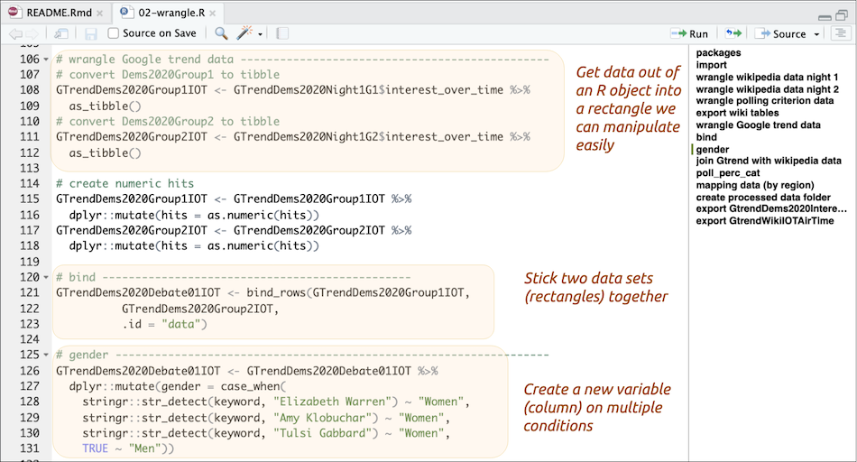

We have different sources of data in RStudio right now (Wikipedia and Google trend data). They both have information on Candidates though. Often we'll want to join two (or more) data sets on a common column (like candidates). We will perform an example of this in the section outlined below. 


The process usually isn't so involved, but we included extra to give more explicit instructions. Be sure to check out the [relational data chapter](https://r4ds.had.co.nz/relational-data.html) the R for Data Science book. 

We'll also be creating a map with the Google (or Twitter) data. Doing this requires another common task, which is loading a dataset from a package in R. The code below loads a state-level map into RStudio.Cloud and joins it to the Google trend data. 


We also export the Google trend data with time-stamp into the `processed/` folder. We should continue adding the code into the `README.Rmd` file until we're confident all the functions will run and we don't see any errors.

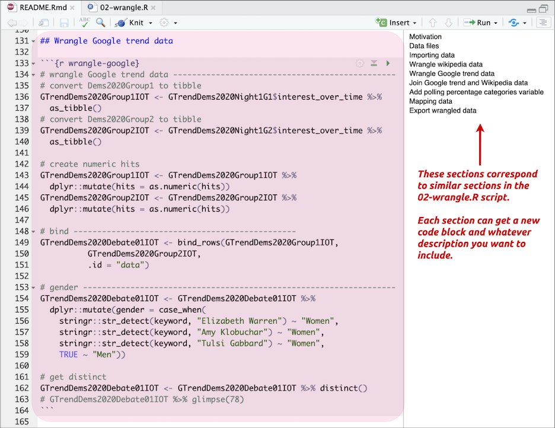

**Note:** The `02-wrangle.R` file is in the `code/` folder, but you won't have to alter the file paths because you're using an RStudio project file. Read more about how these are so helpful to your workflow [here](https://support.rstudio.com/hc/en-us/articles/200526207-Using-Projects). 

***

## Visualize

OK, we've completed our section for the wrangling the data. We are going to insert a divider (`***`) and start a new visualize section (`## Visualize`) in the `README.Rmd` file.  

We've created a `03-visualize.Rmd` file for you to download from Github. You can do this by typing the following code into your `README.Rmd` file:

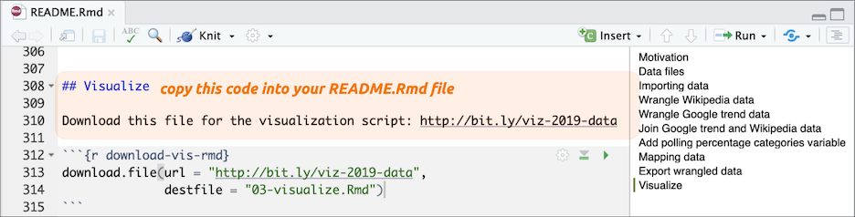

The hyperlink is here: `http://bit.ly/viz-2019-data`

After we've downloaded our `03-visualize.Rmd` file, we can open this file and start copying the code. We should begin at the line just below the `# Visualize data` header (it should be on about line `65`) and extending to the end of the file. 


After selecting the code from `03-visualize.Rmd`, we should click on the line directly under the previous code chunk we used to download the `.Rmd` file. 

After pasting the code from `03-visualize.Rmd` into the `README.Rmd` file, we can click on the *Run* > *Run All Chunks Below* (this will run all the code starting at line `319` until the end of the document).

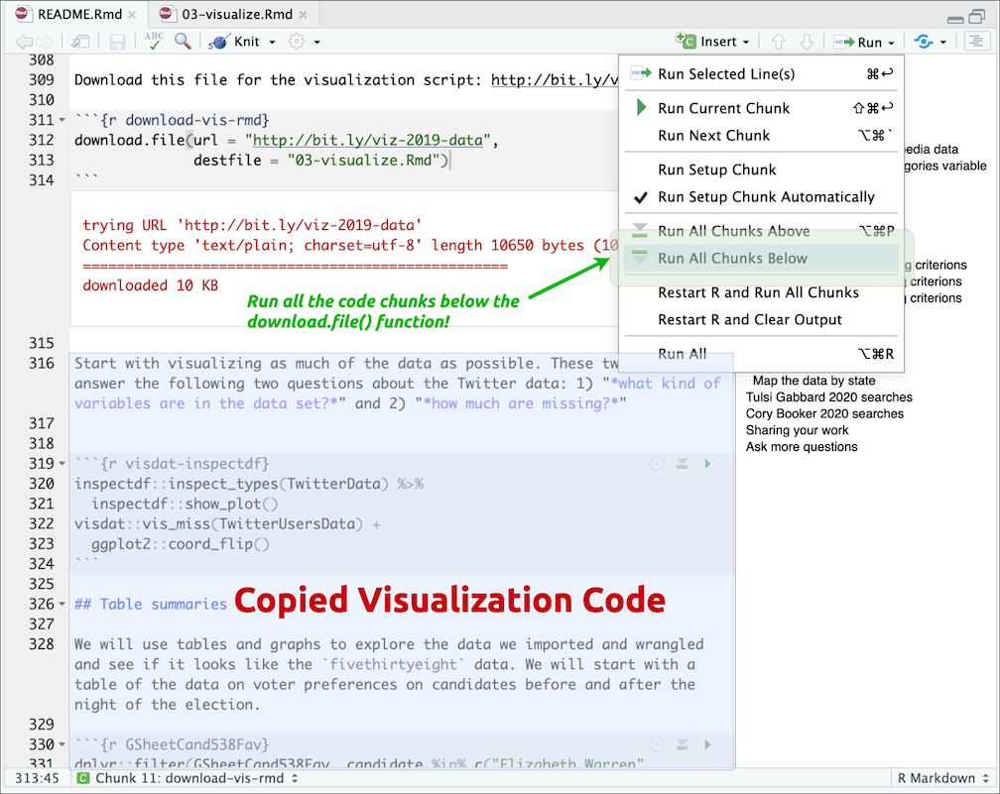

Running the code will create multiple tables and figures in the `README.Rmd` file. We'll go over these in more depth below. For now, we'll follow the directions at the bottom of the pasted code and "*Click `knit` to get the markdown file to share.*"

***

## Knitting RMarkdown files

Clicking *Knit* (or clicking `shift`+`cmd`+`k`) activates the **R Markdown** pane in RStudio.Cloud and we see the code chunks compiling for the entire document. 


When the knitting process completes, a new browser window will pop up with our `README.md` document. The `README.md` will have sections of formatted text (from the Markdown), R code, and the various outputs. 

The top of the file should list the title and the packages (just like our `README.Rmd` file)


If we scroll down to the visualize section and look at the portion titled, *Candidates with high polling criterions)*. We can see the different parts of the Rmarkdown file in the image below:


The file output is a *Preview* of our markdown file (`README.md`). Our browser renders the markdown as a webpage (`README.html`). 

#### Rmarkdown to Word

Working in Rmarkdown give us other options for output, too. For example, we can knit this document to word (`.docx`) using the `YAML` header below.

```yaml
output: 
  word_document: 
    fig_caption: yes
    highlight: kate
    keep_md: yes
    toc: yes
```

#### Rmarkdown to PDF

We can also create a .pdf file using this `YAML` header. This also requires making a few adjustments to the `setup` code chunk, and the summary of the mapping data under `Summarize Interest Data`.

```r
# changes to setup
# create image folder ----
if (!file.exists("figs/")) {
    dir.create("figs/")
}
# create data folder ----
if (!file.exists("data/")) {
    dir.create("data/")
}
knitr::opts_chunk$set(
    warning = FALSE,
    message = FALSE,
    echo = TRUE, # show all code
    tidy = FALSE, # cleaner code printing
    size = "small", # smaller code
    fig.path = "figs/") 
knitr::opts_knit$set(
    width = 78)
base::options(tibble.print_max = 25,
              tibble.width = 78)
```

Changes to `Summarize Interest Data` section

```r
# recheck the structure
GtrendDems2020InterestByRegion %>%
  skimr::skim_to_wide() %>% 
  dplyr::filter(type %in% c("integer", "numeric")) %>% 
  dplyr::select(variable, 
                n, 
                mean, 
                sd, 
                median = p50) # remove the hist
```

And use this `YAML` header.

```yaml
output: 
  pdf_document: 
    highlight: kate
    toc: yes
```

#### Rmarkdown Notebooks

Rmarkdown has it's own dynamic document for data analysis called the [Rmarkdown Notebook](https://bookdown.org/yihui/rmarkdown/notebook.html). These are unique because they create an output file with the `nb.html` extension, which 
> "*is a self-contained HTML file which contains both a rendered copy of the notebook with all current chunk outputs (suitable for display on a website) and a copy of the \*.Rmd file itself.*"

You can create a Rmarkdown document using the following `YAML` header. 

```yaml
output: 
  html_notebook: 
    fig_height: 5
    fig_width: 7
    highlight: kate
    theme: simplex
    toc: yes
```

Note that this output changes the *Knit* icon to *Preview*. The output should look like the image below:

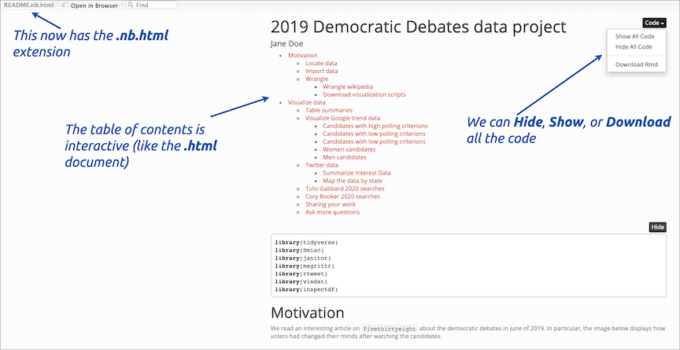


Being able to produce such a wide variety of documents from our Rmarkdown file makes it handy if you have collaborators who aren't using our workflow. We've only touched the surface of available options for Rmarkdown documents. Please check the appendix in chapter 7 for more. 


#### Extracting the .R from the .Rmd 

But now we have all our visualize code in the `03-visualize.Rmd` file--what if we wanted this code in an .R script?

We can run the following code in the **Console** pane. 

```r
knitr::purl("03-visualize.Rmd")
```

We'll see the following script file gets generated. 

```r
processing file: 03-visualize.Rmd
  |.................................................................| 100%
output file: 03-visualize.R

[1] "03-visualize.R"
```

The `knitr::purl()` function produces an R code file with all the code chunks from an existing `.Rmd` file, so it usually needs a little editing to be a well documented `.R` file. 

Remember when we mentioned labeling the code chunks in the Rmarkdown files? This pays off when we run `knitr::purl()` because the labels become our section headers.
