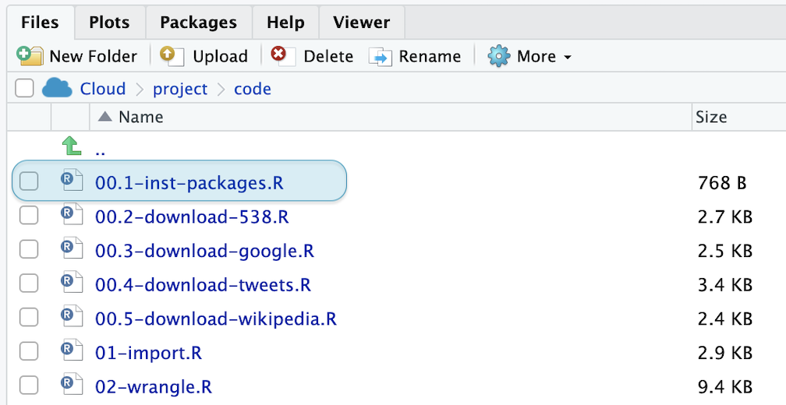
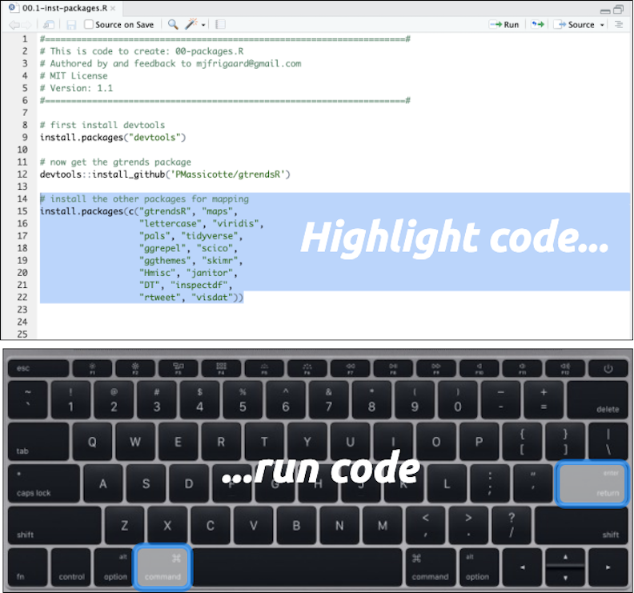
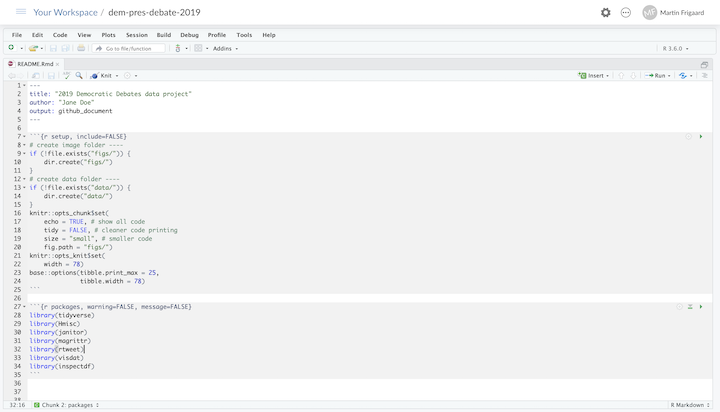

# Part 5: Working with R and RStudio

In this chapter, we're going to learn a bit about R packages, some additional benefits of working in Rmarkdown and plain text, navigating RStudio panes, and how to make and monitor changes with Github. 

## R packages 

Packages are a vital part of the R ecosystem. When we start a new RStudio session, R automatically loads some built-in packages and functions. R users typically refer to these default packages as "base R." The base R packages cover a wide range of statistical procedures and visualizations. Unfortunately, base R is also challenging to learn and doesn't have a consistent syntax. Fortunately, R users have contributed many packages for various functions over the years to create an extensive collection of packages available to download and use. 

R packages are collections of functions and objects collected together with a specific purpose. These packages expand and enhance base R for performing special analyses, creating new visualizations, and producing particular outputs. 

We're going to install the packages we'll use in this project by running an R script (files that end with the `.R` extension), the plain text file use to store R code. 

### The Files pane

The script to install the packages for this project is in the `code` folder. An image of this folder's contents is provided below:

We can see `00-inst-packages.R`, along with other `.R` scripts in the **Files** pane. Note that because the `.R` files are plain text, we know they'll have code for a computer to execute (and hopefully a human can read).

When we click on the `00-inst-packages.R` file, it opens in the **Source** pane. We can see RStudio is giving us a few hints about what packages we need to install.

On the top of ths script we can see a suggestion to install the `devtools` package. We'll take that advice and click on *Install* and wait patiently for `devtools` to install. This might take a minute or two, but after the install is done, you should see the `>` prompt in the **Console** pane. 

## Running R code 

After we write a bit of code, we typically want to run that code to see if it works. To do this, highlight the rest of the script with your mouse cursor, hold down `ctrl` or `cmd` and hit `enter` or `return`. 

After all the packages have been installed, we'll see the following in the **Console** pane.

## Navigating the workbench 

We can see the `README.Rmd` file in the **Files** pane in the lower right corner. After clicking on it, this file opens in the **Source** pane (see image below). 

The highlighted section of the image above is the `README.Rmd` file displayed in the **source** pane. Working in a small corner of the screen can be hard, but fortunately RStudio gives us the ability to expand any pane into a fullscreen view. In this case, we want to zoom in the `README.Rmd` file.

### The Source pane

If we want to focus on the **Source** pane, and can zoom in using `shift`+`control`+`1`.

This should make our screen look like the image below:

Since the **Source** pane is where we'll spend most of our time (we've seen that's where the files will open), being able to quickly focus in on this pane is helpful. 

### The Console pane

The **Console** is probably the second most used area in RStudio (it displays output), so we also should know how to zoom in on this pane, too. 

To focus on this pane, we'll use `shift`+`control`+`2`.

What if we accidentally zoom into the wrong pane? We can easily resize the IDE to it's original position by holding down the `shift`+`control` buttons, then clicking either number again. 

#### Work in one pane at a time

In fact, if you'd like to cycle through every pane in RStudio, you can do this by holding down `shift`+`control` and clicking on numbers `1`-`9`. Go ahead and do that now.

If you ever forget which number corresponds to which pane, you can always find them under *View* > *Panes* (see image below)

As we can see, RStudio is a workbench built around different panes. Each pane serves a specific function, so being able to move between them allow us to work quickly and efficiently.

## YAML headers

The top of the `README.Rmd` document has what's called a "YAML header", and it is going to tell RStudio.Cloud the file is `title`, the `author`, and what the `output` file will be. 

`YAML` headers have many options, but for now we are going to focus on the `github_document` output because that's now part of our handy workflow. Read more about YAML headers in the [RMarkdown book](https://bookdown.org/yihui/rmarkdown/).

The **Knit** button will render our plain text `.Rmd` document into a variety of different options. 

## Code chunks

### Running the code 

### Creating a workflow 

### Kniting a file

## Record the changes 

***

## Documenting the changes with Git

### Git terminology

Below are some commonly used terms/commands associated with Git and Github.

*commits* - commits are the staple in Git/Github the workflow. Commits are what Git uses to track the changes you've made to files or folders, so they can be considered nouns ("I'm creating a commit with these changes") or verbs (I am going to commit these changes to my project"). 

To quote David Demaree, 

> * "Semantically, each commit represents a complete snapshot of the state of your project at a given moment in time; its unique identifier serves to distinguish that state from the way the files in your project looked at any other moment in time."* 

*repository* - this refers to the files and folders in your project and all the changes you make while working on them. On your local computer, a repository can exist in a folder you initialize a repository in (see below). On Github, a repository has the following structure: `https://github.com/<username>/<repository_name>`. 

*init* - the command `git init` is used to initialize a new git repository (it tells Git to start tracking changes in this directory).

*status* - whenever you wonder what you've done, what is happening, or if you're just generally confused, you can check the status of a git repository with `git status` (use this liberally). 

*clone* - this command copies all files and changes into a new working directory from a remote, initializes (`init`) a new Git repository, and it adds a remote called `origin`.

*diff* - this is how Git shows differences between files. Read more about how changes are formatted/displayed [here.](https://www.git-tower.com/learn/git/ebook/en/command-line/advanced-topics/diffs)

### Writing = thinking with words

At the very minimum, a researcher should be able to communicate 1) the problem they found, 2) their proposed solution, 3) what they did, and 4) what they observed. Each of these steps has too much detail for pointing and clicking. 

Every area of research has it's own jargon and acronyms, and it can be challenging to explain complicated concepts in plain language. But we've found doing this is worth the effort because the process allows you to sort through your thoughts on a topic, develop new analogies, and make new connections. 

I highly recommend the article [The Science of Science Writing](https://www.americanscientist.org/blog/the-long-view/the-science-of-scientific-writing) for anyone looking to improve their write technical writing abilities. I received some excellent advice along the way about prose, "*favor brevity above all else, but never sacrifice precision or clarity just to rush to the point*."

