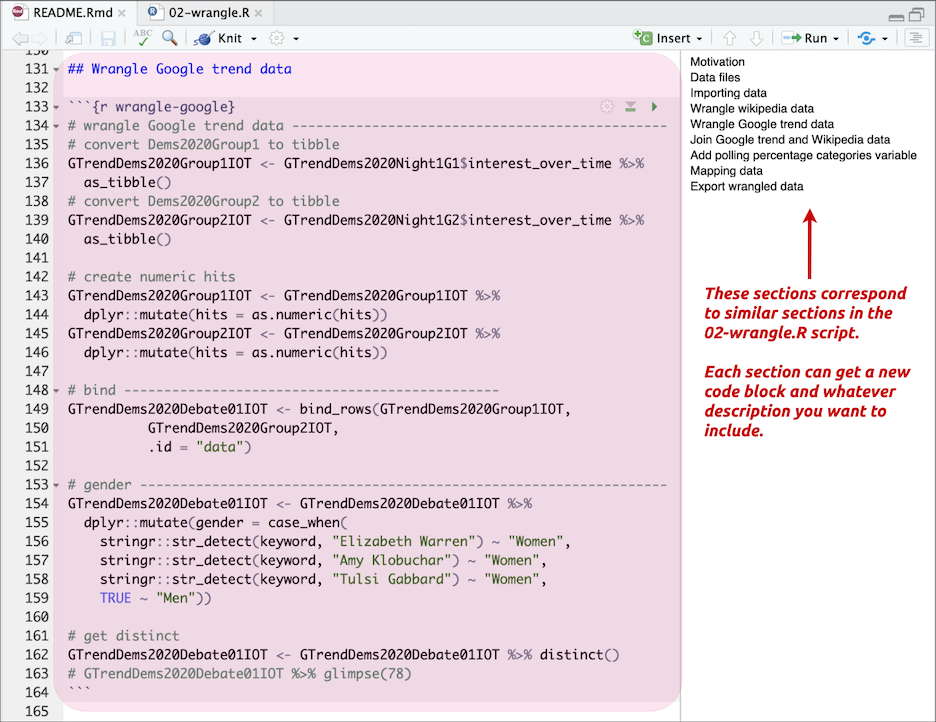
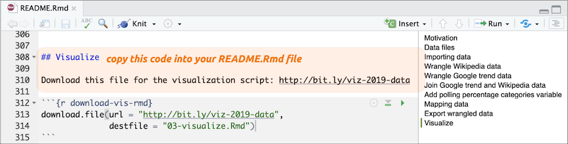
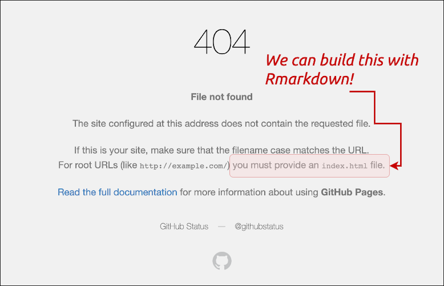
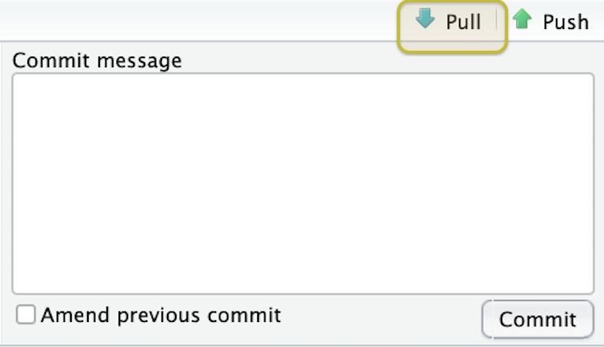

# Part 6: Putting your project on Github

In the previous chapters, we've set up a Github account, learned how to download the files from a Github repository, upload files into RStudio.Cloud, create and run R code, and commit changes using Git. 

In this final chapter, we are going to create some figures and graphs for this project, then put these changes on Github in a way for people to find and share. 

## Moving R code into a .Rmd file

In the last chapter, we used the `README.Rmd` file to upload our data into RStudio. We'll continue using this file to add the contents from one additional `.R` scripts, `02-wrangle.R`. We will then create new section and script for visualizing the data (`03-visualize.R`).

We've provided a lot of code and comments in the `02-wrangle.R` script for you to explore, revise, and adapt to your liking. In the next few sections, we are going to move the code from the `02-wrangle.R` script into two new sections of the `README.Rmd` (you probably guessed it "`Wrangle`").

### A quick lesson in compassionate programming

**Your code will always be communicating to at least two audiences: your computer, and your future self. Be nice to both of them!***

Things like the pipe `%>%` in R can help with clarity. The pipe is part of the [`magrittr` package](https://cran.r-project.org/web/packages/magrittr/vignettes/magrittr.html) and it takes code written like this:

```r
outer_function(inner_function(Data_X), Data_Y)
```

And makes it look like this:

```r
Data_X %>% # do this 
   inner_function() %>% # then do this
   outer_function(Data_Y)
```

`%>%` is a form of [syntactic sugar](https://en.wikipedia.org/wiki/Syntactic_sugar), which is a fancy way of saying "*something that helps us communicate better.*" 

You'll see the pipe throughout the project's R code files, and you can always read it as, "*do this, then do this.*"

## Wrangling code

Data wrangling (or cleaning, or munging) is whatever steps need to be taken to take the raw data (which we always remember not to change) into something we can use to create a table, visualization, model, etc. 

The `02-wrangle.R` script prepares the data from the `01-import.R` so that they can be used for the visualizations. If you think back to the process outlined in the figure in [R for Data Science](https://r4ds.had.co.nz/introduction.html), you will notice that wrangle isn't listed explicitly. This is because both '**Tidy**' and '**Transform**' would be considered wrangling steps (both of these need to happen before any visualizations or models can be properly  run). 


The simplest way to include this script in the README.Rmd file is to create a code chunk, insert the `base::source()` function, and enter the path to the `02-wrangle.R` file. 

However, we want to be nice to our future selves, so we will include some language that describes what the functions are doing above each code chunk.

#### Wrangling the data sets

The first data that need to be wrangled are the Wikipedia tables (seen in the `02-wrangle.R` file on the section below).


These data were stored on the web in Wikipedia (`.html`) tables. We will create some new column names, remove some columns that used to be headers, and make the airtime variable numeric. 

The polling criterion Wikipedia data starting at the section titled, `wrangle polling criterion data`. This section actually creates a list of candidates (in `cand_names_wiki`) and uses it to `filter` out the observations we want. Check out [this webinar](https://www.rstudio.com/resources/webinars/data-wrangling-with-r-and-rstudio/) to get an understanding of how [`dplyr`](https://dplyr.tidyverse.org/)'s verbs work. 

```r
# wrangle polling criterion data ------------------------------------------
# create list from names using dput()
# dput(WikiPollCriterionRaw[ 1:11, 1])
cand_names_wiki <- c("Warren[note 2]", 
                     "O'Rourke[note 2]", 
                     "Booker[note 2]", 
                     "Klobuchar[note 2]", 
                     "Castro[note 2]", 
                     "Gabbard", 
                     "Ryan", 
                     "Inslee", 
                     "de Blasio", 
                     "Delaney")
# subset WikiPollCriterionRaw with list from above
WikiPollCriterion <- WikiPollCriterionRaw %>% 
  # this will remove all candidates not listed above 
  dplyr::filter(`Candidates drawn for the June 26 debate` %in% cand_names_wiki)
```

After the Wikipedia tables have been wrangled, the script exports these files to a new `processed/` folder. This helps ensure they won't be accidentally altered or mistaken for the data files in the `raw/` data folder. 

The export section also timestamps each file so we know the last time it was created. Read more about importing and exporting data in [this RStudio cheatsheet](https://raw.githubusercontent.com/rstudio/cheatsheets/master/data-import.pdf).  

The Google trend data are a little more complicated because they come into RStudio.Cloud as a list, which is a data container in R that [doesn't have to be rectangular](http://adv-r.had.co.nz/Data-structures.html). 

The image below outlines what each portion of code is doing. These are fairly common wrangling tasks, so we recommend going back or bookmarking these files as a reference. 


We have different sources of data in RStudio right now (Wikipedia and Google trend data). They both have information on Candidates though. Often times we'll want to join two (or more) data sets on a common column (like candidates). We will perform an example of this in the section outlined below. 


The process usually isn't so involved, but we included extra to give more explicit instructions. Be sure to check out the [relational data chapter](https://r4ds.had.co.nz/relational-data.html) the R for Data Science book. 

We'll also be creating a map with the Google (or Twitter) data. Doing this requires another common task, which is loading a dataset from a package in R. The code below loads a state-level map into RStudio.Cloud and joins it to the Google trend data. 


The Google trend data are also exported with time-stamp into the `processed/` folder. We should continue adding the code into the `README.Rmd` file until we're confident all the functions will run and we don't see any errors.




**Note:** The `02-wrangle.R` file is in the `code/` folder, but you won't have to alter the file paths because you're using an RStudio project file. Read more about how these are so helpful to your workflow [here](https://support.rstudio.com/hc/en-us/articles/200526207-Using-Projects). 

## Visualization code

OK, we've completed our section for the wrangling the data. We are going to insert a divider (`***`) and start a new visualize section (`## Visualize`) in the `README.Rmd` file.  

We've created a `03-visualize.Rmd` file for you to download from Github. You can do this by typing the following code into your `README.Rmd` file:



The hyperlink is here: `http://bit.ly/viz-2019-data`

After we've downloaded our `03-visualize.Rmd` file, we can open this file and copy the code starting from the line just below the `# Visualize data` heading (it should be on about line `65`) and extending all the way to the end of the file. 


After selecting the code from `03-visualize.Rmd`, we should click on the line directly under the previous code chunk we used to download the `.Rmd` file. 

After pasting the code from `03-visualize.Rmd` into the `README.Rmd` file, we can click on the *Run* > *Run All Chunks Below* (this will run all the code starting at line `319` until the end of the document).


Running the code will create multiple tables and figures in the `README.Rmd` file. We'll go over these in more depth below. For now, we'll follow the directions at the bottom of the pasted code and "*Click `knit` to get the markdown file to share.*"

### Knitting RMarkdown files

Clicking *Knit* (or clicking `shift`+`cmd`+`k`) activates the **Markdown** pane in RStudio.Cloud, and we see the code chunks being run for the entire document. 


When the knitting process completes, a new browser window will pop up with our `README.md` document. The `README.md` will have sections of formatted text (from the Markdown), R code, and the various outputs. 

The top of the file should list the title and the packages: 


Lets scroll down to the visualize section and look at the section titled, **Candidates with high polling criterions)**. We can see the different parts of the Rmarkdown file in the image below:


The file output is actually a *Preview* of our markdown file (`README.md`). Our browser renders the markdown as a webpage (`README.html`). 


#### Extracting the .R from the .Rmd 

But now we have all our visualize code in the `03-visualize.Rmd` file--what if we wanted this code in an .R script?

We can run the following code in the **Console** pane. 

```r
knitr::purl("03-visualize.Rmd")
```

We'll see the following script file is generated. 

```r
processing file: 03-visualize.Rmd
  |.................................................................| 100%
output file: 03-visualize.R

[1] "03-visualize.R"
```

The `knitr::purl()` function produces an R code file with all the code chunks from an existing `.Rmd` file, so it usually needs a little editing to be a well documented `.R` file. 

## Push the changes to Github 

We've come to a point where we want to share our project with friends and colleagues. We need to commit the changes we've made, and then push these changes to a Github repository. 

To do this, first we need to create a new Github repository. Follow the steps below to complete this:

### 1) Set up Github repository 

Name your new Github repository the same thing as your RStudio.Cloud project. 


### 2) Add and commit file changes

After you have a Github repository, we will want to add and commit the changes we've made to our files. We can do this in the **Git** pane by clicking on the yellow question marks (and making them green As or blue Ms). When all the files have been added, click on the *Commit* icon.


Next we want to review the changed files, write a commit message, and commit these changes to Git. 


### 3) Push changes to remote 

After these changes have been committed in our local Git repository, we want to sync the local files with the Github repository we created just created. Fortunately, when we setup our Github repository, all the information we needed was on the landing page.


We're going to type this information directly into the RStudio.Cloud *Terminal* pane. We will see a few error messages, but we can disregard them. 

```sh
$ git remote add origin https://github.com/mjfrigaard2/dem-pres-debate-2019.git
$ git push -u origin master
# the error below can be disregarded--enter your username
error: cannot run rpostback-askpass: No such file or directory
Username for 'https://github.com': mjfrigaard2
# you will see another error--disregard again and enter password
error: cannot run rpostback-askpass: No such file or directory
Password for 'https://mjfrigaard2@github.com':
# now we see the objects being pushed
Counting objects: 82, done.
Delta compression using up to 16 threads.
Compressing objects: 100% (79/79), done.
Writing objects: 100% (82/82), 6.82 MiB | 2.82 MiB/s, done.
Total 82 (delta 16), reused 0 (delta 0)
remote: Resolving deltas: 100% (16/16), done.
To https://github.com/mjfrigaard2/dem-pres-debate-2019.git
 * [new branch]      master -> master
Branch master set up to track remote branch master from origin.
```

The final message tells us the changes have been pushed from the RStudio.Cloud Git repository to the `remote` repository on Github. We can verify this by going to the repository landing page. 

## Sharing our work (with Github pages)

We're finally ready to put our stuff online and share it with everyone on Twitter, LinkedIn, etc. We'll be using [Github pages](https://pages.github.com/) to make our project more discoverable. 

Github pages are literally "Websites for you and your projects", so they're a perfect fit for what we want to create. To turn a repository into a Github page website, we will need to go into our *Settings*.


Scroll down the settings options until you find the Github pages. This is where we will tell Github that we want to use the `master` branch and pick a theme (we chose the Slate theme). 


After completing these steps, Github will tell us the website url.

Unfortunately, there won't be anything there when we click on the link because we need to give Github an `index` file. An `index.html` file tells Github what the landing page will be for our project's website.



Fortunately, we have just the thing--it's our `READMD.md` file! We'll head back over to RStudio.Cloud, change the name of `README.md` to `index.md`, and commit and push the changes to Github. 

#### 1) Change the name of README to index

The `README.md` file can be accessed in the **Files** pane. We will use the *Rename* button to change this file to `index.md`.


Notice the changes to the files in the **Git** pane. Follow the previous steps for adding and committing the file (don't push the changes yet!)

#### 2) Pull the changes from Github (before pushing)

We made a few changes to the repository on Github when we set up the Github pages. Specifically, we added a `_config.yml` file. We need to make sure the local repository has the same files as the `remote` repository on Github, and we can do this by clicking on the *Pull* button (it's right next to the *Push* button) in the upper right corner of the review changes window. 



After clicking on the *Pull* button, the results should display something like the image below. 


Now we can push the changes to Github.


After pushing these changes to Github, we can go back to the project website link. This will now take us to a nice website for our project. 


### HTML documents 

Let's say we don't like the `Slate` theme we selected from Github pages. Fortunately, Rmarkdown and RStudio.Cloud give us the ability to create a new `.html` file we can use as our `index` file. 

Open the `index.md` file in the **Source** pane, click on the small gear next to the *Preview* button, and follow the directions in the figure below to setup the `index.html` output file.


When we click *Ok* and the window closes, we should see a new `YAML` header at the top of the `index.md` file.

```yaml
---
output: 
  html_document: 
    df_print: kable
    fig_height: 5.5
    fig_width: 7.5
    highlight: kate
    keep_md: yes
    theme: simplex
    toc: yes
    toc_depth: 6
---
```

The settings displayed above are some of the ways we can customize our `.Rmd` files. Read more about the html documents [here in the Rmarkdown guide](https://bookdown.org/yihui/rmarkdown/html-document.html). 

To see what these settings do, we will click the *Preview* button on the `index.md` file. 


Now we can add, commit, and push these changes to the Github remote following the steps outlined above to get a new project webpage. 

The new `index.html` file has a few neat qualities: first, we can navigate this file like a webpage (the back button works when we click through the links in the document). Second, just about every computer will have a browser, so we don't have to worry about what version to save. Third, these files are easily transported to the web, which we will do in the next section.

## Conclusion

There you have it! We've covered how to add and extract the code in an `.Rmd` file, how to push these changes to a Github repository, how to knit these files into `.html` documents,

Being able to create files in `.html` format is incredibly handy for interweaving various formatted text, code, and media (tables, images, and graphs). 


