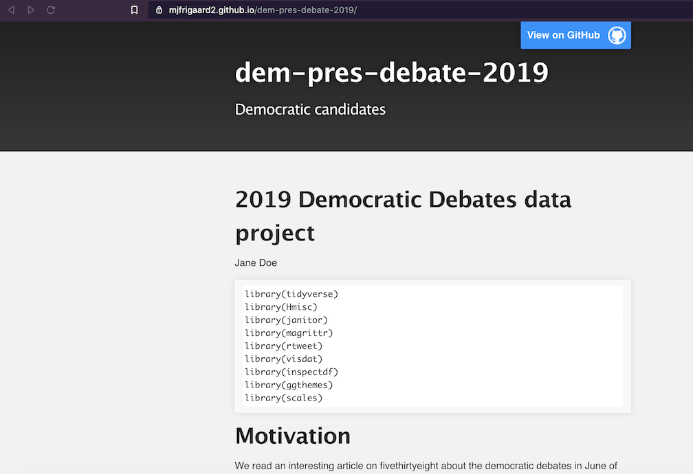
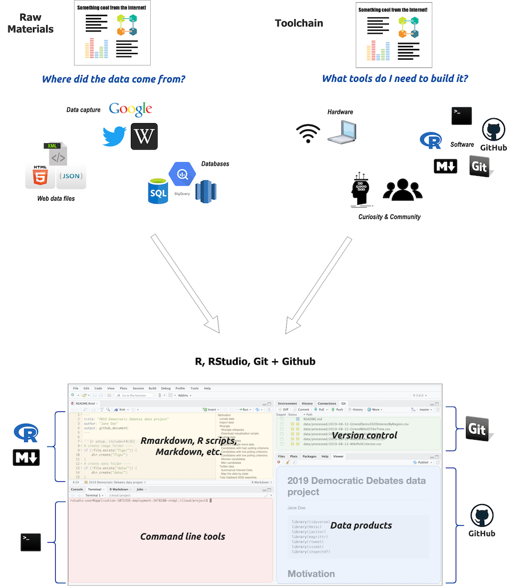

# Part 6: Putting your project on Github

In the previous chapters, we've set up a Github account, learned how to download the files from a Github repository, upload files into RStudio.Cloud, create and run R code, and commit changes using Git. 

In this final chapter, we're going to put these changes on Github in a way for people to find and share.  

## What we've done

***In chapter 4 we set up Git by initializing a repository in RStudio.Cloud,***


***And in chapter 5 we added the files for Git to track,***


***and then we committed the file changes to our Git repository.***


Now we've come to a point where we want to share our project with friends and colleagues. We'll accomplish this by pushing all the changes to a Github repository.


First we need to create a new Github repository for this project. Follow the steps below to complete this:

### 1) Create a Github repository 

Name your new Github repository the same thing as your RStudio.Cloud project. 


### 2) Add and commit file changes

After you've created a Github repository, we'll need to add and commit the changes we've made to the project files. We can do this in the **Git** pane by clicking on the yellow question marks (and making them green As or blue Ms). We've included an icon key so we know what's happening with each file. 


When all the files have been added, click on the *Commit* button. Next we want to review the changed files, write a commit message, and commit these changes to Git (see image below). 


### 3) Push file changes to remote 

After these changes have been committed to our local Git repository in RStudio.Cloud, we need to 'sync' the local files with the Github repository we created in step 1. Fortunately, when we created the Github repository, all the information we needed in on that landing page (see below).


We're going to type this information directly into the RStudio.Cloud *Terminal* pane. **We will see a few error messages, but we can disregard them.**

```sh
$ git remote add origin https://github.com/mjfrigaard2/dem-pres-debate-2019.git
$ git push -u origin master
# the error below can be disregarded--enter your username
error: cannot run rpostback-askpass: No such file or directory
Username for 'https://github.com': mjfrigaard2
# you will see another error--disregard again and enter password
error: cannot run rpostback-askpass: No such file or directory
Password for 'https://mjfrigaard2@github.com':
# now we see the objects being pushed
Counting objects: 82, done.
Delta compression using up to 16 threads.
Compressing objects: 100% (79/79), done.
Writing objects: 100% (82/82), 6.82 MiB | 2.82 MiB/s, done.
Total 82 (delta 16), reused 0 (delta 0)
remote: Resolving deltas: 100% (16/16), done.
To https://github.com/mjfrigaard2/dem-pres-debate-2019.git
 * [new branch]      master -> master
Branch master set up to track remote branch master from origin.
```

The final message tells us the changes have been pushed from the RStudio.Cloud Git repository to the `remote` repository on Github. We can verify this by going to the repository landing page (or URL).

## Sharing our work with Github pages

Now we can finally put our stuff online and share it with everyone on Twitter, LinkedIn, etc! We'll be using [Github pages](https://pages.github.com/) to make our project more discoverable.

Github pages are "*websites for you and your projects*", so they're a perfect fit for what we want to create. To turn a repository into a Github page website, we will need to go into the *Settings* on the repository landing page (see image below).


Scroll down the *Settings* options until you find *Github pages*. 


Under the *Source* section we'll tell Github that we want to use the `master` branch and pick a theme (we chose the Slate theme). 

After completing these steps, Github will tell us the website url.


Github pages builds a website that uses our `README.md` file as the landing page (see below). 



Fortunately, our `READMD.md` file documents our entire project! But using RStudio and Rmarkdown means we're not limited to the themes and options provided by Github pages.

### Creating a project website from your Rmarkdown file

What if we didn't like the `Slate` theme we selected from Github pages? Fortunately, Rmarkdown and RStudio.Cloud give us the ability to create a new `.html` file we can use as our `index` file. 

We'll head back over to RStudio.Cloud, change some of the settings on our Rmarkdown `README.Rmd`, rename the output file to `index.html`, and commit and push all these changes back to Github. 

The `README.Rmd` file can be accessed in the **Files** pane. We are going to alter the `YAML` header by change the `output:` from `github_document` to `html_document`. Copy the `yaml` header below into the `README.Rmd` file

```yaml
output: 
  html_document: 
    df_print: kable
    highlight: zenburn
    keep_md: yes
    theme: united
    toc: yes
```

The settings displayed above are some of the ways we can customize our `.Rmd` files. Read more about the html documents [here in the Rmarkdown guide](https://bookdown.org/yihui/rmarkdown/html-document.html). 

*Save* and *Knit* this new file, and rename the output `index.html`.

Notice the changes to the files in the **Git** pane. Follow the previous steps for adding and committing the file (but don't push the changes yet!)

#### Pulling the changes from Github (before pushing)

Remember that Git is used for tracking *all* changes to the files in our repository. Well, we made a few changes to the `remote` repository on Github when we set up our Github pages website. Specifically, we added a `_config.yml` file. 

This means there are files in the Github repository that aren't in our RStudio.Cloud repository. If we want to make sure the RStudio.Cloud Git repository has the same files as our `remote` repository on Github, we need to click on the *Pull* button (it's right next to the *Push* button) in the upper right corner of the review changes window. 


*Pull* means, *"pull the file changes into my local repo."* After clicking on the *Pull* button, the results should display something like the image below. 


This cryptic language is how Git tells us what changes are being merged with our current repository on RStudio.Cloud. Read more about how to interpret these symbols [here](https://git-scm.com/docs/giteveryday). 

Now we can push the file changes to Github by clicking *Push* in the **Git** pane.


After pushing these changes to Github, we can go back to the project website link. This will now take us to a nice website for our project.  


This new `index.html` file has a few neat qualities: first, we can navigate this file like a webpage (the back button works when we click through the links in the table of contents). Second, just about every computer will have a browser, so we don't have to worry about what version to save. Third, Rmarkdown files are relatively easy to work with and don't force us to learn complicated web programming language (like HTML and CSS).

## Conclusion

There you have it! We've covered how to add and extract the code in an `.Rmd` file, how to push these changes to a Github repository, how to knit these files into `.html` documents,

Being able to create files in `.html` format is incredibly handy for interweaving various formatted text, code, and media (tables, images, and graphs). 

We hope this text was a nice introduction to these technologies, and you feel like you have enough information to move forward and build on this project (or adapt it to something else you're working on).




Check out the next chapter for additional tips, tools and resources. 


