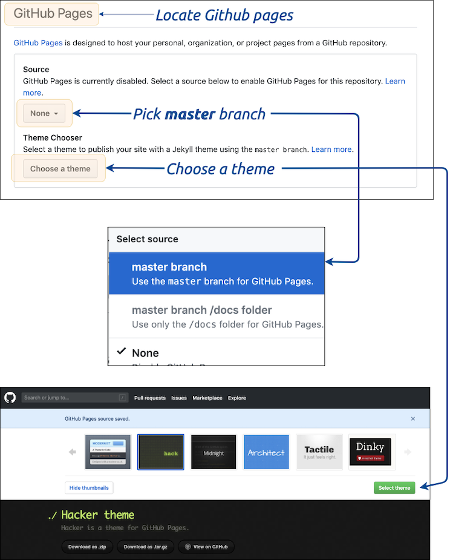
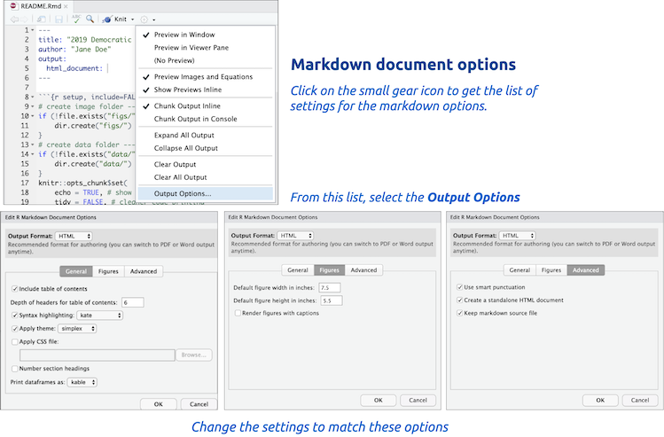
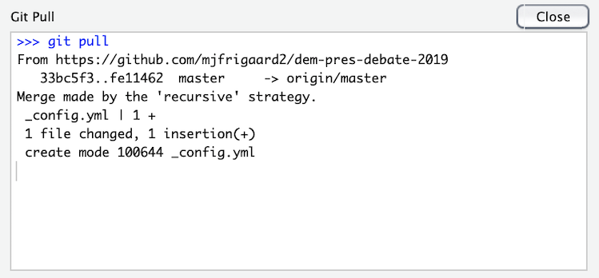

# Part 6: Putting your project on Github

In the previous chapters, we've set up a Github account, learned how to download the files from a Github repository, upload files into RStudio.Cloud, create and run R code, and commit changes using Git. 

In this final chapter, we are going to create some figures and graphs for this project, then put these changes on Github in a way for people to find and share.  

## Push the changes to Github 

We've come to a point where we want to share our project with friends and colleagues. We need to commit the changes we've made, and then push these changes to a Github repository. 

To do this, first we need to create a new Github repository. Follow the steps below to complete this:

### 1) Set up Github repository 

Name your new Github repository the same thing as your RStudio.Cloud project. 


### 2) Add and commit file changes

After you have a Github repository, we will want to add and commit the changes we've made to our files. We can do this in the **Git** pane by clicking on the yellow question marks (and making them green As or blue Ms). When all the files have been added, click on the *Commit* icon.


Next we want to review the changed files, write a commit message, and commit these changes to Git. 


### 3) Push changes to remote 

After these changes have been committed in our local Git repository, we want to sync the local files with the Github repository we created just created. Fortunately, when we setup our Github repository, all the information we needed was on the landing page.


We're going to type this information directly into the RStudio.Cloud *Terminal* pane. We will see a few error messages, but we can disregard them. 

```sh
$ git remote add origin https://github.com/mjfrigaard2/dem-pres-debate-2019.git
$ git push -u origin master
# the error below can be disregarded--enter your username
error: cannot run rpostback-askpass: No such file or directory
Username for 'https://github.com': mjfrigaard2
# you will see another error--disregard again and enter password
error: cannot run rpostback-askpass: No such file or directory
Password for 'https://mjfrigaard2@github.com':
# now we see the objects being pushed
Counting objects: 82, done.
Delta compression using up to 16 threads.
Compressing objects: 100% (79/79), done.
Writing objects: 100% (82/82), 6.82 MiB | 2.82 MiB/s, done.
Total 82 (delta 16), reused 0 (delta 0)
remote: Resolving deltas: 100% (16/16), done.
To https://github.com/mjfrigaard2/dem-pres-debate-2019.git
 * [new branch]      master -> master
Branch master set up to track remote branch master from origin.
```

The final message tells us the changes have been pushed from the RStudio.Cloud Git repository to the `remote` repository on Github. We can verify this by going to the repository landing page. 

## Sharing our work (with Github pages)

We're finally ready to put our stuff online and share it with everyone on Twitter, LinkedIn, etc. We'll be using [Github pages](https://pages.github.com/) to make our project more discoverable. 

Github pages are literally "Websites for you and your projects", so they're a perfect fit for what we want to create. To turn a repository into a Github page website, we will need to go into our *Settings*.


Scroll down the settings options until you find the Github pages. This is where we will tell Github that we want to use the `master` branch and pick a theme (we chose the Slate theme). 



After completing these steps, Github will tell us the website url.


This give us a website that uses our `README.md` file as the landing page.


Fortunately, our `READMD.md` file documents our entire project! But using Rmarkdown means we're not limited to the themes and options provided by Github pages.

#### 1) Create a project website index file

We'll head back over to RStudio.Cloud, change some of the settings on our Rmarkdown `README.Rmd`, rename the output file to `index.html`and commit and push all these changes to Github. 

The `README.Rmd` file can be accessed in the **Files** pane. We are going to alter the `YAML` header by change the `output:` from `github_document` to `html_document`. Click *Save* after making this change.  

Click on the small gear next to the *Preview* button, and follow the directions in the figure below to setup the `index.html` output file.



When we click *Ok* and the window closes, we should see a new `YAML` header at the top of the `index.md` file.

```yaml
---
output: 
  html_document: 
    df_print: kable
    fig_height: 5.5
    fig_width: 7.5
    highlight: kate
    keep_md: yes
    theme: simplex
    toc: yes
    toc_depth: 6
---
```

The settings displayed above are some of the ways we can customize our `.Rmd` files. Read more about the html documents [here in the Rmarkdown guide](https://bookdown.org/yihui/rmarkdown/html-document.html). 

We will use the *Rename* button to change this file to `index.md`.


Notice the changes to the files in the **Git** pane. Follow the previous steps for adding and committing the file (don't push the changes yet!)

#### 2) Pull the changes from Github (before pushing)

We made a few changes to the repository on Github when we set up the Github pages. Specifically, we added a `_config.yml` file. We need to make sure the local repository has the same files as the `remote` repository on Github, and we can do this by clicking on the *Pull* button (it's right next to the *Push* button) in the upper right corner of the review changes window. 


After clicking on the *Pull* button, the results should display something like the image below. 



Now we can push the changes to Github.


After pushing these changes to Github, we can go back to the project website link. This will now take us to a nice website for our project. 


### HTML documents 

Let's say we don't like the `Slate` theme we selected from Github pages. Fortunately, Rmarkdown and RStudio.Cloud give us the ability to create a new `.html` file we can use as our `index` file. 

Open the `index.md` file in the **Source** pane, click on the small gear next to the *Preview* button, and follow the directions in the figure below to setup the `index.html` output file.


When we click *Ok* and the window closes, we should see a new `YAML` header at the top of the `index.md` file.

```yaml
---
output: 
  html_document: 
    df_print: kable
    fig_height: 5.5
    fig_width: 7.5
    highlight: kate
    keep_md: yes
    theme: simplex
    toc: yes
    toc_depth: 6
---
```

The settings displayed above are some of the ways we can customize our `.Rmd` files. Read more about the html documents [here in the Rmarkdown guide](https://bookdown.org/yihui/rmarkdown/html-document.html). 

To see what these settings do, we will click the *Preview* button on the `index.md` file. 


Now we can add, commit, and push these changes to the Github remote following the steps outlined above to get a new project webpage. 

The new `index.html` file has a few neat qualities: first, we can navigate this file like a webpage (the back button works when we click through the links in the document). Second, just about every computer will have a browser, so we don't have to worry about what version to save. Third, these files are easily transported to the web, which we will do in the next section.

## Conclusion

There you have it! We've covered how to add and extract the code in an `.Rmd` file, how to push these changes to a Github repository, how to knit these files into `.html` documents,

Being able to create files in `.html` format is incredibly handy for interweaving various formatted text, code, and media (tables, images, and graphs). 


