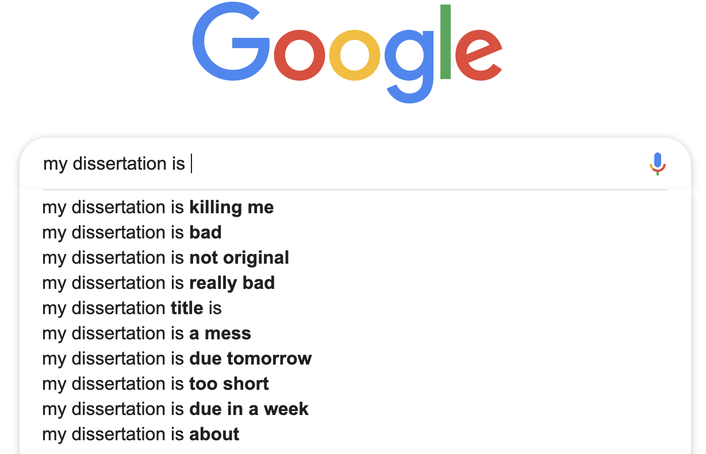

# Showing your work: a guide for graduate students 

Congratulations! You've just entered graduate school and you're on your way to more specialized education and training. Hopefully, after a few challenging years and sleepless nights, you'll be on your way to rewarding career. Provided you did your [research](https://www.usnews.com/education/best-graduate-schools/top-graduate-schools/paying), a graduate school degree is still likely to be a great investment for your future. 

Personally, I loved my graduate school experience. I made friends and colleagues I'm still in contact with, and received some excellent advice from outstanding (and unexpected) mentors. Yet as I write this, the cost of college tuition has grown faster than the amount of [financial aid available](https://www.insidehighered.com/news/2017/10/25/tuition-and-fees-still-rising-faster-aid-college-board-report-shows), and studies are showing degrees is some fields [have more value than others](https://www.eurekalert.org/pub_releases/2015-09/uok-coc091115.php). In recognition of these changes, my colleague and I have decided to write this technical guide. We felt there were a few topics missing from our graduate education, and wanted to share what we've learned in the hopes it would make the transition from school to work a little less shocking.

We sincerely hope you'll find this information useful and give us feedback at `mfrigaard@paradigmdata.io` or `pspangler@paradigmdata.io`.

### Who should read this

This book is written for any graduate student who will be doing research. Whether you're getting a Masters or a PhD, if you're doing research, this book is for you. 

### Assumptions we are making

We assume you've been working on a computer, but mostly to write papers (maybe using Word or Papers), send/receive emails, and explore the internet. Everyone enters graduate school at different times in their lives, so there is a good chance some of you will know the materials we are covering. If this is the case, hopefully we cover it in a novel and ineteresting way that doesn't make reading it feel like a waste of time. 

***

## "It was the best of times, it was the worst of times"

You have entered graduate school in a fantastic time. Most people are walking around with more computational power in their pockets than previous generations ever imagined possible. An internet browser now gives you access to nearly all the accumulated knowledge of the human species (and an unreasonable number of cat pictures). As an example to how much has changed and how fast it's happened, consider a [2000 paper in Nature](https://www.nature.com/articles/21987) by Steve Lawrence and C. Lee Giles titled, "Accessibility of information on the web." The authors open with the jaw-dropping statistic that the internet is "*800 million pages, encompassing about six terabytes of text data on about 3 million servers.*" Fast forward to 2016, and Google claims to be aware of [130 trillion pages](https://searchengineland.com/googles-search-indexes-hits-130-trillion-pages-documents-263378) across the web. Wikipedia has  5.71 million articles (as of September 2018), and is contributed to by [127,026 Wikipedians](https://en.wikipedia.org/wiki/Wikipedia:Wikipedians) (people who actively edit wikipedia articles). We've never had more access to information than we do right now, and it's unlikely that there will ever be less available information in the near future. 

> "*Your work should speak for itself...*" - unknown

You need your gradutate work to be discoverable **on the internet**. You want collaborators, future employers, other graduate students, and (most importantly) future 'you' to be able to find a catalog of what you've been doing all those late nights in front of your computer. 

**Don't rely soley on your scientific papers to showcase your work?** 

Be honest--*how many theses/dissertations have you read?* Ask your most bibliophilic friends what their favorite thesis is, or what dissertation they think everyone *must* read? These documents aren't a waste of time--they serve a different purpose (and it's not to make sure all of your hard work reaches a broad audience).

And even if you decide to convert your work into a peer-reviewed manuscript, it will be for a very niche audience, and rarely in a way that makes it's contents interesting beyond a small number of researchers closest to the subject matter. 

Scientific papers are still essential to advancing science (and your career as a scientist), but they represent the end of a long process in which you've demonstrated many different skills (reading and summarizing previous research, designing a study, data analysis, and communication). This sentiment is summarized well in the quote from Jonathan Buckheit and David Donoho at Stanford,

> "*An article about computational science in a scientific publication is not the scholarship itself, it is merely advertising of the scholarship. The actual scholarship is the complete software development environment and the complete set of instructions which generated the figures.*" 

And like most advertising, peer-reviewed papers leave many essential details out. For example, journal articles can't document how you ended up at the particular research question or hypothesis you tested (and why you had to change it). Neither the thesis/dissertation nor the peer-reviewed paper can document what you did in graduate school.  

* coming up with an idea, 
* turning that idea into a research question, 
* convincing people of that idea (or some version of it), 
* collecting your data, 
* teaching labs/lectures, 
* recruiting volunteers, 
* entering your data, 
* managing your committee member's expectations (and egos), 
* cleaning your data, 
* persuading someone to read early drafts, 
* politely reminding your committee to give you constructive criticism (promptly so you can graduate), and 
* solving a million other little day-to-day problems. 

A paper and set of slides won't capture most of these experiences, so if you want your work to count, it needs to documented somewhere else. 

## Showing your work

This book will show you how to make your work more discoverable. We'll introduce you to the technologies, methods, and places used by scientists who have successfully communicated their work. These scientists have used the internet as a tool to reach broader audiences, document some of their daily struggles/successes, and share more about what it means to conduct research. 

**Won't people find my work boring--who would want to read this?**

The best science writers capture their audience by weaving science into a compelling narrative. Carl Sagan, Mary Roach, Freeman Dyson, Jared Diamond--all of these authors have a unique talent for making complicated, intricate scientific topics enjoyable by engaging us with the people in the story. By entering graduate school and doing your research, you're now one of the people in that story. No one is born with an ability to write well--it takes a lot of practice and feedback. The more you communicate with different audiences about your research, the better you'll get at finding an ability to convey its importance. 

Lastly, science is a method, not a product. That process of how you found what you found is the most critical part of your research because it's the part that tells us 1) why we can trust what you published, and 2) how we can try to reproduce your findings. 

So when you think about it, all those early drafts of your proposal, the lines of code you've used to wrangle your data, the graphs, tables, and figures you've used to learn about the distributions and relationships between your variables, the random notes, and epiphanies, etc...*these artifacts are the real 'science'*. 

To quote [Roger Peng](https://science.sciencemag.org/content/334/6060/1226) from the Department of Biostatistics, in the Johns Hopkins Bloomberg School of Public Health, 

> "the data and code used to make a finding are available and they are sufficient for an independent researcher to recreate the finding."

When we were kids in math class, the teacher would ask us to "Show our work." Teachers gave these instructions so they could follow our thought process through a problem. Communicating our work should be the goal of everyone doing research. If you think about it, our job isn't done as researchers when we defend our thesis/dissertation and get the degree; it isn't done when our research has been submitted and accepted to a conference or high-impact journal; it isn't even done when someone reads the article or attends the talk. 

As researchers, our jobs are done when someone has understood our research and the impact it will have on the world. 

***

# Getting set up

All of the tools in this book are available completely free. The reason we recommend using open-source software is the communities behind these tools. You'll find a massive network of support on [Stackoverflow](https://stackoverflow.com/questions/tagged/r), [RStudio Community](https://community.rstudio.com/), and [Google Groups](https://groups.google.com/forum/#!forum/r-help-archive). 

To follow along with this book, you'll need to download and install R, RStudio, and Git. I will cover this process assuming you have none of these on your machine. This section will include downloading installing R and RStudio, and basic commands in Terminal.

## Using R & RStudio

**What is R?** 

*[R](https://www.r-project.org/) is a free statistical modeling software application and language.* 

**What is RStudio?** 

*[RStudio](https://www.rstudio.com/products/RStudio/) is an integrated development environment (IDE) for using R.*

RStudio is a free and open-source [integrated development environment](https://en.wikipedia.org/wiki/Integrated_development_environment) (IDE) for R. You should explore different IDE's on your own--you'll see there are many options, both paid and unpaid. These applications typically come with a code editor (with syntax highlighting), a graphical/drag-and-drop tools, and some debugging display. 

Other examples of IDEs are [DataGrip](https://www.jetbrains.com/datagrip/) for relational data, [Spyder IDE](https://www.spyder-ide.org/) for Python, or  [Stata](https://www.stata.com/why-use-stata/). *These are not free*.

## Getting set up with R/RStudio

1. Download and install R from [CRAN](https://cran.r-project.org/)   
2. Download and install [RStudio](https://www.rstudio.com/products/rstudio/download/), the integrated development environment (IDE) for R  
3. An alternative to downloading and installing RStudio is using [RStudio.Cloud](https://rstudio.cloud/) which operates entirely in your browser. You'll need to sign up for RStudio.cloud for free using your Google account or email address, but we recommend using a Github account. You can create a Github account [here](https://github.com/join)  

In the next section, we'll cover using the command line, version control, and syncing RStudio with Github.

***

#### Notes 

- The scientific journal industry is not looking out for your best interests. They have a [clearly unethical business model](https://www.theguardian.com/commentisfree/2011/aug/29/academic-publishers-murdoch-socialist), even [prominent universities can't afford their prices](https://www.theguardian.com/science/2012/apr/24/harvard-university-journal-publishers-prices) (which means fewer people reading your work), and they won't [compensate](https://whyevolutionistrue.wordpress.com/2011/09/01/the-racket-of-academic-publishing/) you for your efforts.

- The metrics previously used to measure success in academic publishing are [unreliable and susceptible to being gamed](https://academic.oup.com/gigascience/article/8/6/giz053/5506490). You don't want to have these be your sole measure of productivity. 

- Read more about the reproducibility crisis in science [here](https://www.nature.com/news/1.19970), and why it's so important. 