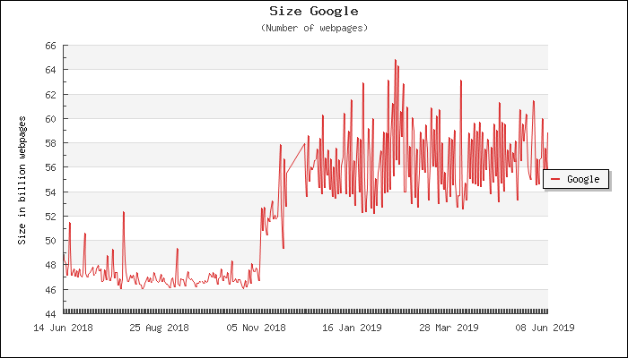
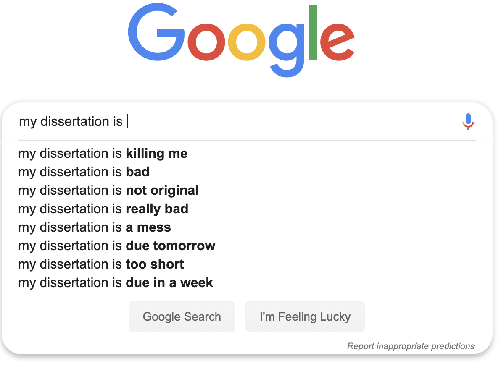

# Welcome!

Congratulations! You've just entered graduate school, and you're on your way to more specialized education and training. Provided you did your [research](https://www.usnews.com/education/best-graduate-schools/top-graduate-schools/paying), a graduate school degree is still likely to be an excellent investment for your future. And after a few challenging years and sleepless nights, you'll be on your way to a rewarding career. 

## About us

I loved my graduate school experience. I made friends and colleagues I'm still in contact with, and received some excellent advice from outstanding (and unexpected) mentors. As I write this, the cost of college tuition has grown faster than the amount of [financial aid available](https://www.insidehighered.com/news/2017/10/25/tuition-and-fees-still-rising-faster-aid-college-board-report-shows), and studies are showing degrees is some fields [have more value than others](https://www.eurekalert.org/pub_releases/2015-09/uok-coc091115.php). In recognition of these changes, my colleague and I have decided to write this technical guide. We felt a few topics were missing from our graduate education, and wanted to share what we've learned in the hopes it would make the transition from school to work a little less shocking.

We sincerely hope you'll find this information useful and give us feedback at `mfrigaard@paradigmdata.io` or `pspangler@paradigmdata.io.`

### Who should read this?    

We originally wrote this text as a manual for graduate students beginning their research, but anyone who needs to extract meaningful information from data (using a state-of-the-art toolset) will find this text useful. Many of the concepts covered in this text came from our observations as we transitioned from graduate school into professional work (non-profit and private sector jobs), and we've included other lessons from colleagues who were generous enough to share their insights. 

### The assumptions we've made

We assume you'll be working on a computer (laptop or desktop), and have the ability to download, locate, and install software applications. Although the examples in this book use a macOS operating system, you can extend most of these commands to any Unix operating system (such as the [Ubuntu-based operating systems](https://en.wikipedia.org/wiki/List_of_Linux_distributions#Ubuntu-based), like MATE).

We assume you've been using your computer to send/receive emails, write papers, and explore the internet. People encounter a need for these tools at different times in their lives, so we realize there's a chance you'll be familiar with the materials we're covering. If this is the case, hopefully, we cover it in a novel and painless way that doesn't make reading it feel like a waste of time. 

### Language and style in this book

Although one person put this information together in this particular format, we use the plural 'we' because this is the result of many conversations, emails, comment threads, and communications that could not have happened in isolation. 

The text uses the following style guide: 

`code` 

> *quoted text*

[hyperlink]()

plain text 

---

## Modern research

Science has undergone significant changes in the last 10+ years. Computers have made writing papers and analyzing data accessible to wider audiences, and the internet has made publishing faster and easier. These changes and others are described in the excellent book, ["How to be a modern scientist"](https://leanpub.com/modernscientist), by the biostatistician and Professor at Johns Hopkins Bloomberg School of Public Health, Jeff Leek,

> *The modern academic scientist develops code in the open, publishes data and code open source, posts preprints of their academic work, still submits to traditional journals, and reviews for those journals, but may also write blog posts or use social media to critique published work in post-publication review fora. These activities can dramatically increase the profile of scientists, particularly junior scientists, if done well. But their value for important career milestones such as promotion and tenure or getting grants, is still often muted or fuzzy.*

It's been over three years since this post was published, and it's only become more accurate. Modern scientific work is increasingly [done in the open](https://www.nature.com/articles/d41586-018-01414-6), using [open source code and software](https://www.nature.com/articles/nphys3313), with [pre-prints](https://peerj.com/collections/50-practicaldatascistats/) and [social media](https://twitter.com/hashtag/datascience?lang=en) (and other [mediums](https://www.listennotes.com/search/?q=data%20science&scope=podcast)). 

As the quote above alludes to, academic publishing isn't the guaranteed pathway to success it used to be. As I write this, many scientists believe [science is in the midst of a reproducibility crisis](https://www.nature.com/news/1.19970), some people are pushing to [make every scientific journal article free](https://www.sciencealert.com/this-woman-has-illegally-uploaded-millions-of-journal-articles-in-an-attempt-to-open-up-science), and the University of California college system [dropped their $11 million annual subscription contract with Elsevier](https://www.vox.com/the-highlight/2019/6/3/18271538/open-access-elsevier-california-sci-hub-academic-paywalls).    

You have entered graduate school in exciting times, but the future of how we'll be measuring scientific productivity and contributions are still somewhat uncertain. The traditional advice of "publish or perish" makes sense in a world where writing papers, getting published, then getting cited made your work highly visible. But it's lead to creating a [system doesn't work as well as intended](https://www.nature.com/news/the-top-100-papers-1.16224), and encouraged citation metrics which are [easily manipulated](https://academic.oup.com/gigascience/article/8/6/giz053/5506490). 

More importantly, the amount of published scientific information is growing faster than we can keep track of it. The [1986 article by Don Swanson](https://www.jstor.org/stable/4307965?seq=1#page_scan_tab_contents) predicted this phenomenon. Swanson describes a scenario where a team of scientists discovers the presence of a black swan in a world where the accepted scientific consensus is that all swans are white, 

> *...a report of a family of black swans is presumed to be an acceptable and well-corroborated fact in the published literature, a fact that refutes a published hypothesis that all swans are white. But these two elements of information-the hypothesis and its refutation-may not both be known to any one person, at least not for some period of time, owing to the difficulties of identifying, locating, and gaining access to the relevant published information. Thus I have shown that it is possible for the refutation of theory to stand, even if temporarily, as undiscovered public knowledge.*

**Undiscovered public knowledge** -- that's what we're trying to prevent. We want your work to get discovered by the right people, in the right field, and in a way that advances your career. We see this as a "win-win" because your good work should be shared, and you should get rewarded for creating and sharing that work.  

### Science and the internet

The internet has made information easily accessible to everyone, and most people are walking around with more computational power in their pockets than previous generations ever imagined possible. With a laptop and internet browser, we can get access to nearly all the accumulated knowledge of the human species (and an unreasonable number of cat pictures). Part of this reason this is all so amazing is the relatively short time it took to happen.

Here is an example to demonstrate this rate of change: in a [2000 paper in Nature](https://www.nature.com/articles/21987) by Steve Lawrence and C. Lee Giles titled, "Accessibility of information on the web." The authors open with what was considered by many to be a jaw-dropping statistic at the time, "*[the internet] is 800 million pages, encompassing about six terabytes of text data on about 3 million servers.*." 

Sixteen years later, Google will claim to be indexing [130 trillion pages](https://searchengineland.com/googles-search-indexes-hits-130-trillion-pages-documents-263378) across the web. At the time of this writing, the Indexed Web has an estimated 5.64 billion pages ( [Monday, 10 June 2019](https://www.worldwidewebsize.com/) ).

We've never had more access to information than we do right now, and it's unlikely that there will ever be less available information any time soon. 

### Getting your science *on* the internet

> "*Your work should speak for itself...*" - author unknown

The sea of information on the internet means competing voices for your audience's attention. All that excellent work you're doing in graduate school needs to be discoverable on the internet by people who can advance (and refine) your ideas. For that to happen, you have to create more than just a single thesis, dissertation, or manuscript. If your future collaborators, prospective employers, and fellow graduate students are going to find you, that means keeping an ongoing catalog of what you've done discoverable by searching the internet. And unless you're willing to pay for advertisements, that means creating useful content that people read and share. 

*** Don't rely solely on your scientific papers to showcase your work***

> "*What a strange document a scientific journal article is. We work on them for months or even years. We write them in a highly specialized vernacular that even most other scientists don't share. We place them behind a paywall and charge something ridiculous, like $34.95, for the privilege of reading them. We so readily accept their inaccessibility that we have to start "journal clubs" in the hopes that our friends might understand them and summarize them for us.*" - [ScienceMag - How to read a scientific paper](https://www.sciencemag.org/careers/2016/01/how-read-scientific-paper)

Be honest--how many theses/dissertations have you read? How many peer-reviewed articles would you recommend for people to read for pure enjoyment? I suspect that even if you asked your most bibliophilic friends what their favorite peer-reviewed article is, or what dissertation they think everyone *must* read, they couldn't give you one quickly. These documents aren't a waste of time--they serve a different purpose (and it's not to make sure all of your hard work reaches a broad audience).

Even if you decide to convert your graduate research into a peer-reviewed manuscript, it'll be for a very niche audience, and rarely in a way that makes the contents interesting beyond a few researchers who are closest to the subject matter. 

Scientific papers are still essential to advancing science (and your career as a scientist), but they're not a demonstration of all the skills you've developed in graduate school. These artifacts represent the end of a long process in which you've demonstrated many different skills (reading and summarizing previous research, designing a study, data analysis, and communication). This sentiment is summarized well in the quote from [Jonathan Buckheit and David Donoho at Stanford](http://statweb.stanford.edu/~wavelab/Wavelab_850/wavelab.pdf),

> "*An article about computational science in a scientific publication is not the scholarship itself, it is merely advertising of the scholarship. The actual scholarship is the complete software development environment and the complete set of instructions which generated the figures.*." 

And like most advertising, peer-reviewed papers leave many of the essential details out. For example, consider the following activities that are common in graduate school:

* Coming up with an idea, 
* Turning that idea into a research question, 
* Convincing people the idea is worthy of scholarship (or a version of it is), 
* Collecting your data, 
* Teaching labs/lectures, 
* Recruiting volunteers, 
* Entering your data, 
* Managing your committee member's expectations (and egos), 
* Cleaning your data, 
* Persuading someone to read early drafts, 
* Analyzing your data  
* Politely reminding your committee to give you constructive criticism (promptly so you can graduate), and 
* Re-analyzing your data 
* Wondering why you've done this to yourself 
* Finding a position or job to transition to after you graduate 

A few papers that were written and edited by a committee and some PowerPoint presentations won't adequately capture how you developed professionally through your graduate school adventure. We're going to show you a few ways to create more research artifacts, get discovered, get and give feedback, and connect to a community throughout the entire process.

---

## Computer science and science

Computers, code, and the internet have become pretty standard in modern professional work, especially if that work involves research. Just about every field of science now has a 'computational' area or journal to accompany it.  [Archaeologists](https://en.wikipedia.org/wiki/Computational_archaeology) use computers to study geographical information systems (GIS) data and simulate human behavior.  [Chemists](https://en.wikipedia.org/wiki/Computational_chemistry) use data and simulation to determine the arrangements and features of molecules and particles, or to estimate binding affinities for drug molecules on a given receptor or target. [Biologists](https://en.wikipedia.org/wiki/Computational_biology) use computers to build models and simulate biological, ecological, behavioral, and social systems. The list goes on and on:

 * [Economics](https://en.wikipedia.org/wiki/Computational_economics)  
 * [History](https://en.wikipedia.org/wiki/Computational_history)  
 * [Finance](https://en.wikipedia.org/wiki/Computational_finance)  
 * [Linguistics](https://en.wikipedia.org/wiki/Computational_linguistics)  
 * [Law](https://en.wikipedia.org/wiki/Computational_law)   
 * [Sociology](https://en.wikipedia.org/wiki/Computational_sociology)  

I suspect most of the people in these fields probably weren't thinking they'd be writing code or designing algorithms, but the widespread adoption of computation throughout science is a sign of its near-universal utility. To fully capitalize on the potential of what our computers can do, we need to dig a little deeper into how they work (and how we interact with them).

### Examples

This book will show you some of the tools to make your work more discoverable. We'll introduce you to the technologies, methods, and places used by scientists who have successfully communicated their work. These scientists have used the internet as a tool to engage with broader audiences, create better tools for doing science, document some of their daily struggles/successes, and share more about what it means to conduct research. 

For example,  [Lucy D'Agostino McGowan](https://www.lucymcgowan.com/) is a post-doc at Johns Hopkins Bloomberg School of Health. She maintains a [blog](https://livefreeordichotomize.com/), publishes [ebooks](https://leanpub.com/ggplot2in2), has [online courses](https://leanpub.com/u/lucymcgowan), and also attempts to create a [real BB-8](https://magazine.amstat.org/blog/2017/11/01/lucy-dagostino-mcgowan-and-ryan-jarrett/). Her work is *highly discoverable* and showcases a wide range of skills. 

Or take Thomas Lin Pedersen, a former bioinformaticist who now designs software. His graduate research was on tools to analyze [hierarchical pangenome data](https://vimeo.com/181004000), which he turned into a [tool](https://www.data-imaginist.com/panviz/), made the [code free](https://github.com/thomasp85/PanViz), and [published](https://www.ncbi.nlm.nih.gov/pubmed/28057677) his work in a scientific journal. He's also an [artist](https://www.instagram.com/thomasp85_/).

Both of these researchers did two things very well: they created outstanding work, and they put it online for people to find. Of course, they had to know their subject areas, and have something worth sharing online, but they didn't wait until they were done with their research, either. They started engaging with people while they were completing their research training.

---

## What we'll cover

This book is a technical manual that covers how to get started with RStudio. We use RStudio for most of our research activities, and it's the sheer number of things we can accomplish in RStudio that makes us recommend it to you. Research is, by design, an interdisciplinary endeavor because it requires being competent in various topics outside your primary area of study: computer science, data analysis, data management, programming, and verbal/non-verbal communication. We've focused on distilling these topics into a toolset that you can absorb quickly because your time is limited. We'll also be giving you plenty of resources where you can come back and learn more as you need it. 

### Overcoming language barriers

> "*You must learn to talk clearly. The jargon of scientific terminology which rolls off your tongues is mental garbage*." - Martin H. Fischer

The most substantial barrier to understanding new disciplines or technologies is getting a handle on the jargon. Because this book sits at the intersection of computer science, statistics, and web technologies, the vocabulary can often seem like learning a foreign language. 

Wherever possible, we'll do our best to clear up or define any terms related to computer science, data management system, web technology, or statistics. To maximize the power of the tools in this text, it will help to know a little about their history, so we'll also cover some background.

### Practicing your communication

No one is born with an ability to write well--it takes a lot of practice and feedback. The more you communicate with different audiences about your research, the better you'll get at finding an ability to convey its importance. 

The best science writers capture their audience by weaving science into a compelling narrative. Carl Sagan, Mary Roach, Freeman Dyson, Jared Diamond--all of these authors have a unique talent for making complicated, intricate scientific topics enjoyable by engaging us with the people in the story. By entering graduate school and doing your research, you're now one of the people in the story, contributing to the research topic. It's your job to tell your portion of the story. 

Remember, **science is a method, not a product**. That process of how you found what you found is the most critical part of your research because it's the part that tells us 1) why we can trust what you published, and 2) how we can try to reproduce your findings. 

When we were kids in math class, the teacher would ask us to "show our work." Teachers gave these instructions so they could follow our thought processes through a problem, and see where our thinking was incomplete or mistaken (and probably also to make sure we weren't looking at someone else's paper). If you regularly show your work, you'll be able to follow your line of thinking as you progress through graduate school. More importantly, people who find your work will see you're an actual human, with a full range of human experiences, and not just another CV and headshot. 

---

## The path forward 
 
Communicating our work should be the goal of anyone doing research. After leaving graduate school, I realized how few people had the skills I was taking into the world (and how many people would benefit from them). One of the most attractive things about understanding math and science is that small investments in understanding can yield significant returns. 

I've realized we don't communicate the importance of being 'good enough' at math and science, and that's a shame. Being 'good enough' means you could read about technology and be capable of distinguishing it from magic, or that you can imagine a metric that might matter to your business or personal life, and then devise a way to measure it. Perhaps more importantly, an emphasis on a 'good enough' understanding of math and science could help break down the "us vs. them" mentality that arises when science inevitably makes its way into the public sphere. 

In our opinion, the job of a scientist or researcher isn't done when they defend a thesis/dissertation and get their degree; it isn't done when their research has been submitted and accepted to a conference or high-impact journal; it isn't even done when someone reads that article or attends their talk. 

As researchers, we consider our jobs are done when someone has heard and understood our research, and knows the impact it will have on the world. 

---

#### Footnotes

1. The scientific journal industry is not looking out for your best interests:  
 - They have a [clearly unethical business model](https://www.theguardian.com/commentisfree/2011/aug/29/academic-publishers-murdoch-socialist),  
 - Other [prominent universities can't afford their prices](https://www.theguardian.com/science/2012/apr/24/harvard-university-journal-publishers-prices),  
 - and they won't [compensate](https://whyevolutionistrue.wordpress.com/2011/09/01/the-racket-of-academic-publishing/) you for your efforts.

2. The metrics previously used to measure success in academic publishing are [unreliable and susceptible to being gamed](https://academic.oup.com/gigascience/article/8/6/giz053/5506490). You don't want to have these be your sole measure of productivity. 

3. John Ioannidis has led the charge in pointing out some of the ways science publication is flawed. [Massive citations to misleading methods and research tools: Matthew effect, quotation error, and citation copying](https://link.springer.com/article/10.1007/s10654-018-0449-x).

4. Here are more perspectives on the reproducibility crisis and publishing practices.    
* [Opinion: Is science really facing a reproducibility crisis, and do we need it to?](https://www.pnas.org/content/115/11/2628)     
* [Publish or Perish: Is Milton's Paradise Lost on Academia?](https://areomagazine.com/2018/10/09/publish-or-perish-is-miltons-paradise-lost-on-academia/)  

