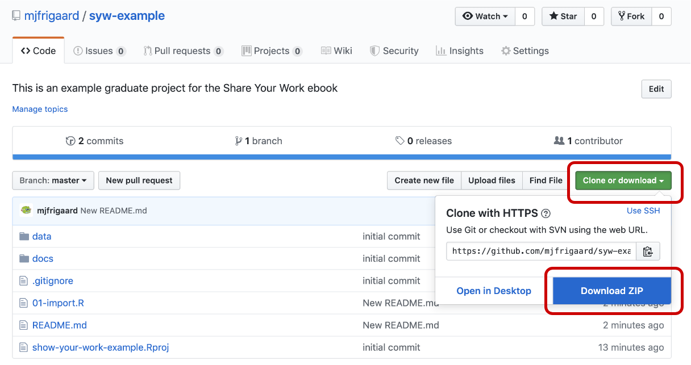
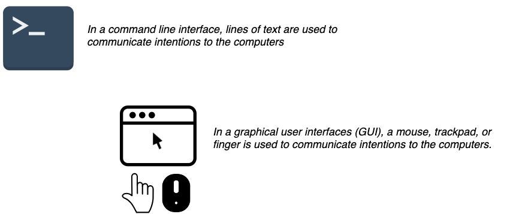

# 2) Getting set up with R/RStudio

This text is an opinionated technical manual for graduate students to share their work with a broad audience through a variety of mediums. We will be making recommendations based on what we were taught to use in school, learned to use at various jobs, and what we've abandoned. 

All of the tools in this book are available completely free. The reason we recommend using open-source software is the communities behind these tools. You'll find a massive network of support on [Stackoverflow](https://stackoverflow.com/questions/tagged/r), [RStudio Community](https://community.rstudio.com/), and [Google Groups](https://groups.google.com/forum/#!forum/r-help-archive). 

To follow along with this book, you'll need to download and install R, RStudio, and Git. I will cover this process assuming you have none of these on your machine. This section will include downloading installing R and RStudio, and basic commands in Terminal.

## For analysis use R & RStudio

**What is R?** 

[R](https://www.r-project.org/) is a free statistical modeling software application and language.

**What is RStudio?** 

[RStudio](https://www.rstudio.com/products/RStudio/) is an integrated development environment (IDE) for using R. If you can't install RStudio on your computer, you can also use [RStudio.cloud](https://rstudio.cloud/).

RStudio is a free and open-source [integrated development environment](https://en.wikipedia.org/wiki/Integrated_development_environment) (IDE) for R. You should explore different IDE's on your own-- you'll see there are many options, both paid and unpaid. These applications typically come with a code editor (with syntax highlighting), a graphical/drag-and-drop tools, and some debugging display. 

Other examples of IDEs are [DataGrip](https://www.jetbrains.com/datagrip/) for relational data, [Spyder IDE](https://www.spyder-ide.org/) for Python, or  [Stata](https://www.stata.com/why-use-stata/). *These are not free*.

## Getting set up with R/RStudio

1. Download and install R from [CRAN](https://cran.r-project.org/)   

2. Download and install [RStudio](https://www.rstudio.com/products/rstudio/download/), the integrated development environment (IDE) for R  

3. An alternative to downloading and installing RStudio is using [RStudio.Cloud](https://rstudio.cloud/) which operates entirely in your browser. You'll need to sign up for RStudio.cloud for free using your Google account or email address, but we recommend using a Github account. You can create a Github account [here](https://github.com/join)  

In the next section, we'll cover using the command line, version control, and syncing RStudio with Github.

***

# Take command of the command line

Doing research, posting your work online, and creating/building tools to highlight your work and abilities will require you to know more about how computers work than the average person. Computers and software have become such a standard part of modern professional work; you can consider these next few paragraphs as 'filling-in-the-gaps.'

## An example project

To help guide you through learning these technologies, we've made a code repository of some files typically found in a research project. The files in this repository were used to create this [master's thesis](http://csuchico-dspace.calstate.edu/handle/10211.3/10211.4_387) and [this peer-reviewed publication](https://journals.sagepub.com/doi/abs/10.1177/1941406412470719).

Download these files by clicking on the green icon and downloading the zip file. 

Put the zipped file in a recognizable place (like the `Documents` folder or on your `Desktop`). Unzip the folder and examine its contents. We'll be using these files throughout the text. 

***

## The language barrier

> "*You must learn to talk clearly. The jargon of scientific terminology which rolls off your tongues is mental garbage*." - Martin H. Fischer

The most substantial barrier to understanding new disciplines or technologies is getting a handle on the jargon. Because this book sits at the intersection of computer science, statistics, and web technologies, the vocabulary can often seem like learning a foreign language. 

Wherever possible, I'll do my best to clear up or define any terms related to computer science, data management system, web technology, or statistics. To maximize the power of the tools in this text, it will help to know a little about their history, so we'll also cover some background.

## Computers and science 

Just about every field of science also has a 'computational' area or journal to accompany it.  [Archaeologists](https://en.wikipedia.org/wiki/Computational_archaeology) use computers to study geographical information systems (GIS) data and simulate human behavior.  [Chemists](https://en.wikipedia.org/wiki/Computational_chemistry) use data and simulation to determine the arrangements and features of molecules and particles, or to estimate binding affinities for drug molecules on a given receptor or target. [Biologists](https://en.wikipedia.org/wiki/Computational_biology) use computers to build models and simulate biological, ecological, behavioral, and social systems. The list goes on and on...

* [Economics](https://en.wikipedia.org/wiki/Computational_economics)  
* [History](https://en.wikipedia.org/wiki/Computational_history)  
* [Finance](https://en.wikipedia.org/wiki/Computational_finance)  
* [Linguistics](https://en.wikipedia.org/wiki/Computational_linguistics)  
* [Law](https://en.wikipedia.org/wiki/Computational_law)   
* [Sociology](https://en.wikipedia.org/wiki/Computational_sociology)  

Computers and their peripheral technologies help researchers in almost every discipline research, record, analyze, review, and publish their work. So odds are if you're doing research in graduate school, you'll be using your computer a lot. 

*I already know how to use my computer--I do it everyday...*

Most people interact with their computers using a [graphical user interface](https://en.wikipedia.org/wiki/Graphical_user_interface) or GUI (pronounced 'gooey'). GUI's are quick and easy to learn because the operating system or software application environment usually mimics an actual physical space (i.e., desktops, folders, documents). If a new task is needed, an additional software application gets installed in this virtual environment to perform that specific function. 
Below is a list of standard computer tasks, and the associated software GUIs (point-and-click): 

* Browsing the internet: Chrome, Safari, and Firefox  
* Word processing (articles & reports): Microsoft Word, Apple iWork Papers, and Google Docs  
* Composing emails: Microsoft Outlook or Apple Mail  
* Building presentations: Microsoft PowerPoint or Apple iWork Keynote  
* Creating spreadsheets for numerical calculations to organize data: Microsoft Excel, Apple iWork Numbers, or Googlesheets

Users interact with a GUI using a mouse, trackpad, or touchscreen. These devices serve as digital appendages for transmitting intentions to their computers, whether this means opening an application by clicking on it, deleting a file by dragging it into a virtual trash bin, pinching fingers together to zoom in on an image, etc.

Having a [user-centered design](https://en.wikipedia.org/wiki/User-centered_design) has made software applications (and other technologies) available to a broader range of people, and reduced many of the frustrating experiences many of us had in the early days of computing. 

But all the benefits of GUIs come with a cost. Creating applications and operating systems that encourage clicking around until users can figure out they work sounds harmless, but it also presents challenges. 

For example, it's hard to keep track of everywhere a user clicks (or the order of things they clicked on) in a GUI, which makes it hard for automation. Furthermore, most GUIs come with a limited collection of possible operations a user can choose from (all of which were selected by the designer of the software).  

The [command line interface](https://en.wikipedia.org/wiki/Command-line_interface) (CLI) was the predecessor to a GUI, and there is a reason it hasn't gone away. CLI is a text-based screen where users interact with their computer's programs, files, and operating system using a combination of commands and parameters. This basic design might make the CLI sound inferior to a trackpad or touchscreen but after a few lessons on the command-line and you'll see the power of using these tools. 

Don't worry--we're not going to advise you start only interacting with your computer via the command line. There are plenty of tasks that are better suited for a GUI (*imagine how fun it would be if you had to play angry birds on a command line*). But as someone who'll be using a computer to document and communicate their research, you do need to understand the technologies that are used to store, manipulate, and analyze data. 

Hadley Wickham made this point in an excellent talk aptly titled," [You can't do data science in a GUI](https://www.youtube.com/watch?v=cpbtcsGE0OA) "

> "*The gooey is the easiest type of approach where you point and click, and everything is laid out in front of you. All of the options are laid out in front of you, which is great because you can see everything you can do. But it's also terrible because you have constraints--you can only do what the inventors of (SAS or Excel) wanted. Whereas with R--or other programming languages--is the opposite. All you get is this blinking cursor, and it's just telling you can do literally anything, but it's not gonna give you much...*"

> "*So I think an important thing about programming languages--like R or Python--is they give you a language to express your ideas, they give you very few constraints, which makes life tough for your learning or doing data science things occasionally, but the payoff for investing in a programming language is you get this whole this new language, and what you can express with them.*"

