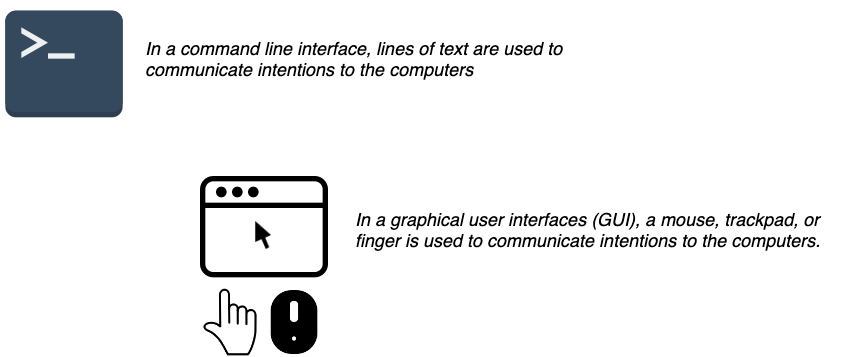

# Part 2: the toolset

**Disclaimer:** This text is an opinionated technical manual for graduate students to share their work with a broad audience through a variety of mediums. We'll be making recommendations based on what we were taught to use in school, learned to use at various jobs, and what we've abandoned. We primarily recommend RStudio, Git/Github, and Unix-based command line tools. We are not saying there aren't equally effective or productive ways of accomplishing the same tasks; we've just found the most success using the tools in this text. 

## Open source tools

All of the tools in this book are free. The primary reason we recommend using open source software is the communities that you'll become a part of when you start adopting them. The other reason is philosophical: we all benefit from using these tools and sharing improvements on them together. This is captured in the ['four freedoms' of open source software](https://www.gnu.org/philosophy/free-sw.html) outlined below. 

> - **Freedom 0**: The freedom to run the program as you wish, for any purpose.  
> - **Freedom 1**: The freedom to study how the program works, and change it so it does your computing as you wish.  
> - **Freedom 2**: The freedom to redistribute copies so you can help your neighbor.  
> - **Freedom 3**: The freedom to distribute copies of your modified versions to others. By doing this you can give the whole community a chance to benefit from your changes.

We also think it's overly onerous to require graduate students (and other scientists) to purchase proprietary software licenses in order to participate in science. 

Examples of open source tools are displayed in the image below:

- [Git](https://git-scm.com/)   
- [Github](https://github.com/)   
- [Linux](https://www.linux.org/)   
- [MySQL](https://www.mysql.com/)    
- [Netlify](https://www.netlify.com/)  
- [Python](https://www.python.org/)    
- [R](https://www.r-project.org/)    
- [RStudio](https://www.rstudio.com/)    

***
  
  
## The computer science in science

Computers, code, and the internet have become pretty standard in modern professional work, especially if that work involves research. Just about every field of science now has a 'computational' area or journal to accompany it.  [Archaeologists](https://en.wikipedia.org/wiki/Computational_archaeology) use computers to study geographical information systems (GIS) data and simulate human behavior.  [Chemists](https://en.wikipedia.org/wiki/Computational_chemistry) use data and simulation to determine the arrangements and features of molecules and particles, or to estimate binding affinities for drug molecules on a given receptor or target. [Biologists](https://en.wikipedia.org/wiki/Computational_biology) use computers to build models and simulate biological, ecological, behavioral, and social systems. The list goes on and on...

 * [Economics](https://en.wikipedia.org/wiki/Computational_economics)  
 * [History](https://en.wikipedia.org/wiki/Computational_history)  
 * [Finance](https://en.wikipedia.org/wiki/Computational_finance)  
 * [Linguistics](https://en.wikipedia.org/wiki/Computational_linguistics)  
 * [Law](https://en.wikipedia.org/wiki/Computational_law)   
 * [Sociology](https://en.wikipedia.org/wiki/Computational_sociology)  

I suspect most of the people in these fields probably didn't enter them thinking they'd be writing code or designing algorithms, but widespread adoption of computation throughout science is a sign of its near-universal utility. To fully realize the potential of what a computer can do, you'll have dig a little deeper into how they work (and how we interact with them).

Doing research, sharing your work online, and creating/building tools that highlight your work and abilities will require you to know more about how computers work than the average person. 

### Graphical user interfaces (the gooey)

Most people interact with their computers using a [graphical user interface](https://en.wikipedia.org/wiki/Graphical_user_interface) or GUI (pronounced 'gooey'). GUI's are quick and easy to learn because the operating system or software application environment usually mimics an actual physical space (i.e., desktops, folders, documents). If a new task is needed, an additional software application gets installed in this virtual environment to perform that specific function. 
Below is a list of standard computer tasks, and the associated software GUIs (point-and-click): 

* Browsing the internet: Chrome, Safari, and Firefox  
* Word processing (articles & reports): Microsoft Word, Apple iWork Papers, and Google Docs  
* Composing emails: Microsoft Outlook or Apple Mail  
* Building presentations: Microsoft PowerPoint or Apple iWork Keynote  
* Creating spreadsheets for numerical calculations to organize data: Microsoft Excel, Apple iWork Numbers, or Googlesheets

Users interact with a GUI using a mouse, trackpad, or touchscreen. These devices serve as digital appendages for transmitting intentions to their computers, whether this means opening an application by clicking on it, deleting a file by dragging it into a virtual trash bin, pinching fingers together to zoom in on an image, etc.

Having a [user-centered design](https://en.wikipedia.org/wiki/User-centered_design) has made software applications (and other technologies) available to a broader range of people, and reduced many of the frustrating experiences many of us had in the early days of computing. 

But all the benefits of GUIs come with a cost. Creating applications and operating systems that encourage clicking around until users can figure out they work sounds harmless, but it also presents challenges. 

For example, it's hard to keep track of everywhere a user clicks (or the order of things they clicked on) in a GUI, which makes it hard for automation. Furthermore, most GUIs come with a limited collection of possible operations a user can choose from (all of which were selected by the designer of the software).  

## Command line interfaces (shells, terminals, and text)

The [command line interface](https://en.wikipedia.org/wiki/Command-line_interface) (CLI) was the predecessor to a GUI, and there is a reason these tools haven't gone away. CLI is a text-based screen where users interact with their computer's programs, files, and operating system using a combination of commands and parameters. This basic design might make the CLI sound inferior to a trackpad or touchscreen, but after a few examples of what's possible from on the command-line and you'll see the power of using these tools. 

Don't worry-- we're not going to advise you start only interacting with your computer via the command line. There are plenty of tasks that are better suited for a GUI (*imagine how fun it would be if you had to play angry birds on a command line*). But as someone who'll be using a computer to document and communicate their research, you do need to understand the technologies that are used to store, manipulate, and analyze data. 

We also need to make a distinction between the command line, GUIs, and writing code. **We are recommending you write code**. We've noticed that clarity in writing brings clarity in thought, and code is a form of expression. 

Hadley Wickham made this point in an excellent talk aptly titled, [You can't do data science in a GUI](https://www.youtube.com/watch?v=cpbtcsGE0OA)

> *The gooey is the easiest type of approach where you point and click, and everything is laid out in front of you. All of the options are laid out in front of you, which is great because you can see everything you can do. But it's also terrible because you have constraints--you can only do what the inventors of (SAS or Excel) wanted. Whereas with R--or other programming languages--is the opposite. All you get is this blinking cursor, and it's just telling you can do literally anything, but it's not gonna give you much...*
> 
> *So I think an important thing about programming languages--like R or Python--is they give you a language to express your ideas, they give you very few constraints, which makes life tough for your learning or doing data science things occasionally, but the payoff for investing in a programming language is you get this whole this new language, and what you can express with them.*

You should write code because it makes you think explicitly about what you want to do with your computer. Writing out instructions for how to use a GUI is possible, but it amounts to a bunch of pictures with text saying *"click here, then click here"*. Learning to code well is like learning to write well--the better you get, the more clear your intentions become to *both* your computer and everyone else reading your code.  

## Use R and RStudio 

***What is R?***

[R](https://www.r-project.org/) is a free statistical modeling software application and language.

***What is RStudio?***

[RStudio](https://www.rstudio.com/products/RStudio/) is an integrated development environment (IDE) for using R. If you can't install RStudio on your computer, you can also use [RStudio.cloud](https://rstudio.cloud/).

RStudio is a free and open source [integrated development environment](https://en.wikipedia.org/wiki/Integrated_development_environment) (IDE) for R. You should explore different IDE's on your own-- you'll see there are many options, both paid and unpaid. 

These applications typically come with a code editor (with syntax highlighting), a graphical/drag-and-drop tools, and some debugging display. Other examples of IDEs are [DataGrip](https://www.jetbrains.com/datagrip/) for relational data, [Spyder IDE](https://www.spyder-ide.org/) for Python, or  [Stata](https://www.stata.com/why-use-stata/). *These are not free*.

## Why should I use R/RStudio and not Python?

Python is a great language, and it can do a wider range of tasks than R. I would never tell a researcher or scientist that a language like Python is something they shouldn't learn (the benefits of being multilingual extend beyond just spoken languages, too). 

We recommend R/RStudio for three reasons: First, this book is written for people doing research in graduate school. Most graduate students have a research question, or general curiosity, that they will turn into a data set that needs to be analyzed. Thus, the entry point for almost all graduate students into data science is *that they have data they need to analyze*, and this is exactly what R was built to do. 

The second reason we recommend R/RStudio is the time saved by switching between software applications. For example, when I was in graduate school, I had to have *a minimum of five applications open* to do my daily work of data analysis (MS Word to write, MS Excel to create tables, Stata for analysis, the browser for internet research, and Adobe for reading .PDFs). Five different GUIs, each with their own design characteristics, and each costing me valuable neurons every time I had to switch between them (read more in the footnotes). With R/RStudio, this number is cut to two (RStudio and the browser).

> ‘The only factor becoming scarce in a world of abundance is human attention” – Kevin Kelly in Wired

The third reason is the design of the IDE itself. RStudio is a complementary cognitive artifact, something described in [this article from David Krakauer](http://nautil.us/blog/will-ai-harm-us-better-to-ask-how-well-reckon-with-our-hybrid-nature),

> *"They're certainly amplifiers, but in many cases they're much, much more. They're also teachers and coaches...Expert users of the abacus are not users of the physical abacus—they use a mental model in their brain. And expert users of slide rules can cast the ruler aside having internalized its mechanics. Cartographers memorize maps, and Edwin Hutchins has shown us how expert navigators form near symbiotic relationships with their analog instruments."*

These are in contrast to competitive cognitive artifacts, which is what a GUI does. 

> "*In each of these examples our effective intelligence is amplified, but not in the way of complementary artifacts. In the case of competitive artifacts, when we are deprived of their use, we are no better than when we started. They're not coaches and teachers—they are serfs.*"

RStudio does not remove the complexity of doing data analysis, writing blog posts, building applications, debugging code, etc. Instead, it creates an environment where you can do each of these tasks without having them abstracted away from you into drop-down menus, dialogue boxes, and point-and-click options. 

There have been considerable efforts from the scientists at RStudio to create an environment and ecosystem of tools (called `packages`) to make data analysis less painful (and even fun). We're confident you'll find it helps you think about the inputs and outputs of your work in productive and creative ways. 

## Download R & RStudio 

1. Download and install R from [CRAN](https://cran.r-project.org/)   

2. Download and install [RStudio](https://www.rstudio.com/products/rstudio/download/), the integrated development environment (IDE) for R  

3. An alternative to downloading and installing RStudio is using [RStudio.Cloud](https://rstudio.cloud/) which operates entirely in your browser. You'll need to sign up for RStudio.cloud for free using your Google account or email address, but we recommend using a Github account. You can create a Github account [here](https://github.com/join)  

You'll also find a massive network of support on [Stackoverflow](https://stackoverflow.com/questions/tagged/r), [RStudio Community](https://community.rstudio.com/), and [Google Groups](https://groups.google.com/forum/#!forum/r-help-archive). 

***

::FOOTNOTES::

- The Ford Foundation report, ["Roads and Bridges"](https://www.fordfoundation.org/about/library/reports-and-studies/roads-and-bridges-the-unseen-labor-behind-our-digital-infrastructure/), outlines some other reason you should be using open source software. 
- Read this articles on multitasking (then try to stop doing it). 
	- [Why is it so hard to do my work? The challenge of attention residue when switching between work tasks - ScienceDirect](https://www.sciencedirect.com/science/article/pii/S0749597809000399)
	- [Information, Attention, and Decision Making](https://aom.org/uploadedFiles/Publications/AMJ/June_2015_FTE.pdf)
	- [Causes, effects, and practicalities of everyday multitasking](https://www.sciencedirect.com/science/article/pii/S0273229714000513)

