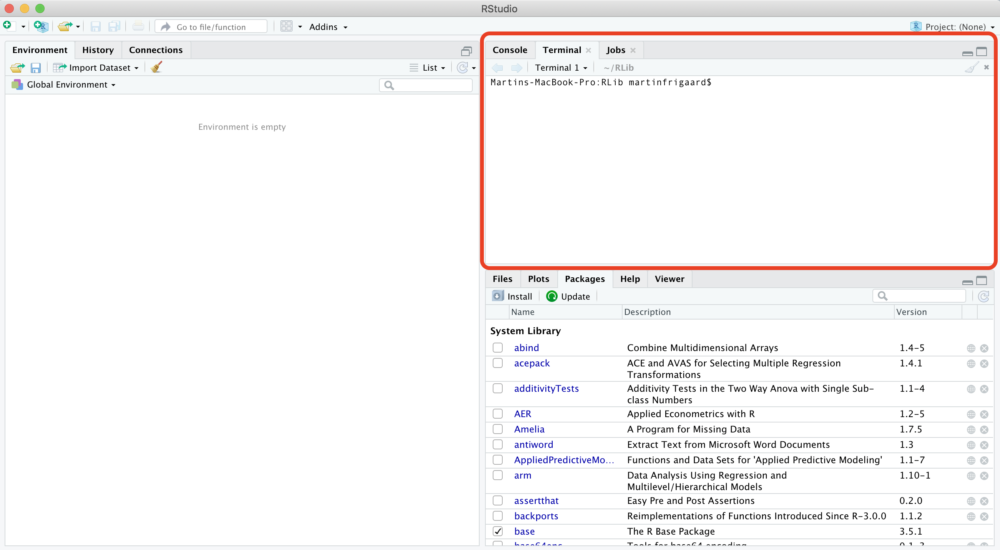

# Taking command of the command line

> *This chapter covers some essential computer science topics, terminology, and how they've changed modern research methods.*

## An example project

To help guide you through learning these technologies, we've made a code repository of some files typically found in a research project. The files in this repository were used to create this [master's thesis](http://csuchico-dspace.calstate.edu/handle/10211.3/10211.4_387) and [this peer-reviewed publication](https://journals.sagepub.com/doi/abs/10.1177/1941406412470719).

Download these files by clicking on the green icon and downloading the zip file. 

Put the zipped file in a recognizable place (like the `Documents` folder or on your `Desktop`). Unzip the folder and examine its contents. We'll be using these files throughout the text. 

***

## The language barrier

> "*You must learn to talk clearly. The jargon of scientific terminology which rolls off your tongues is mental garbage*." - Martin H. Fischer

The most substantial barrier to understanding new disciplines or technologies is getting a handle on the jargon. Because this book sits at the intersection of computer science, statistics, and web technologies, the vocabulary can often seem like learning a foreign language. 

Wherever possible, I'll do my best to clear up or define any terms related to computer science, data management system, web technology, or statistics. To maximize the power of the tools in this text, it will help to know a little about their history, so we'll also cover some background.

## Computers and science 

Just about every field of science also has a 'computational' area or journal to accompany it.  [Archaeologists](https://en.wikipedia.org/wiki/Computational_archaeology) use computers to study geographical information systems (GIS) data and simulate human behavior.  [Chemists](https://en.wikipedia.org/wiki/Computational_chemistry) use data and simulation to determine the arrangements and features of molecules and particles, or to estimate binding affinities for drug molecules on a given receptor or target. [Biologists](https://en.wikipedia.org/wiki/Computational_biology) use computers to build models and simulate biological, ecological, behavioral, and social systems. The list goes on and on...

* [Economics](https://en.wikipedia.org/wiki/Computational_economics)  
* [History](https://en.wikipedia.org/wiki/Computational_history)  
* [Finance](https://en.wikipedia.org/wiki/Computational_finance)  
* [Linguistics](https://en.wikipedia.org/wiki/Computational_linguistics)  
* [Law](https://en.wikipedia.org/wiki/Computational_law)   
* [Sociology](https://en.wikipedia.org/wiki/Computational_sociology)  

Computers and their peripheral technologies help researchers in almost every discipline research, record, analyze, review, and publish their work. So odds are if you're doing research in graduate school, you'll be using your computer a lot. 

*I already know how to use my computer--I do it everyday...*

Most people interact with their computers using a [graphical user interface](https://en.wikipedia.org/wiki/Graphical_user_interface) or GUI (pronounced 'gooey'). GUI's are quick and easy to learn because the operating system or software application environment usually mimics an actual physical space (i.e., desktops, folders, documents). If a new task is needed, an additional software application gets installed in this virtual environment to perform that specific function. 
Below is a list of standard computer tasks, and the associated software GUIs (point-and-click): 

* Browsing the internet: Chrome, Safari, and Firefox  
* Word processing (articles & reports): Microsoft Word, Apple iWork Papers, and Google Docs  
* Composing emails: Microsoft Outlook or Apple Mail  
* Building presentations: Microsoft PowerPoint or Apple iWork Keynote  
* Creating spreadsheets for numerical calculations to organize data: Microsoft Excel, Apple iWork Numbers, or Googlesheets

Users interact with a GUI using a mouse, track-pad, or touchscreen. These devices serve as digital appendages for transmitting intentions to their computers, whether this means opening an application by clicking on it, deleting a file by dragging it into a virtual trash bin, pinching fingers together to zoom in on an image, etc.

Having a [user-centered design](https://en.wikipedia.org/wiki/User-centered_design) has made software applications (and other technologies) available to a broader range of people, and reduced many of the frustrating experiences many of us had in the early days of computing. 

But all the benefits of GUIs come with a cost. Creating applications and operating systems that encourage clicking around until you can figure out how to get things done sounds harmless, but it also presents challenges for automation and keeping track of everything the user does in a GUI. Furthermore, most GUIs come with a limited collection of possible operations a user can choose from (all of which were selected by the designer of the software).  

The command-line interface is the predecessor to a GUI, and there is 
On the other hand, a [command line interface](https://en.wikipedia.org/wiki/Command-line_interface) is a text-based screen where users interact with their computer's programs, files, and operating system using a combination of commands and parameters.

Don't worry--we're not going to advise you start only interacting with your computer via the command line. There are plenty of tasks that are better suited for a GUI (*imagine how fun it would be if you had to play angry birds on a command line*).

But as someone who'll be using a computer to document and communicate their research, you do need to understand the technologies that are used to store, manipulate, and analyze data. 

Hadley Wickham made this point in an excellent talk aptly titled," [You can't do data science in a GUI](https://www.youtube.com/watch?v=cpbtcsGE0OA) "

> "*The gooey is the easiest type of approach where you point and click, and everything is laid out in front of you. All of the options are laid out in front of you, which is great because you can see everything you can do. But it's also terrible because you have constraints--you can only do what the inventors of (SAS or Excel) wanted. Whereas with R--or other programming languages--is the opposite. All you get is this blinking cursor, and it's just telling you can do literally anything, but it's not gonna give you much...*"

> "*So I think an important thing about programming languages--like R or Python--is they give you a language to express your ideas, they give you very few constraints, which makes life tough for your learning or doing data science things occasionally, but the payoff for investing in a programming language is you get this whole this new language, and what you can express with them.*"

**WARNING**--command-lines are frustrating. Most of the technologies we interact with daily don't behave in ways that are easy to understand (that's why GUIs exist). Switching from a GUI to a CLI seems like a step backward at first, but the initial headaches pay off because of the gains you'll have in control, flexibility, automation, and reproducibility.

## The Terminal 

The Terminal is a command line interface application for Mac users. Terminal is available as an application (on Mac go to *Applications* > *Utilities* > *Terminal*) or as a pane in RStudio.

Here is a quick list of commonly used Terminal commands.

* **`pwd`** - Print working directory 
* **`cd`** - change directories  
* **`cp`** - copy files from one directory to another  
* **`ls`** - list all files
* **`ls -la`** - list all files, including hidden ones
* **`mkdir`** - make directory  
* **`cat`** - display a text file in Terminal screen
* **`echo`** - outputs text as arguments, prints to Terminal screen, file, or in a pipeline
* **`touch`** - create a few files
* **`grep`** - "globally search a regular expression and print"
* **`>>`** and **`>`** - redirect output of program to a file (don't display on Terminal screen)
* **`sudo`** and **`sudo -s`** (**BE CAREFUL!!**) perform commands as **`root`** user  

### The Terminal application

Below is an image of what the terminal application looks like on macOS with Homebrew syntax highlighting. 

### The Terminal pane

The Terminal pane is also available in RStudio under *Tools* > *Terminal* > *New Terminal*. 

### Operating systems

In 2007, Apple released its [Leopard](https://en.wikipedia.org/wiki/MacOS_version_history#Version_10.5:_%22Leopard%22) operating system that was the first to adhere to the [Single Unix Specification](https://en.wikipedia.org/wiki/Single_UNIX_Specification). I only introduce this bit of history to help keep the terminology straight. macOS and Linux are both Unix systems, so they have a similar underlying architecture (and philosophy). You can use most Linux commands on a Mac.  

Windows has a command line tool called Powershell, but this is not the same as the Unix shells discussed above. The differences between these tools reflect the differences in design between the two operating systems. However, if you're a Windows 10 user, you can install a [bash shell command-line tool](https://www.windowscentral.com/how-install-bash-shell-command-line-windows-10). 

### Terminal applications

Strictly speaking, the Terminal application is not a shell, but rather it *gives the user access to the shell*. Other terminal emulator options exist, depending on your operating system and age of your machine. Terminal.app is the default application installed on macOS, but you can download other options (see [iTerm2](https://www.iterm2.com/)). For example, the [GNOME](https://en.wikipedia.org/wiki/GNOME) is a desktop environment based on Linux which also has a Terminal emulator, but this gives users access to the Unix shell. 

### Shells

On Macs, the Terminal application runs a [bash shell](https://en.wikipedia.org/wiki/Bash_(Unix_shell)). This is the most commonly used shell, but there are other options too (see [Zsh](http://zsh.sourceforge.net/), [tcsh](https://en.wikipedia.org/wiki/Tcsh), and [sh](https://en.wikipedia.org/wiki/Bourne_shell)). *in fact, bash is a pun for Bourne-again shell*.

In the next section, We are going to introduce version control with Git and linking your local machine to Github. 