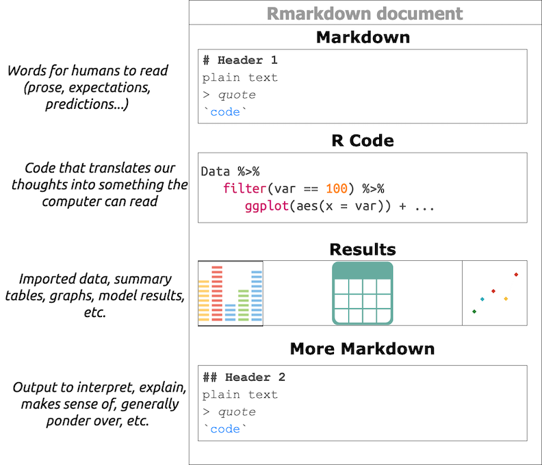

# Part 2: Have a workflow

This chapter will cover the three principles of our recommended workflow. 

1. Use open source software
2. Use your words 
3. Use plain text

## Principle 1: Use open source software

All of the tools in this book are available open source and available free of charge. The cost of a subscription to SPSS at the time of this writing is $99.00 per user per month. Stata is $595 per year or $1,595 for a perpetual license. There are educational discounts available, but this cost is not offset by much when you take into account the price of tuition.

A more important reason we recommend open source tools are the communities that you'll get access to when you start using them. By entering the universe of open source software, you get to take advantage of seeing problems solved in the open. You'll also find people like you, grappling with the same issues, and it's hard to overstate the benefit of this shared camaraderie. 

The final reason is philosophical: we all benefit from using open source tools and sharing improvements on them together. The ['four freedoms' of open source software](https://www.gnu.org/philosophy/free-sw.html) captures this sentiment below. 

**Freedom 0**: The freedom to run the program as you wish, for any purpose.

**Freedom 1**: The freedom to study how the program works, and change it so it does your computing as you wish.  

**Freedom 2**: The freedom to redistribute copies so you can help your neighbor.  

**Freedom 3**: The freedom to distribute copies of your modified versions to others. By doing this you can give the whole community a chance to benefit from your changes.

We also think it's onerous to require graduate students (and other scientists) to purchase proprietary software licenses to participate in science. 

We've displayed some examples of open source tools for data management, statistics, and communication in the image below:

Follow the links below to learn more. 

- [Git](https://git-scm.com/)   
- [Github](https://github.com/)   
- [Linux](https://www.linux.org/)   
- [MySQL](https://www.mysql.com/)    
- [Netlify](https://www.netlify.com/)  
- [Python](https://www.python.org/)    
- [R](https://www.r-project.org/)    
- [RStudio](https://www.rstudio.com/)    

***

### Use R, RStudio, Git, and Github

We recommend using R, RStudio, Git, and Github for the majority of your work. You can discover more about these tools [here](https://www.rstudio.com/).

### What is R?

[R](https://www.r-project.org/) is a free statistical modeling software application and language.

### What is RStudio?

[RStudio](https://www.rstudio.com/products/RStudio/) is a free and open source [integrated development environment](https://en.wikipedia.org/wiki/Integrated_development_environment) (IDE) for R. 

The IDE has four separate panes, each serving a specific function. 

- the `Code` pane is where we can document both human readable and computer readable text  
- the `Workspace` holds the data, functions, and other data analysis artifacts  
- the `Console` displays the results from our written code 
- the `Files` gives us a few of happenings outside the RStudio environment (imported raw data, exported results, etc.)

Follow the steps below to install R and RStudio.  

1. First, you'll need to download and install R from [CRAN](https://cran.r-project.org/).  
2. Second, download and install [RStudio](https://www.rstudio.com/products/rstudio/download/), the integrated development environment (IDE) for R   
3. An alternative to downloading and installing R and RStudio is using [RStudio.Cloud](https://rstudio.cloud/) which operates entirely in your browser. You'll need to sign up for RStudio.cloud for free using your Google account or email address, but we recommend using a Github account. You can create a Github account [here](https://github.com/join)  

**BONUS:** You'll also find a massive network of support on [Stackoverflow](https://stackoverflow.com/questions/tagged/r), [RStudio Community](https://community.rstudio.com/), and [Google Groups](https://groups.google.com/forum/#!forum/r-help-archive). 

### What is Git?

[Git](https://git-scm.com/) is a version control system (VCS). VCSs are used to track changes to projects with code. You can read more about Git in this online [text](https://git-scm.com/book/en/v2).

### What is Github?

[Github](https://github.com/) is the web-based hosting service for Git. You should set up a free an account with Github [here](https://github.com/join?source=header). 

We will cover more on Git/Github in later sections, but for now, know these tools will allow you to keep track of changes to your project over time. 

**Note:** *You should explore different IDE's on your own-- you'll see there are many options, both paid and unpaid. We're confident you'll see RStudio is well suited to handle >90% of the things you'll want to accomplish.* 

---
  
## Principle 2: Use your words

Usually, people interact with their computers using point-and-click [graphical user interfaces](https://en.wikipedia.org/wiki/Graphical_user_interface) or GUIs (pronounced 'gooey'). GUIs are quick and easy to learn because their design environment usually mimics an actual physical space (i.e., desktops, folders, or documents). GUIs are a mostly positive development because designing software with a more [user-centered design](https://en.wikipedia.org/wiki/User-centered_design) is one of the main reasons technology adoption has been on the rise for the past 20+ years. 

User-centered-designed software includes most of the point-and-click operating systems and applications. These programs give the user the ability to click through a predetermined list of options and procedures using their mouse or track-pad. 

However, we think there are times when we should resist the temptation to abstract away some of life's complexity, and data science is one of them. Using applications like these encourage a copy + paste workflow like the one below. 

As you can see from the image when you receive feedback or input to your project, you'll be required to go back through the same elaborate procedure (with each time taking just as long as the first).

We recommend an alternative to the copy + paste workflow based on the activities of a modern scientist from Jeff Leek we outlined in Chapter 1:

1. Develop code in the open   
2. Publish data and code open source  
3. Post preprints of your work  
4. Submit and review for traditional journals  
5. Blog or use social media to critique published work 

Two things should stand out from the list above: first, modern science is mostly writing. Second, some of that writing is code (i.e., programming). It's, for this reason, we recommend adopting a workflow based on, "*using your words*" wherever possible. 'Using your words' means being able to type, which might be daunting for people who struggle on a keyboard. We recommend practicing this skill (there are plenty of great apps out there to help!) because typing is an unavoidable necessity for data science. 

### Software isn't a solution

An extension of the "*use your words*" philosophy is to view software applications as instruments for gaining a deeper understanding of the world (but not oversimplifying or obfuscating it). 

As we stated in chapter 1, science is a process. We recommend viewing software as a tool to help move that process along faster. Software that improves our understanding shortens the distance between questions and answers but doesn't leave out any crucial details. 

For this reason, we recommend avoiding point-and-click environments in most proprietary software applications (SPSS, Stata, SAS, etc.). It's hard to keep track of everything you click on (or the order of you clicked on them in) inside these environments, and this makes it hard to know what step you're currently doing.

### What do we mean by 'a workflow'?

A workflow is a set of steps that can be used repeatedly to answer any question you might encounter in your work. 

The quote below is from an interview with Andrew Gelman, a statistician from Cornell, who is an author on the excellent blog [Statistical Modeling, Causal Inference, and Social Science](https://statmodeling.stat.columbia.edu/). 

> **Question:** "I'm wondering how you, as an educator and statistician, would like to see statistical and data literacy change in general for a general population?"

> **Answer:** "...I've come to realize that a lot of people don't even know what they did. People don't have a workflow, they have a bunch of numbers, and they start screwing around with the numbers and putting calculations in different places on their spreadsheet, and then at the end, they pull a number out and write it down and type it into their report." - [Andrew Gelman](https://soundcloud.com/dataframed/election-forecasting-polling) 

As the quote above illustrates, how you got an answer is just as relevant as the answer you got.  The tools we provide in this text give you a start-to-finish chain of documentation from question to solutions.

To recap, data science is complicated, and in order organize that complexity, you'll need a workflow that gives you the ability to 1) document your plans and ideas, and 2) write code that translates those thoughts and intentions into something a computer can execute. Plain text files are a great way to accomplish these tasks. 

***

## Principle 3: Use plain text

In [The Pragmatic Programmer](https://www.amazon.com/Pragmatic-Programmer-Journeyman-Master/dp/020161622X), authors Hunt and Thomas advise *'Keep[ing] Knowledge in Plain Text'*. This sentiment has been repeated [here](https://simplystatistics.org/2017/06/13/the-future-of-education-is-plain-text/), [here](https://richardlent.github.io/post/the-plain-text-workflow/), and [here](http://plain-text.co/index.html#introduction). 

We recommend you keep track of your changes, notes, and any pertinent documentation about your project in plain text `README` files. The reasons for this will become more apparent as we move through the example, but I wanted to outline a few here:

- plain text lasts forever (files written 40 years ago are still readable today)  
- plain text can be *converted* to any other kind of document  
- plain text is text searchable (ctrl+F or cmd+F allows us to find keywords or phrases)  

These all sound great, but you might still be wondering what makes a file 'plain text,' so we'll define this below. This chapter will also cover why you might want to consider switching over to a plain text editor if you're currently using something like, Google Docs, Apple Papers, or Microsoft Word. 

### Wait--why would I change what I'm doing if it works?

We get it--change is difficult, and if you have a working ecosystem of software that keeps you productive, don't abandon it. However, you should be aware of these technologies and recognize that people using them will be adapting *their* workflows to collaborate with you. 

We covered the problems with a copy+paste workflow previously, but there are additional reasons to avoid this toolset:

1. It's not reproducible  
2. It's not logical or necessarily honest to separate computation from the analysis or presentation 
4. It's error prone  

### What *isn't* plain text

Non-plain text files are usually called binary (i.e., files with binary-level compatibility) need special software to run on your computer. The language below is a handy way to think about these files:

> "Binary files are *[computer-readable but not human-readable](https://www.webopedia.com/TERM/B/binary_file.html)*"   

### What *is* plain text

So if binary files aren't plain text, what is a plain text file? The language from the [Wikipedia](https://en.wikipedia.org/wiki/Text_file) description is helpful here: 

> *When opened in a text editor, plain text files display computer and human-readable content*.

And here is the most crucial distinction--**human-readable vs. computer-readable**. I'll be sure to point out which files are binary and which are plain text as we go through the example, but generally speaking, a plain text file can be opened using a text editor.  Examples of text editors include [Atom](https://atom.io/), [Sublime Text](https://www.sublimetext.com/), and [Notepad++](https://notepad-plus-plus.org/)

### Markdown & Rmarkdown

A common type of plain text file is a markdown file, or `.md` file. Markdown has a straightforward syntax that's easy for both humans and computers to read, and it allows for some formatting options to aid with communication (see [Markdown Syntax Documentation](https://daringfireball.net/projects/markdown/syntax) on John Gruber's site). 

RStudio has an extension of markdown, [RMarkdown](https://rmarkdown.rstudio.com/). Using RMarkdown in RStudio allows for a genuinely reproducible workflow because you're able to write your thoughts, code, display results, and then share everything in multiple outputs.  

I recommend reading up on R and RMarkdown because of how many different outputs this combination can be used to produce (.pdf, .docx, and .html). Consult the [R Markdown: The Definitive Guide](https://bookdown.org/yihui/rmarkdown/) for more information. The image below is an output from an `.Rmd` document in RStudio.

### Python vs. RStudio 

Python is a great language, and it can do a broader range of computational tasks than R. I would never tell a researcher or scientist that Python is something they shouldn't learn (the benefits of being multilingual extend beyond just spoken languages, too). 

We recommend R/RStudio because we wrote this book for people who have a data file and specific questions (or general curiosity). Thus, the entry point for our audience into data science is *with data they need to analyze*, and this is what R was made to do. 

---

## Additional reasons for using R/RStudio

Below are a few more reasons you should consider using R/RStudio in case you're still on the fence.

### You can focus on your work

> '*The only factor becoming scarce in a world of abundance is human attention*" – Kevin Kelly in Wired

We recommend R/RStudio because of the time saved by switching between software applications. For example, when I was in graduate school, I had to have *a minimum of five applications open* to do my daily work of data analysis (MS Word to write, MS Excel to create tables, Stata for statistics, the browser for internet research, and Adobe for reading .PDFs). 

Five different GUIs, each with their design characteristics, and each costing me valuable neurons every time I had to switch between them (read more about attentional residue in the footnotes). With R/RStudio, I cut this number to two (RStudio and the browser).

### RStudio gives you a better mental model for data analysis

The third reason is the design of the IDE itself. RStudio is a complementary cognitive artifact, something described in [this article from David Krakauer](http://nautil.us/blog/will-ai-harm-us-better-to-ask-how-well-reckon-with-our-hybrid-nature),

> "*[complementary cognitive artifacts are] certainly amplifiers, but in many cases they're much, much more. They're also teachers and coaches...Expert users of the abacus are not users of the physical abacus—they use a mental model in their brain. And expert users of slide rules can cast the ruler aside having internalized its mechanics. Cartographers memorize maps, and Edwin Hutchins has shown us how expert navigators form near symbiotic relationships with their analog instruments.*"

These are in contrast to competitive cognitive artifacts, which is what a GUI does. 

> "*In the case of competitive artifacts, when we are deprived of their use, we are no better than when we started. They're not coaches and teachers—they are serfs.*"

RStudio does not remove the complexity of doing data analysis, writing blog posts, building applications, debugging code, etc. Instead, it creates an environment where you can do each of these tasks without having them abstracted away from you into drop-down menus, dialogue boxes, and point-and-click options. 

There have been considerable efforts from the scientists at RStudio to create an environment and ecosystem of tools (called `packages`) to make data analysis less painful (and even fun). We're confident you'll find it helps you think about the inputs and outputs of your work in productive and creative ways. 

---

#### FOOTNOTES

- The Ford Foundation report, ["Roads and Bridges"](https://www.fordfoundation.org/about/library/reports-and-studies/roads-and-bridges-the-unseen-labor-behind-our-digital-infrastructure/), outlines some other reason you should be using open source software. 
- Read these articles on attentional residue and multitasking (then try to stop doing it). 
    - [Why is it so hard to do my work? The challenge of attention residue when switching between work tasks - ScienceDirect](https://www.sciencedirect.com/science/article/pii/S0749597809000399)
    - [Information, Attention, and Decision Making](https://aom.org/uploadedFiles/Publications/AMJ/June_2015_FTE.pdf)
    - [Causes, effects, and practicalities of everyday multitasking](https://www.sciencedirect.com/science/article/pii/S0273229714000513)
-  see [Baumer et al.](https://arxiv.org/abs/1402.1894) for an in-depth summary of why you should abandon a copy + paste workflow
-  This text is an *opinionated technical manual* anyone looking to get started with data science, visualization, reproducible reporting, dashboards development, or website/blog creation. We primarily recommend performing these tasks with R & RStudio (via RStudio.Cloud), and Git/Github. We're not saying there aren't other means or tools capable of accomplishing the same activities; these are the tools we've found success with, so they're what we recommend.

