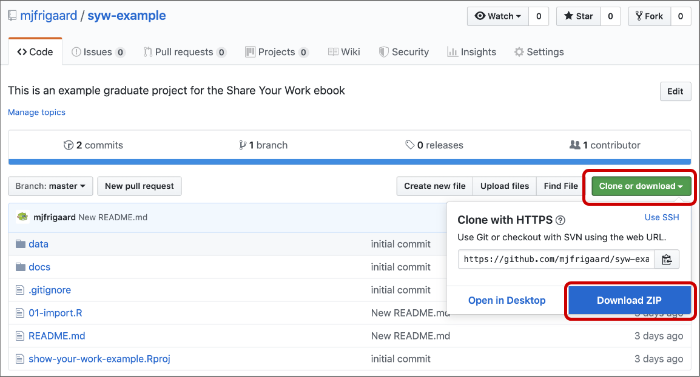
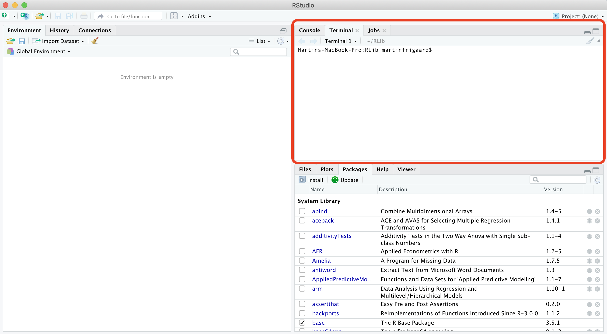
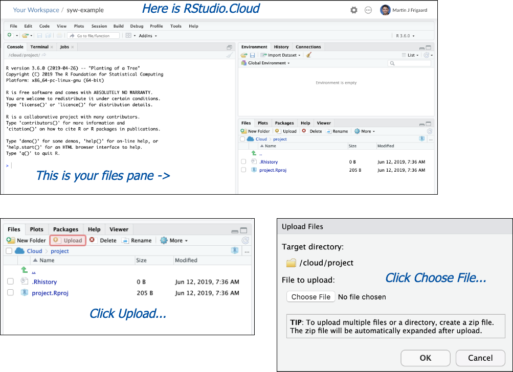
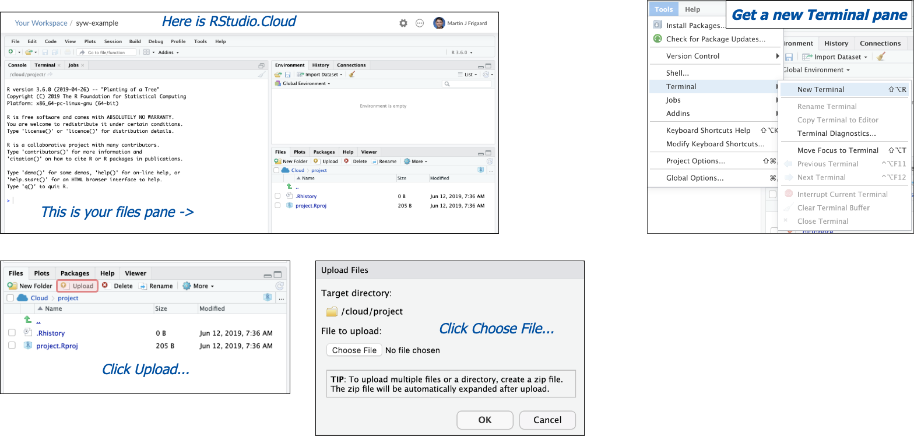
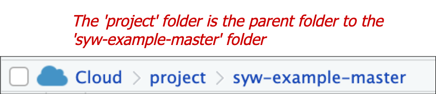

# Part 3: An example project

To help guide you through learning these technologies, we've made a code repository of some files typically found in a research project. The files in this repository were used to create this [master's thesis](http://csuchico-dspace.calstate.edu/handle/10211.3/10211.4_387) and [this peer-reviewed publication](https://journals.sagepub.com/doi/abs/10.1177/1941406412470719).

Download these files by clicking on the green icon and downloading the zip file. 



Put the zipped file in a recognizable place (like the `Documents` folder or on your `Desktop`). Unzip the folder and examine its contents. We'll be using these files throughout the rest of the text. 

If you can't download these files onto your computer, you can use [RStudio.Cloud](https://rstudio.cloud/) (which we will cover in the next sections).

The next few sessions cover some background on common operating systems, jargon, and some handy commands. 

## Operating systems

In 2007, Apple released its [Leopard](https://en.wikipedia.org/wiki/MacOS_version_history#Version_10.5:_%22Leopard%22) operating system that was the first to adhere to the [Single Unix Specification](https://en.wikipedia.org/wiki/Single_UNIX_Specification). I only introduce this bit of history to help keep the terminology straight. macOS and Linux are both Unix systems, so they have a similar underlying architecture (and philosophy). You can use most Linux commands on a Mac.  

Windows has a command line tool called Powershell, but this is not the same as the Unix shells discussed above. The differences between these tools reflect the differences in design between the two operating systems. However, if you're a Windows 10 user, you can install a [bash shell command-line tool](https://www.windowscentral.com/how-install-bash-shell-command-line-windows-10). 

### What Terminal looks like

Below is an image of what the terminal application looks like on macOS with Homebrew syntax highlighting. 


The Terminal is a command line interface application for Mac users. Terminal is available as an application (on Mac go to *Applications* > *Utilities* > *Terminal*) or as a pane in RStudio.

The Terminal pane is also available in RStudio under *Tools* > *Terminal* > *New Terminal*. 



## Some common Terminal commands


**FAIR WARNING**--command line interfaces can be frustrating. Most of the technologies we interact with daily don't behave in ways that are easy to understand (that's why GUIs exist). Switching from a GUI to a CLI seems like a step backward at first, but the initial headaches pay off because of the gains you'll have in control, flexibility, automation, and reproducibility.


Here is a quick list of commonly used Terminal commands.

* **`pwd`** - print working directory 
* **`cd`** - change directories  
* **`cp`** - copy files from one directory to another  
* **`ls`** - list all files
* **`ls -la`** - list all files, including hidden ones
* **`mkdir`** - make directory  
* **`rmdir`** - remove a directory 
* **`cat`** - display a text file in Terminal screen
* **`echo`** - outputs text as arguments, prints to Terminal screen, file, or in a pipeline
* **`touch`** - create a few files
* **`grep`** - "globally search a regular expression and print"
* **`>>`** and **`>`** - redirect output of program to a file (don't display on Terminal screen)
* **`sudo`** and **`sudo -s`** (**BE CAREFUL!!**) perform commands as **`root`** user  

### Terminal emulators and shells 

Strictly speaking, the Terminal application is not a shell, but rather it *gives the user access to the shell*. Other terminal emulator options exist, depending on your operating system and age of your machine. Terminal.app is the default application installed on macOS, but you can download other options (see [iTerm2](https://www.iterm2.com/)). For example, the [GNOME](https://en.wikipedia.org/wiki/GNOME) is a desktop environment based on Linux which also has a Terminal emulator, but this gives users access to the Unix shell. 

On Macs, the Terminal application runs a [bash shell](https://en.wikipedia.org/wiki/Bash_(Unix_shell)). This is the most commonly used shell, but there are other options too (see [Zsh](http://zsh.sourceforge.net/), [tcsh](https://en.wikipedia.org/wiki/Tcsh), and [sh](https://en.wikipedia.org/wiki/Bourne_shell)). *in fact, bash is a pun for Bourne-again shell*.

## Why am I learning the command line?

The key features that make the Unix programs so powerful are 1) specificity, and 2) modularity.

- [Specificity](https://www.dictionary.com/browse/specific) means each Unix command or tool does one thing very well (or [DOTADIW](https://en.wikipedia.org/wiki/Unix_philosophy#Do_One_Thing_and_Do_It_Well)). 

- [Modularity](https://en.wikipedia.org/wiki/Modularity#Table_1:_The_use_of_modularity_by_discipline[34]) is the ability to mix and match these tools together with 'pipes', a kind of grammatical glue that allows users to expand these tools in seemingly endless combinations.  

### Task 1: Listing your files 

The files in the [example project folder](https://github.com/mjfrigaard/syw-example) that you downloaded in chapter 2. After unzipping these files, open the Terminal pane in RStudio. 

If you're using RStudio.Cloud, you will need to create a New Project, and upload the `syw-example-master.zip` file. 



We are going to use the Terminal pane in RStudio to explore the contents of this folder, starting with `ls` to list the files. 



```sh
$ ls
project.Rproj  syw-example-master
```

This shows the RStudio project file, and the folder we uploaded. We actually want to bring these files into the [root folder](https://techterms.com/definition/root_directory). The root folder is the [parent folder](https://www.pcmag.com/encyclopedia/term/68042/parent-folder) to the `syw-example-master` folder.



We are going to copy the files into the `root` folder from the `syw-example-master` using the following commands. 


`cp -a /syw-example-master/. /./`

Its not necessary that you totally understand what these commands are doing, but be sure to *type them into the Terminal*. 


```sh
$ cp -a syw-example-master/. .
```

Now we can check for the files again with `ls`

```sh
$ ls
README.md  docs           show-your-work-example.Rproj  syw-example-master
data       project.Rproj  src
```

Ok, but we don't need the old folder, `syw-example-master`, so we will remove it with `rm` and combine it with two flags `i` and `R`. 

Type the following into the Terminal to learn more about the `rm` command. 

### Getting help 

```sh
$ info rm
```

If we scroll down we learn the following about the `i` flag.

```
 -i          Request confirmation before attempting to remove each file,
             regardless of the file's permissions, or whether or not the
             standard input device is a terminal.  The -i option overrides
             any previous -f options.
```


*What does the `R` do?*

After you've answered that question, type the following into the terminal pane and hit return/enter. 


```sh
$ rm -iR syw-example-master
```

The terminal is going to ask you if you want to delete each file. This can be tedious, but it's better than deleting everything before reviewing the files. 

First you'll be asked if you want to `descend into directory 'syw-example-master'?`, and we do, so we type `y`. Then we are asked if we want to head into the `docs` folder (we do), then we get asked if we want to `remove regular file` in the `docs` folder, `2012-10-62-ican-manuscript-revision-v02.docx`, and we do so we enter `y` and hit enter or return. After we've deleted all of the files, we can check the files in the root folder using `ls` again. 

```sh
$ ls 
README.md  data  docs  project.Rproj  src  syw-example.Rproj
```

Hm, this looks like a list of the files and folders, but not the files *in* the folders. Is there a way to get a nice [folder tree](https://en.wikipedia.org/wiki/Tree_(command)) that shows the entire project? 


The bash shell on macOS comes with a whole host of packages you can install with [Homebrew](https://brew.sh/), the "The missing package manager for macOS (or Linux)".

*(You won't be able to do this on RStudio Terminal, but there are other options we will list below)*

### Installing packages in Terminal

You can install the `tree` package with homebrew, then enter the following commands to get the `tree` package.  

```sh
$ # install tree with homebrew
$ brew install tree
$ # get a folder tree for this project
$ tree
```

This gives us the following output:

```sh
.
├── README.md
├── data
│   └── IcanBP.csv
├── docs
│   └── 2012-10-62-ican-manuscript-revision-v02.docx
├── src
│   ├── 01-import.R
│   └── 02-wrangle.R
└── syw-example.Rproj
```

### Combining tools with pipes

We can imagine a situation where an output like this would be helpful, but it would be great if we could store it somewhere with these project files. It's probably never a bad idea to store the original folder contents somewhere as a backup. 

In order to accomplish this, we will 'pipe' the output from `tree` into a plain text file and call it `syw-folder-backup`. We will also include today's date. 

```sh
$ tree > syw-folder-backup-$(date +%Y-%m-%d).txt
```

Now we can view the contents of this file using the `cat` command. 

```sh
$ cat syw-folder-backup-2019-06-12.txt
.
├── README.md
├── data
│   └── IcanBP.csv
├── docs
│   └── 2012-10-62-ican-manuscript-revision-v02.docx
├── src
│   ├── 01-import.R
│   └── 02-wrangle.R
├── syw-example.Rproj
└── syw-folder-backup-2019-06-12.txt
```

This is a small taste of how these commands can be combined to create very efficient workflows and procedures. I can tether commands together, and move inputs and outputs around with a lot of flexibility (and a little reading).

## Getting more help

This section has been a concise introduction to command line tools, but hopefully, we've demystified some of the terminologies for you. The reason these technologies still exist is that they are powerful. Probably, you're starting to see the differences between these tools and the standard GUI software installed on most machines. [Vince Buffalo](http://vincebuffalo.org/blog/), sums up the difference very well,

> "*the Unix shell does not care if commands are mistyped or if they will destroy files; the Unix shell is not designed to prevent you from doing unsafe things.*"

The command line can seem intimidating because of its power and ability to destroy the world, but there are extensive resources available for safely using it and adding it to your wheelhouse. 

* [The Unix Workbench](https://seankross.com/the-unix-workbench/) 

* [Data Science at the Command Line](https://www.datascienceatthecommandline.com/)

* [Software Carpentry Unix Workshop](https://swcarpentry.github.io/shell-novice/) 

