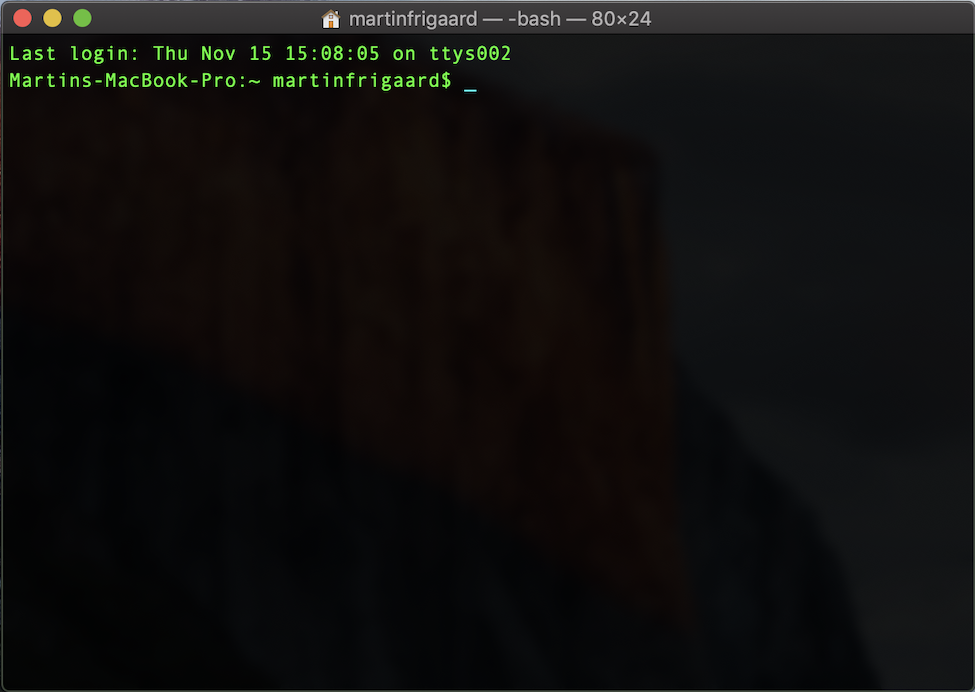
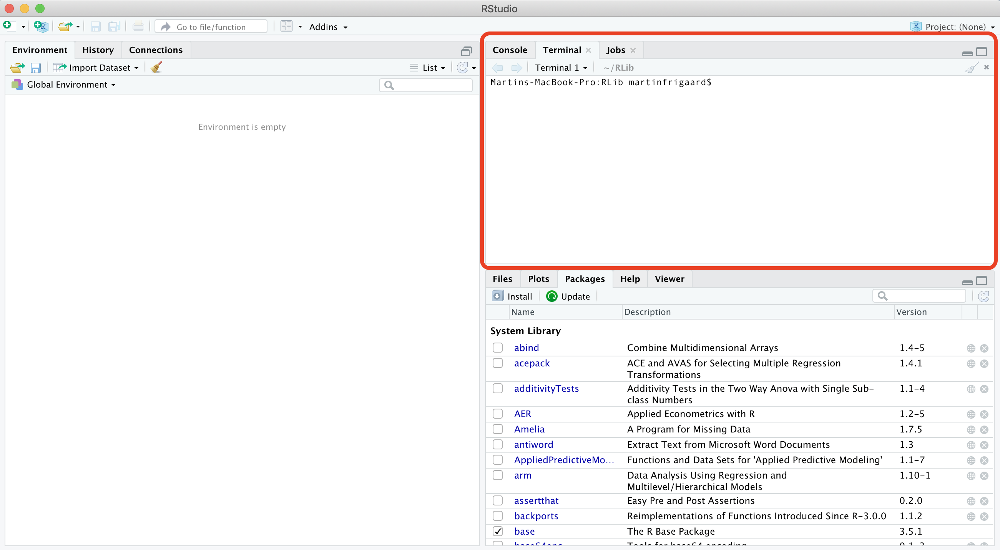

# Part 3: a quick introduction to the command line 

**FAIR WARNING**--command line interfaces can be frustrating. Most of the technologies we interact with daily don't behave in ways that are easy to understand (that's why GUIs exist). Switching from a GUI to a CLI seems like a step backward at first, but the initial headaches pay off because of the gains you'll have in control, flexibility, automation, and reproducibility.

## The Terminal 

The Terminal is a command line interface application for Mac users. Terminal is available as an application (on Mac go to *Applications* > *Utilities* > *Terminal*) or as a pane in RStudio.

Here is a quick list of commonly used Terminal commands.

* **`pwd`** - print working directory 
* **`cd`** - change directories  
* **`cp`** - copy files from one directory to another  
* **`ls`** - list all files
* **`ls -la`** - list all files, including hidden ones
* **`mkdir`** - make directory  
* **`cat`** - display a text file in Terminal screen
* **`echo`** - outputs text as arguments, prints to Terminal screen, file, or in a pipeline
* **`touch`** - create a few files
* **`grep`** - "globally search a regular expression and print"
* **`>>`** and **`>`** - redirect output of program to a file (don't display on Terminal screen)
* **`sudo`** and **`sudo -s`** (**BE CAREFUL!!**) perform commands as **`root`** user  

### The Terminal application

Below is an image of what the terminal application looks like on macOS with Homebrew syntax highlighting. 

### The Terminal pane

The Terminal pane is also available in RStudio under *Tools* > *Terminal* > *New Terminal*. 

### Operating systems

In 2007, Apple released its [Leopard](https://en.wikipedia.org/wiki/MacOS_version_history#Version_10.5:_%22Leopard%22) operating system that was the first to adhere to the [Single Unix Specification](https://en.wikipedia.org/wiki/Single_UNIX_Specification). I only introduce this bit of history to help keep the terminology straight. macOS and Linux are both Unix systems, so they have a similar underlying architecture (and philosophy). You can use most Linux commands on a Mac.  

Windows has a command line tool called Powershell, but this is not the same as the Unix shells discussed above. The differences between these tools reflect the differences in design between the two operating systems. However, if you're a Windows 10 user, you can install a [bash shell command-line tool](https://www.windowscentral.com/how-install-bash-shell-command-line-windows-10). 

### Terminal applications

Strictly speaking, the Terminal application is not a shell, but rather it *gives the user access to the shell*. Other terminal emulator options exist, depending on your operating system and age of your machine. Terminal.app is the default application installed on macOS, but you can download other options (see [iTerm2](https://www.iterm2.com/)). For example, the [GNOME](https://en.wikipedia.org/wiki/GNOME) is a desktop environment based on Linux which also has a Terminal emulator, but this gives users access to the Unix shell. 

### Shells

On Macs, the Terminal application runs a [bash shell](https://en.wikipedia.org/wiki/Bash_(Unix_shell)). This is the most commonly used shell, but there are other options too (see [Zsh](http://zsh.sourceforge.net/), [tcsh](https://en.wikipedia.org/wiki/Tcsh), and [sh](https://en.wikipedia.org/wiki/Bourne_shell)). *in fact, bash is a pun for Bourne-again shell*.

In the next section, We are going to introduce version control with Git and linking your local machine to Github. 

## Getting more help

This section has been a concise introduction to command line tools, but hopefully, we've demystified some of the terminologies for you. The reason these technologies still exist is that they are powerful. Probably, you're starting to see the differences between these tools and the standard GUI software installed on most machines. [Vince Buffalo](http://vincebuffalo.org/blog/), sums up the difference very well,

> "*the Unix shell does not care if commands are mistyped or if they will destroy files; the Unix shell is not designed to prevent you from doing unsafe things.*"

The command line can seem intimidating because of its power and ability to destroy the world, but there are extensive resources available for safely using it and adding it to your wheelhouse. 

* [The Unix Workbench](https://seankross.com/the-unix-workbench/) 

* [Data Science at the Command Line](https://www.datascienceatthecommandline.com/)

* [Software Carpentry Unix Workshop](https://swcarpentry.github.io/shell-novice/) 

