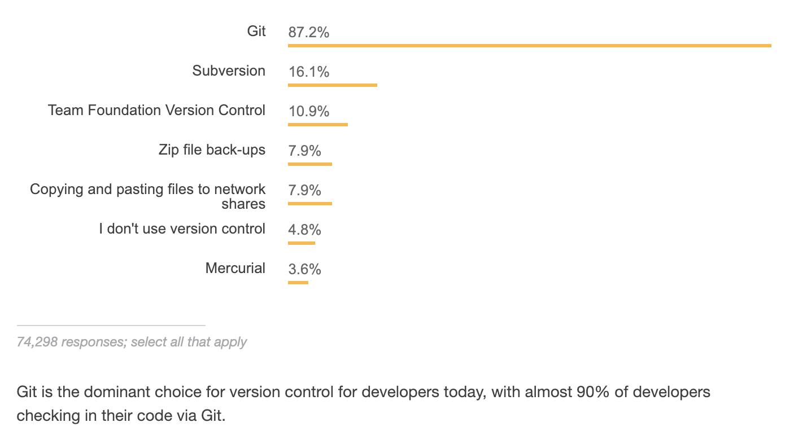
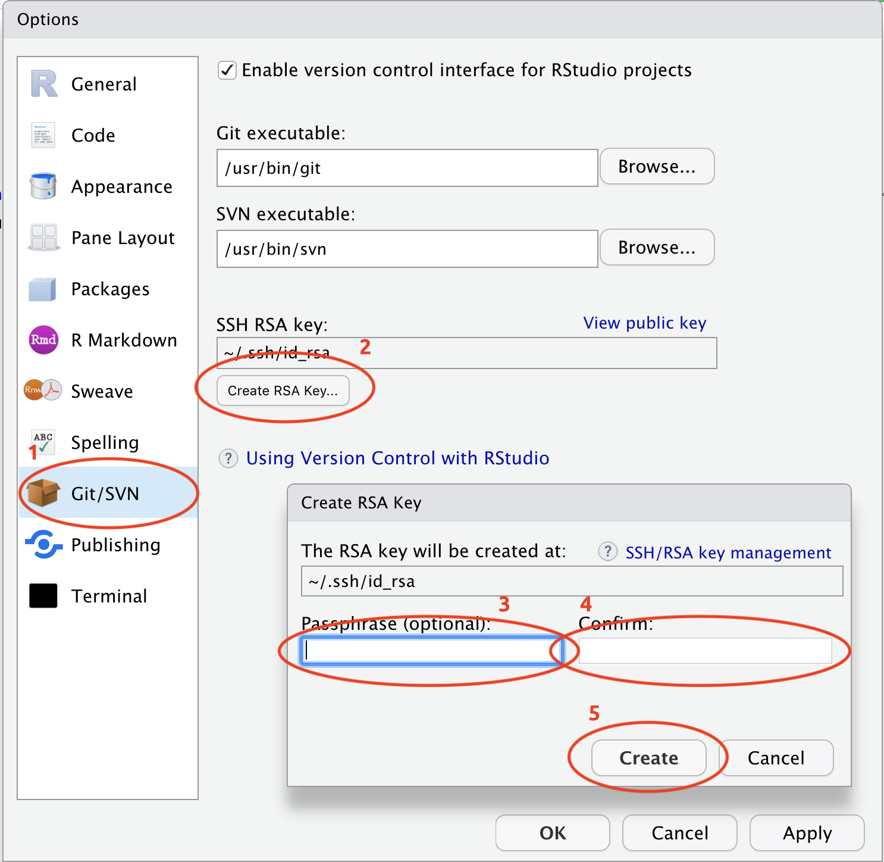

Keeping track of the changes to your work
==========


> In the previous section, we covered R and RStudio, the command line, Shells, and the Terminal. If you're unfamiliar with these topics, please start there. This section will cover plain text files, version control, installing, and setting up Git.

# Plain text vs. most other file types

In the classic text [The Pragmatic Programmer](https://www.amazon.com/Pragmatic-Programmer-Journeyman-Master/dp/020161622X), authors Hunt and Thomas advise *'Keep[ing] Knowledge in Plain Text'*. This sentiment has been repeated [here](https://simplystatistics.org/2017/06/13/the-future-of-education-is-plain-text/), [here](https://richardlent.github.io/post/the-plain-text-workflow/), and [here](http://plain-text.co/index.html#introduction). This chapter will cover what is meant by 'plain text,' and why you might want to consider switching over to a plain text editor if you're currently using something like Papers or Microsoft Word. 

## What * isn't* plain text

Non-plain text files are usually binary files (the `0`/`1` kind of binary). Binary files (i.e., files with binary-level compatibility) need special software to run on your computer. The language below is a handy way to think about these files:

> "Binary files are *[computer-readable but not human-readable](https://www.webopedia.com/TERM/B/binary_file.html)*"   

# What *is* plain text

So if binary files aren't written in plain text, what's a plain text file? The language from the [Wikipedia](https://en.wikipedia.org/wiki/Text_file) description is helpful here: 

> *When opened in a text editor, plain text files display computer and human-readable content*.

And here is the most crucial distinction--**human-readable vs. computer-readable**. I'll be sure to point out which files are binary and which are plain text as we go through the example, but generally speaking, a plain text file can be opened using a text editor.  Examples of text editors include [Atom](https://atom.io/), [Sublime Text](https://www.sublimetext.com/), and [Notepad++](https://notepad-plus-plus.org/)

# Git

Git is a [version control system](https://en.wikipedia.org/wiki/Version_control) (VCS), which is somewhat like the **Tracked Changes** in Microsoft Word or the **Version History** in Google Sheets.  

Git will help you keep track of your documents, datasets, code, images, and other files. 

## What files work best with Git?

Git prefers plain text files because, until recently, software engineers and app developers were using programs like Git to track their source code (most of which gets written in plain text). A plain text file has the extension `.txt`, but can also have a `.md` extension). Humans and computers can read these files (or more specifically in this instance, your  

Most academic papers get written in Microsoft Word or Google Sheets, and these are not plain text (but they can be converted to plain text). 

## Why should you use Git?

Git has become the most common version control system used by [programmers](https://insights.stackoverflow.com/survey/2018#work-version-control). 



source: [StackOverflow Developer Survey Results](https://insights.stackoverflow.com/survey/2018#overview)

Git is also a helpful way of thinking about the changes to your project. The terminology of Git is strange at first, but if you use Git long enough, you'll be thinking about your code in terms of 'commits', 'pushes', 'forks', and 'repos'.

## Installing Git

1. Download and install [Git.](http://git-scm.org/)     

2. Create a [Github](https://github.com/) account.  

## Configuring Git with `git config`

Git needs a little configuration before we can start using it and linking it to Github. There are three levels of configuration within Git, `system`, `user`, and `project.` 

1) For **system** level configuration use:  
`git config --system`

2) For **user** level configuration, use:  
`git config --global`

3) For **Project** level configuration use:  
`git config`

I'll set my Git `user.name` and `user.email` with `git config --global` so these are configured for all projects on this computer. 

```sh
$ git config --global user.name "Martin Frigaard"
$ git config --global user.email "mjfrigaard@gmail.com"
```

I can check what I've configured with `git config --list`. 

```sh
$ git config --list
```

At the bottom of the output, I can see the changes. 

```sh
user.name=Martin Frigaard
user.email=mjfrigaard@gmail.com
```

These are also stored in a `.gitconfig` file I can view using:

```sh
$ cat .gitconfig
[user]
    name = Martin Frigaard
    email = mjfrigaard@gmail.com
```

## Git terminology

Below are some commonly used terms/commands associated with Git and Github.

*commits* - commits are the staple in Git/Github the workflow. Commits are what Git uses to track the changes you've made to files or folders, so they can be considered nouns ("I'm creating a commit with these changes") or verbs (I am going to commit these changes to my project"). 

To quote David Demaree, 

> *"Semantically, each commit represents a complete snapshot of the state of your project at a given moment in time; its unique identifier serves to distinguish that state from the way the files in your project looked at any other moment in time."* 

*repository* - this refers to the files and folders in your project and all the changes you make while working on them. On your local computer, a repository can exist in a folder you initialize a repository in (see below). On Github, a repository has the following structure: `https://github.com/<username>/<repository_name>`. 

*init* - the command `git init` is used to initialize a new git repository (it tells Git to start tracking changes in this directory).

*status* - whenever you wonder what you've done, what is happening, or if you're just generally confused, you can check the status of a git repository with `git status` (use this liberally). 

*clone* - this command copies all files and changes into a new working directory from a remote, initializes (`init`) a new Git repository, and it adds a remote called `origin`.

*diff* - this is how Git shows differences between files. Read more about how changes are formatted/displayed [here.](https://www.git-tower.com/learn/git/ebook/en/command-line/advanced-topics/diffs)

# Our example project 

I have a project in a GitHub [repository](https://github.com/mjfrigaard/syw-example) that has a `README.md` file, two `.R` script files (`01-import.R` and `02-wrangle.R`), a `.csv` file (`IcanBP.csv`), and a revised manuscript document (`2012-10-62-ican-manuscript-revision-v02.docx`).

I'll clone this repository into a local directory (folder), read the data into R, create a figure, and then put everything back on Github. 

## Synchronize RStudio and Git/Github

The online resource [Happy Git and GitHub for the useR](http://happygitwithr.com/) has all in the information you will need for connecting RStudio and Git/Github. I repeat some of that information below (with copious screen shots).

Go to *Tools* > *Global Options* > ...





1. Click on *Git/SVN*  

2. Then *Create RSA Key...*  

3. In the dialog box, enter a passphrase (and store it in a safe place), then click *Create*. 

The result should look something like this:

```sh
whoeveryouare ~ $ ssh-keygen -t rsa -b 2891 -C "USEFUL-COMMENT"
Generating public/private rsa key pair.
Enter file in which to save the key (/Users/username/.ssh/id_rsa):     
Enter passphrase (empty for no passphrase): 
Enter same passphrase again: 
Your identification has been saved in /Users/username/.ssh/id_rsa.
Your public key has been saved in /Users/username/.ssh/id_rsa.pub.
The key fingerprint is:
SHA483:g!bB3r!sHg!bB3r!sHg!bB3r!sH USEFUL-COMMENT
The key's randomart image is:
+---[RSA 2891]----+
|      o+   . .   |
|     .=.o . +    |
|     ..= + +     |
|      .+* E      |
|     .= So =     |
|    .  +. = +    |
|   o.. = ..* .   |
|  o ++=.o =o.    |
| ..o.++o.=+.     |
+----[SHA483]-----+
```

Now I need to go back to Terminal and store this `SSH` from RStudio. 

## Adding a key SSH in Terminal

In the Terminal I enter the following commands. 

```sh
$ eval "$(ssh-agent -s)"
```

This tells me I'm an `Agent`.

```sh
Agent pid 007
```

Now I want to add the *SSH RSA* to the keychain. There are three elements in this command: the `ssh-add`, the `-K`, and `~/.ssh/id_rsa`. 

* The `ssh-add` is the command to add the *SSH RSA*    

* The `-K` stores the passphrase I generated, and    

* `~/.ssh/id_rsa` is the location of the *SSH RSA*.  

```sh
$ ssh-add -K ~/.ssh/id_rsa
```

Enter the passphrase and then have it tell me the identity has been added.  

```sh
Enter passphrase for /Users/username/.ssh/id_rsa: 
Identity added: /Users/username/.ssh/id_rsa (username@Martins-MacBook-Pro.local)
```

## Create the `~/.ssh/config` file

On macOS-Sierra 10.12.2 or higher requires a `config` file. I can do this using the Terminal commands above. 

First, I move into the `~/.ssh/` directory. 

```sh
$ cd ~/.ssh/
```

Then I create this `config` file with `touch`

```sh
$ touch config
# verify 
$ ls
config        id_rsa        id_rsa.pub
```

I use `echo` to add the following text to the `config` file.

```sh
Host *
 AddKeysToAgent yes
 UseKeychain yes
```

Recall the `>>` will send the text to the `config` file.

```sh
# add text 
$ echo "Host *
>  AddKeysToAgent yes
>  UseKeychain yes" >> config
```

Finally, I can check `config` with `cat`

```sh
# verify 
$ cat config
Host *
 AddKeysToAgent yes
 UseKeychain yes
```

Great! Now I am all set up to use Git with RStudio. In the next section, we will move the contents of a local folder to Github. 


