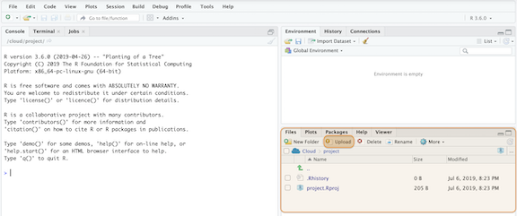

# Part 3: Project organization

***NOTE:*** *Now that we've recommend a set of tools (R+RStudio+Git+Github), we'll demonstrate how powerful this workflow can be with an example. But before we can do this, we need to spend a few minutes on project organization. This topic was rarely covered in our statistical coursework, but how you organize your files and folders will directly contribute to your ability to be productive. In the same way it's hard to get things done in a messy space, it'll be hard to do data analysis with unorganized files.*

---

## A common scenario with data

We've created [a Dropbox folder with some files](http://bit.ly/ican-data) that are typically part of a research project. The data file, **IcanBP.csv**, and a data dictionary **data-dictionary-icanbp.txt**. We say "typically" with caution here, because many times you might only end up with a data set and an email with some questions. The data are in a comma-separated values (.csv) file, and the documentation is in a plain text (.txt) file. 


It's a good habit to pay attention to file extensions and the programs that can open them. Both of these files are considered 'plain text' files, and this means they can be opened with a wide variety of applications (including R, RStudio, and the Terminal). Download these files following the instructions below. 


The example we will work through in this text follows a common scenario: *you have a data set and an incomplete description of it's contents, and a problem to solve.* 

Other variations on this scenario include:  

- solve a problem (or answer a question) using data you don't currently posses  

- there are data in a database, but these data need to be retrieved, restructured, and presented in a way that doesn't currently exist  

- combine data from multiple sources (APIs, web-scraping, local data) stored in different types (JSON, SQL, Excel, etc.) into a model or dashboard 

We've encountered all of these situations, but the common thread between all of them is they contain data files and some accompanying documentation. In the example we've provided, there are only two files **data-dictionary-icanbp.txt** and **IcanBP.csv**, but it's easy to how this number can grow over the life of a project. 

In this next session we are going to cover operating system differences, Terminal commands, and how to use command line tools effectively. 

## Unix and Windows

In 2007, Apple released its [Leopard](https://en.wikipedia.org/wiki/MacOS_version_history#Version_10.5:_%22Leopard%22) operating system that was the first to adhere to the [Single Unix Specification](https://en.wikipedia.org/wiki/Single_UNIX_Specification). I only introduce this bit of history to help keep the terminology straight. macOS and Linux are both Unix systems, so they have a similar underlying architecture (and philosophy). You can use most Linux commands on a Mac.  

Windows has a command line tool called Powershell, but this is not the same as the Unix shells discussed above. The differences between these tools reflect the differences in design between the two operating systems. However, if you're a Windows 10 user, you can install a [bash shell command-line tool](https://www.windowscentral.com/how-install-bash-shell-command-line-windows-10). 

### Command line tools

The [command line interface](https://en.wikipedia.org/wiki/Command-line_interface) (CLI) was the predecessor to a GUI, and there is a reason these tools haven't gone away. CLI is a text-based screen where users interact with their computer's programs, files, and operating system using a combination of commands and parameters. This basic design might make the CLI sound inferior to a trackpad or touchscreen, but after a few examples of what's possible from on the command-line and you'll see the power of using these tools. 

### The Terminal (mac0S)

Below is an image of what the terminal application looks like on macOS with Homebrew syntax highlighting. On Macs, the Terminal application runs a [bash shell](https://en.wikipedia.org/wiki/Bash_(Unix_shell)). This is the most commonly used shell, but there are other options too (see [Zsh](http://zsh.sourceforge.net/), [tcsh](https://en.wikipedia.org/wiki/Tcsh), and [sh](https://en.wikipedia.org/wiki/Bourne_shell)). *in fact, bash is a pun for Bourne-again shell*.

The Terminal is a command line interface application for Mac users. Terminal is available as an application (on Mac go to *Applications* > *Utilities* > *Terminal*) or as a pane in RStudio.


The Terminal pane is also available in RStudio under *Tools* > *Terminal* > *New Terminal*. 


Strictly speaking, the Terminal application is not a shell, but rather it *gives the user access to the shell*. Other terminal emulator options exist, depending on your operating system and age of your machine. Terminal.app is the default application installed on macOS, but you can download other options (see [iTerm2](https://www.iterm2.com/)). For example, the [GNOME](https://en.wikipedia.org/wiki/GNOME) is a desktop environment based on Linux which also has a Terminal emulator, but this gives users access to the Unix shell. 

### Common Terminal commands

**FAIR WARNING**--command line interfaces can be frustrating. Most of the technologies we interact with daily don't behave in ways that are easy to understand (that's why GUIs exist). Switching from a GUI to a CLI seems like a step backward at first, but the initial headaches pay off because of the gains you'll have in control, flexibility, automation, and reproducibility.

Here is a quick list of commonly used Terminal commands.

* **`pwd`** - print working directory 
* **`cd`** - change directories  
* **`cp`** - copy files from one directory to another  
* **`ls`** - list all files
* **`ls -la`** - list all files, including hidden ones
* **`mkdir`** - make directory  
* **`rmdir`** - remove a directory 
* **`cat`** - display a text file in Terminal screen
* **`echo`** - outputs text as arguments, prints to Terminal screen, file, or in a pipeline
* **`touch`** - create a few files
* **`grep`** - "globally search a regular expression and print"
* **`>>`** and **`>`** - redirect output of program to a file (don't display on Terminal screen)
* **`sudo`** and **`sudo -s`** (**BE CAREFUL!!**) perform commands as **`root`** user  

### Unlocking the command line

Being able to use the command line gives you more 'under-the-hood' access to your computer. You'll use the command line to navigate your computer's files, install new programs or libraries, and track changes to your files. It might seem clunky and ancient, but there's a reason this technology is still around. The two key features that make the Unix programs so powerful are 1) specificity and 2) modularity.

- [Specificity](https://www.dictionary.com/browse/specific) means each Unix command or tool does one thing very well (or [DOTADIW](https://en.wikipedia.org/wiki/Unix_philosophy#Do_One_Thing_and_Do_It_Well)). 

- [Modularity](https://en.wikipedia.org/wiki/Modularity#Table_1:_The_use_of_modularity_by_discipline[34]) is the ability to mix and match these tools together with 'pipes,' a kind of grammatical glue that allows users to expand these tools in seemingly endless combinations.  
We will work through an example to demonstrate some of these features. 

### Putting the command line to work: Find your stuff

After downloading the files from Dropbox, we unzipped the .zip file and put the `ican-data` folder inside the `Documents` folder (see image below):


It's important to make sure you designate a folder for your project that isn't your downloads folder. This folder is the default location in many browsers, so it can quickly become a overwhelming and cluttered.  

#### Absolute vs. relative file paths

We are working on a Mac, but the GUI representation of your folder structure won't be much different if you're working on a Windows machine. What *will* be different is the way you navigate to these folders. The path to these files on a Mac or Linux machine will look like this:

```sh
/Users/martinfrigaard/Documents/ican-data
```

While the path on a Windows machine will look like this:

```sh
C:\Users\martinfrigaard\Documents\ican-data
```

In R, the `\` is called an escape character, so in order to navigate through folders you will have to use two backslashes `\\`, which makes the above project located here:

```sh
C:\\Users\\martinfrigaard\\Documents\\ican-data
```

We will cover a few other differences between these two common operating systems below. 

#### Absolute file paths 

An absolute file path starts from a specific place (i.e. an absolute place). If you're working on a Mac, the root structure is accessed using the tilde (`~`) or forward slash. For example, if I open a fresh Terminal window, I'll be able to see my location.


I am on `Martins-MacBook-Pro:` in the root `~` folder, signed in as `martinfrigaard`. If I want to move into the `ican-data` folder located inside `/Users/martinfrigaard/Documents`, I can use the `cd` or change directory command. 

```sh
cd /Users/martinfrigaard/Documents/ican-data
```

Now when I look at the Terminal window, I see the following: 


The Terminal application is showing that I am still using `Martins-MacBook-Pro:`, but now I am in `ican-data`. 

#### Relative file paths

A relative file path is the location of a folder or files starting from wherever you happen to be. This might seems confusing, but we can demonstrate the difference. We are currently in the `ican-data` folder. We will return the `root` folder using: 

```sh
cd ~
```

This places us in `/Users/martinfrigaard`, and if we want to get back to the `ican-data` folder, we can simply move forward from `/Users/martinfrigaard` using `cd` 

```sh
Martins-MacBook-Pro:~ martinfrigaard$ cd Documents/ican-data
Martins-MacBook-Pro:ican-data martinfrigaard$ 
```

Both of these got us to the same place, but the second is preferred. Why? Not everyone's folders are set up the same, so it's best not to assume that `/Users/martinfrigaard/Documents` means anything to a computer other than mine.

#### Using RStudio.Cloud

As discussed in the previous chapters, if you can't download these files onto your computer, you can use [RStudio.Cloud](https://rstudio.cloud/). We recommend setting up a Github account to sign in with. 

The next few sessions cover some background on standard operating systems, jargon, and some handy Terminal commands. 

***

If you're using RStudio.Cloud, you will need to create a *New Project* and upload the `ican-data.zip` file. 



We're going to use the Terminal pane in RStudio to explore the contents of this folder, starting with `ls` to list the files. 


```sh
$ ls

```

The output shows the RStudio project file, and the folder we uploaded. We want to bring these files into the [root folder](https://techterms.com/definition/root_directory). The root folder is the [parent folder](https://www.pcmag.com/encyclopedia/term/68042/parent-folder) to the `syw-example-master` folder.


We are going to copy the files into the `root` folder from the `syw-example-master` using the following commands. 


`cp -a /syw-example-master/. /./`

It's not necessary that you fully understand what these commands are doing, but be sure to *type them into the Terminal*. 


```sh
$ cp -a syw-example-master/. .
```

Now we can check for the files again with `ls`

```sh
$ ls
README.md  docs           show-your-work-example.Rproj  syw-example-master
data       project.Rproj  src
```

Ok, but we don't need the old folder, `syw-example-master`, so we will remove it with `rm` and combine it with two flags `i` and `R`. 

Type the following into the Terminal to learn more about the `rm` command. 

### Getting help 

```sh
$ info rm
```

If we scroll down, we learn the following about the `i` flag.

```
 -i     Request confirmation before attempting to remove each file,  
        regardless of the file's permissions, or whether or not the  
        standard input device is a terminal.  The -i option overrides  
        any previous -f options.
```


*What does the `R` do?*

After you've answered that question, type the following into the terminal pane, and hit return/enter. 


```sh
$ rm -iR syw-example-master
```

The Terminal is going to ask you if you want to delete each file. The process is a little tedious, but it's better than deleting everything before reviewing the files. 

First, Terminal asks if you want to `descend into directory 'syw-example-master'?`, and we do, so we type `y`. Then we are asked if we're going to head into the `docs` folder (we do), then we get asked if we want to `remove regular file` in the `docs` folder, `2012-10-62-ican-manuscript-revision-v02.docx`, and we do so we enter `y` and hit enter or return. After we've deleted all of the files, we can check the files in the root folder using `ls` again. 

```sh
$ ls 

```

Hm, this looks like a list of the files and folders, but not the files *in* the folders. Is there a way to get a beautiful [folder tree](https://en.wikipedia.org/wiki/Tree_(command)) that shows the entire project? 

### Install homebrew

The bash shell on macOS comes with a whole host of packages you can install with [homebrew](https://brew.sh/), the "The missing package manager for macOS (or Linux)".

*(You won't be able to do this on RStudio Terminal, but there are other options we will list below)*

After installing homebrew, you can install the [`tree`](https://brewinstall.org/Install-tree-on-Mac-with-Brew/) package, then enter the following commands to get the `tree` package.  

```sh
$ # install tree with homebrew
$ brew install tree
$ # get a folder tree for this project
$ tree
```

The `tree` command gives us the following output:

```sh

```

## Organizing your project files

As we can see, `tree` gives us a printout of the project folder in a hierarchy (or tree). The thing to notice is the separation of files into folders titled, `data`, `docs`, and `src`. The folders listed in `syw-example-master` represent somewhat of a 'bare minimum of folders' each research project should contain. 

## Organizing your project files

As we can see, `tree` gives us a printout of the project folder in a hierarchy (or tree). The thing to notice is the separation of files into folders titled, 	`data`, `docs`, and `src`. The folders listed in `syw-example-master` represent somewhat of a 'bare minimum of folders' each research project should contain.  

We can imagine a situation where an output like the one above would be helpful, but it would be better if we could store it somewhere with our project files. It's probably never a bad idea to save the original folder contents somewhere as a backup. 

We are going to use a few Terminal commands to document our file and folder organization.

### Create a file

We want to create a new file, `YYYY-MM-DD-syw-folder-backup.txt`, but have today's date in the `YYYY-MM-DD` position. We can do this by combining `touch`--a bash command--with the date variable (as `$(date +%Y-%m-%d)`) with the new file title (`-ican-folder-backup.txt`)

```sh
$ touch $(date +%Y-%m-%d)-ican-folder-backup-.txt
```

Check to see if this file has been created with `ls`. 

```sh
$ ls

```

To accomplish this, we will 'pipe' the output from `tree` into a plain text file and call it `ican-folder-backup`. We will also include today's `date`. Check out `date` and `(date +%Y-%m-%d)` in the Terminal to see what gets printed. 

```sh
$ date
Sun Jun 16 18:32:10 PDT 2019
```

```sh
$ (date +%Y-%m-%d)
2019-06-16
```

```sh
$ tree >> $(date +%Y-%m-%d)-ican-folder-backup.txt

```

Now we can view the contents of this file using the `cat` command. 

```sh

```

There we have it! We've backed up the original file contents and structure and time-stamped it. 

The main takeaways from this activity are 1) keep raw data in a separate folder and 2) document everything in `README.md` files. 


We've covered a small taste of how these commands can be combined to create very efficient workflows and procedures. I can tether commands together, and move inputs and outputs around with a lot of flexibility (and a little reading).

## Getting more help

This section has been a concise introduction to command line tools, but hopefully, we've demystified some of the terminologies for you. The reason these technologies still exist is that they are powerful. Probably, you're starting to see the differences between these tools and the standard GUI software installed on most machines. [Vince Buffalo](http://vincebuffalo.org/blog/), sums up the difference very well,

> "*the Unix shell does not care if commands are mistyped or if they will destroy files; the Unix shell is not designed to prevent you from doing unsafe things.*"

The command line can seem intimidating because of its power and ability to destroy the world, but there are extensive resources available for safely using it and adding it to your wheelhouse. 

* [The Unix Workbench](https://seankross.com/the-unix-workbench/) 

* [Data Science at the Command Line](https://www.datascienceatthecommandline.com/)

* [Software Carpentry Unix Workshop](https://swcarpentry.github.io/shell-novice/) 

### More on file organization, collaborating, and version control

*Fortunately, many articles have come out in the last few years with excellent, practical advice. I recommend reading these before getting started (you'd be surprised at the cacophony of files a single project can produce). We've listed a few 'must reads' below:*

- [working with data in spread sheets](https://www.tandfonline.com/doi/full/10.1080/00031305.2017.1375989), 
- [sharing data with collaborators](https://www.tandfonline.com/doi/full/10.1080/00031305.2017.1375987), 
- [how to name your files](https://speakerdeck.com/jennybc/how-to-name-files), and 
- [the importance of using version control](https://www.nature.com/news/democratic-databases-science-on-github-1.20719).

#### Why you can trust this example

We are confident these files will be useful--the data in this repository were used to create this [master's thesis](http://csuchico-dspace.calstate.edu/handle/10211.3/10211.4_387) and [this peer-reviewed publication](https://journals.sagepub.com/doi/abs/10.1177/1941406412470719). 